# TFL book guide
Metrum Research Group  
`r Sys.Date()`  


# Preface {-}

<a href="http://metrumrg.com/" target="_blank"></a>


The TFL package is an R package for creating tables, figures, and listings in a reproducible manner.

To compile this book you need to install **bookdown** from Github:

<!---

--->

Each Rmd file contains a chapter that explains sets of similar funcationalities as specified in the file name.

To compile this to PDF, you need to install XeLaTeX.


Load into the global enviornment data used in the tutorial


<!--chapter:end:index.Rmd-->

# Example Data
## twoCmt
Example dataset '0069.csv' contains a NONMEM input datafile merged with output from a population PK analysis. 
Dosing records have been removed for this example.  The input datafile was derived from a single-dose, parallel group, dose-escalation study with intravenous and subcutaneous routes of administration.  PK samples were collected extensively following dosing in 108 subjects who were healthy or had disease status 1 or 2 (DISF).  Basic patient-specific demographics are included in the dataset such as Age (AGE), Weight (WGTB), Height (HGTB), and Race (RACE).

### Data


```r
library(dplyr)
tab=read.table(file.path(find.package('TFL'),'external/0069/0069.tab'),
               header=TRUE, skip=1, stringsAsFactors=F, fill=TRUE)
tab <- subset(tab, select=c(ID:HGTB,MDV))
tab <- group_by(tab, ID,TIME,STUD,EVID)
tab <- mutate(tab, WGT=WGTB+.1*TIME+rnorm(length(WGTB)))
tab$WGT[ tab$STUD==183 ] <- NA
```

<!--html_preserve--><div id="htmlwidget-36bd38f9b1d56796233e" style="width:100%;height:auto;" class="datatables html-widget"></div>
<script type="application/json" data-for="htmlwidget-36bd38f9b1d56796233e">{"x":{"data":[["1","2","3","4","5","6","7","8","9","10","11","12","13","14","15","16","17","18","19","20","21","22","23","24","25","26","27","28","29","30","31","32","33","34","35","36","37","38","39","40","41","42","43","44","45","46","47","48","49","50","51","52","53","54","55","56","57","58","59","60","61","62","63","64","65","66","67","68","69","70","71","72","73","74","75","76","77","78","79","80","81","82","83","84","85","86","87","88","89","90","91","92","93","94","95","96","97","98","99","100","101","102","103","104","105","106","107","108","109","110","111","112","113","114","115","116","117","118","119","120","121","122","123","124","125","126","127","128","129","130","131","132","133","134","135","136","137","138","139","140","141","142","143","144","145","146","147","148","149","150","151","152","153","154","155","156","157","158","159","160","161","162","163","164","165","166","167","168","169","170","171","172","173","174","175","176","177","178","179","180","181","182","183","184","185","186","187","188","189","190","191","192","193","194","195","196","197","198","199","200","201","202","203","204","205","206","207","208","209","210","211","212","213","214","215","216","217","218","219","220","221","222","223","224","225","226","227","228","229","230","231","232","233","234","235","236","237","238","239","240","241","242","243","244","245","246","247","248","249","250","251","252","253","254","255","256","257","258","259","260","261","262","263","264","265","266","267","268","269","270","271","272","273","274","275","276","277","278","279","280","281","282","283","284","285","286","287","288","289","290","291","292","293","294","295","296","297","298","299","300","301","302","303","304","305","306","307","308","309","310","311","312","313","314","315","316","317","318","319","320","321","322","323","324","325","326","327","328","329","330","331","332","333","334","335","336","337","338","339","340","341","342","343","344","345","346","347","348","349","350","351","352","353","354","355","356","357","358","359","360","361","362","363","364","365","366","367","368","369","370","371","372","373","374","375","376","377","378","379","380","381","382","383","384","385","386","387","388","389","390","391","392","393","394","395","396","397","398","399","400","401","402","403","404","405","406","407","408","409","410","411","412","413","414","415","416","417","418","419","420","421","422","423","424","425","426","427","428","429","430","431","432","433","434","435","436","437","438","439","440","441","442","443","444","445","446","447","448","449","450","451","452","453","454","455","456","457","458","459","460","461","462","463","464","465","466","467","468","469","470","471","472","473","474","475","476","477","478","479","480","481","482","483","484","485","486","487","488","489","490","491","492","493","494","495","496","497","498","499","500","501","502","503","504","505","506","507","508","509","510","511","512","513","514","515","516","517","518","519","520","521","522","523","524","525","526","527","528","529","530","531","532","533","534","535","536","537","538","539","540","541","542","543","544","545","546","547","548","549","550","551","552","553","554","555","556","557","558","559","560","561","562","563","564","565","566","567","568","569","570","571","572","573","574","575","576","577","578","579","580","581","582","583","584","585","586","587","588","589","590","591","592","593","594","595","596","597","598","599","600","601","602","603","604","605","606","607","608","609","610","611","612","613","614","615","616","617","618","619","620","621","622","623","624","625","626","627","628","629","630","631","632","633","634","635","636","637","638","639","640","641","642","643","644","645","646","647","648","649","650","651","652","653","654","655","656","657","658","659","660","661","662","663","664","665","666","667","668","669","670","671","672","673","674","675","676","677","678","679","680","681","682","683","684","685","686","687","688","689","690","691","692","693","694","695","696","697","698","699","700","701","702","703","704","705","706","707","708","709","710","711","712","713","714","715","716","717","718","719","720","721","722","723","724","725","726","727","728","729","730","731","732","733","734","735","736","737","738","739","740","741","742","743","744","745","746","747","748","749","750","751","752","753","754","755","756","757","758","759","760","761","762","763","764","765","766","767","768","769","770","771","772","773","774","775","776","777","778","779","780","781","782","783","784","785","786","787","788","789","790","791","792","793","794","795","796","797","798","799","800","801","802","803","804","805","806","807","808","809","810","811","812","813","814","815","816","817","818","819","820","821","822","823","824","825","826","827","828","829","830","831","832","833","834","835","836","837","838","839","840","841","842","843","844","845","846","847","848","849","850","851","852","853","854","855","856","857","858","859","860","861","862","863","864","865","866","867","868","869","870","871","872","873","874","875","876","877","878","879","880","881","882","883","884","885","886","887","888","889","890","891","892","893","894","895","896","897","898","899","900","901","902","903","904","905","906","907","908","909","910","911","912","913","914","915","916","917","918","919","920","921","922","923","924","925","926","927","928","929","930","931","932","933","934","935","936","937","938","939","940","941","942","943","944","945","946","947","948","949","950","951","952","953","954","955","956","957","958","959","960","961","962","963","964","965","966","967","968","969","970","971","972","973","974","975","976","977","978","979","980","981","982","983","984","985","986","987","988","989","990","991","992","993","994","995","996","997","998","999","1000","1001","1002","1003","1004","1005","1006","1007","1008","1009","1010","1011","1012","1013","1014","1015","1016","1017","1018","1019","1020","1021","1022","1023","1024","1025","1026","1027","1028","1029","1030","1031","1032","1033","1034","1035","1036","1037","1038","1039","1040","1041","1042","1043","1044","1045","1046","1047","1048","1049","1050","1051","1052","1053","1054","1055","1056","1057","1058","1059","1060","1061","1062","1063","1064","1065","1066","1067","1068","1069","1070","1071","1072","1073","1074","1075","1076","1077","1078","1079","1080","1081","1082","1083","1084","1085","1086","1087","1088","1089","1090","1091","1092","1093","1094","1095","1096","1097","1098","1099","1100","1101","1102","1103","1104","1105","1106","1107","1108","1109","1110","1111","1112","1113","1114","1115","1116","1117","1118","1119","1120","1121","1122","1123","1124","1125","1126","1127","1128","1129","1130","1131","1132","1133","1134","1135","1136","1137","1138","1139","1140","1141","1142","1143","1144","1145","1146","1147","1148","1149","1150","1151","1152","1153","1154","1155","1156","1157","1158","1159","1160","1161","1162","1163","1164","1165","1166","1167","1168","1169","1170","1171","1172","1173","1174","1175","1176","1177","1178","1179","1180","1181","1182","1183","1184","1185","1186","1187","1188","1189","1190","1191","1192","1193","1194","1195","1196","1197","1198","1199","1200","1201","1202","1203","1204","1205","1206","1207","1208","1209","1210","1211","1212","1213","1214","1215","1216","1217","1218","1219","1220","1221","1222","1223","1224","1225","1226","1227","1228","1229","1230","1231","1232","1233","1234","1235","1236","1237","1238","1239","1240","1241","1242","1243","1244","1245","1246","1247","1248","1249","1250","1251","1252","1253","1254","1255","1256","1257","1258","1259","1260","1261","1262","1263","1264","1265","1266","1267","1268","1269","1270","1271","1272","1273","1274","1275","1276","1277","1278","1279","1280","1281","1282","1283","1284","1285","1286","1287","1288","1289","1290","1291","1292","1293","1294","1295","1296","1297","1298","1299","1300","1301","1302","1303","1304","1305","1306","1307","1308","1309","1310","1311","1312","1313","1314","1315","1316","1317","1318","1319","1320","1321","1322","1323","1324","1325","1326","1327","1328","1329","1330","1331","1332","1333","1334","1335","1336","1337","1338","1339","1340","1341","1342","1343","1344","1345","1346","1347","1348","1349","1350","1351","1352","1353","1354","1355","1356","1357","1358","1359","1360","1361","1362","1363","1364","1365","1366","1367","1368","1369","1370","1371","1372","1373","1374","1375","1376","1377","1378","1379","1380","1381","1382","1383","1384","1385","1386","1387","1388","1389","1390","1391","1392","1393","1394","1395","1396","1397","1398","1399","1400","1401","1402","1403","1404","1405","1406","1407","1408","1409","1410","1411","1412","1413","1414","1415","1416","1417","1418","1419","1420","1421","1422","1423","1424","1425","1426","1427","1428","1429","1430","1431","1432","1433","1434","1435","1436","1437","1438","1439","1440","1441","1442","1443","1444","1445","1446","1447","1448","1449","1450","1451","1452","1453","1454","1455","1456","1457","1458","1459","1460","1461","1462","1463","1464","1465","1466","1467","1468","1469","1470","1471","1472","1473","1474","1475","1476","1477","1478","1479","1480","1481","1482","1483","1484","1485","1486","1487","1488","1489","1490","1491","1492","1493","1494","1495","1496","1497","1498","1499","1500","1501","1502","1503","1504","1505","1506","1507","1508","1509","1510","1511","1512","1513","1514","1515","1516","1517","1518","1519","1520","1521","1522","1523","1524","1525","1526","1527","1528","1529","1530","1531","1532","1533","1534","1535","1536","1537","1538","1539","1540","1541","1542","1543","1544","1545","1546","1547","1548","1549","1550","1551","1552","1553","1554","1555","1556","1557","1558","1559","1560","1561","1562","1563","1564","1565","1566","1567","1568","1569","1570","1571","1572","1573","1574","1575","1576","1577","1578","1579","1580","1581","1582","1583","1584","1585","1586","1587","1588","1589","1590","1591","1592","1593","1594","1595","1596","1597","1598","1599","1600","1601","1602","1603","1604","1605","1606","1607","1608","1609","1610","1611","1612","1613","1614","1615","1616","1617","1618","1619","1620","1621","1622","1623","1624","1625","1626","1627","1628","1629","1630","1631","1632","1633","1634","1635","1636","1637","1638","1639","1640","1641","1642","1643","1644","1645","1646","1647","1648","1649","1650","1651","1652","1653","1654","1655","1656","1657","1658","1659","1660","1661","1662","1663","1664","1665","1666","1667","1668","1669","1670","1671","1672","1673","1674","1675","1676","1677","1678","1679","1680","1681","1682","1683","1684","1685","1686","1687","1688","1689","1690","1691","1692","1693","1694","1695","1696","1697","1698","1699","1700","1701","1702","1703","1704","1705","1706","1707","1708","1709","1710","1711","1712","1713","1714","1715","1716","1717","1718","1719","1720","1721","1722","1723","1724","1725","1726","1727","1728","1729","1730","1731","1732","1733","1734","1735","1736","1737","1738","1739","1740","1741","1742","1743","1744","1745","1746","1747","1748","1749","1750","1751","1752","1753","1754","1755","1756","1757","1758","1759","1760","1761","1762","1763","1764","1765","1766","1767","1768","1769","1770","1771","1772","1773","1774","1775","1776","1777","1778","1779","1780","1781","1782","1783","1784","1785","1786","1787","1788","1789","1790","1791","1792","1793","1794","1795","1796","1797","1798","1799","1800","1801","1802","1803","1804","1805","1806","1807","1808","1809","1810","1811","1812","1813","1814","1815","1816","1817","1818","1819","1820","1821","1822","1823","1824","1825","1826","1827","1828","1829","1830","1831","1832","1833","1834","1835","1836","1837","1838","1839","1840","1841","1842","1843","1844","1845","1846","1847","1848","1849","1850","1851","1852","1853","1854","1855","1856","1857","1858","1859","1860","1861","1862","1863","1864","1865","1866","1867","1868","1869","1870","1871","1872","1873","1874","1875","1876","1877","1878","1879","1880","1881","1882","1883","1884","1885","1886","1887","1888","1889","1890","1891","1892","1893","1894","1895","1896","1897","1898","1899","1900","1901"],[1,1,1,1,1,1,1,1,1,1,1,1,1,1,1,1,1,2,2,2,2,2,2,2,2,2,2,2,2,2,2,2,2,2,3,3,3,3,3,3,3,3,3,3,3,3,3,3,3,3,3,4,4,4,4,4,4,4,4,4,4,4,4,4,4,4,4,4,5,5,5,5,5,5,5,5,5,5,5,5,5,5,5,5,5,6,6,6,6,6,6,6,6,6,6,6,6,6,6,6,6,6,7,7,7,7,7,7,7,7,7,7,7,7,7,7,7,7,7,8,8,8,8,8,8,8,8,8,8,8,8,8,8,8,8,8,9,9,9,9,9,9,9,9,9,9,9,9,9,9,9,9,9,10,10,10,10,10,10,10,10,10,10,10,10,10,10,10,10,10,11,11,11,11,11,11,11,11,11,11,11,11,11,11,11,11,11,12,12,12,12,12,12,12,12,12,12,12,12,12,12,12,12,12,13,13,13,13,13,13,13,13,13,13,13,13,13,13,13,13,13,14,14,14,14,14,14,14,14,14,14,14,14,14,14,14,14,14,15,15,15,15,15,15,15,15,15,15,15,15,15,15,15,15,15,16,16,16,16,16,16,16,16,16,16,16,16,16,16,16,16,16,17,17,17,17,17,17,17,17,17,17,17,17,17,17,17,17,17,18,18,18,18,18,18,18,18,18,18,18,18,18,18,18,18,18,19,19,19,19,19,19,19,19,19,19,19,19,19,19,19,19,19,20,20,20,20,20,20,20,20,20,20,20,20,20,20,20,20,20,21,21,21,21,21,21,21,21,21,21,21,21,21,21,21,21,21,22,22,22,22,22,22,22,22,22,22,22,22,22,22,22,22,22,23,23,23,23,23,23,23,23,23,23,23,23,23,23,23,23,24,24,24,24,24,24,24,24,24,24,24,24,24,24,24,24,24,25,25,25,25,25,25,25,25,25,25,25,25,25,25,25,25,25,26,26,26,26,26,26,26,26,26,26,26,26,26,26,26,26,26,27,27,27,27,27,27,27,27,27,27,27,27,27,27,27,27,27,28,28,28,28,28,28,28,28,28,28,28,28,28,28,28,28,28,29,29,29,29,29,29,29,29,29,29,29,29,29,29,29,29,30,30,30,30,30,30,30,30,30,30,30,30,30,30,30,30,30,31,31,31,31,31,31,31,31,31,31,31,31,31,31,31,31,31,31,32,32,32,32,32,32,32,32,32,32,32,32,32,32,32,32,32,32,33,33,33,33,33,33,33,33,33,33,33,33,33,33,33,33,33,33,34,34,34,34,34,34,34,34,34,34,34,34,34,34,34,34,34,34,35,35,35,35,35,35,35,35,35,35,35,35,35,35,35,35,35,35,36,36,36,36,36,36,36,36,36,36,36,36,36,36,36,36,36,36,37,37,37,37,37,37,37,37,37,37,37,37,37,37,37,37,37,37,37,37,37,38,38,38,38,38,38,38,38,38,38,38,38,38,38,38,38,38,38,38,38,38,39,39,39,39,39,39,39,39,39,39,39,39,39,39,39,39,39,39,39,39,39,40,40,40,40,40,40,40,40,40,40,40,40,40,40,40,40,40,40,40,40,40,41,41,41,41,41,41,41,41,41,41,41,41,41,41,41,41,41,41,41,41,41,42,42,42,42,42,42,42,42,42,42,42,42,42,42,42,42,42,42,42,42,42,43,43,43,43,43,43,43,43,43,43,43,43,43,43,43,43,43,43,43,43,43,44,44,44,44,44,44,44,44,44,44,44,44,44,44,44,44,44,44,44,44,44,45,45,45,45,45,45,45,45,45,45,45,45,45,45,45,45,45,45,45,45,45,46,46,46,46,46,46,46,46,46,46,46,46,46,46,46,46,46,46,46,46,46,47,47,47,47,47,47,47,47,47,47,47,47,47,47,47,47,47,47,47,47,47,48,48,48,48,48,48,48,48,48,48,48,48,48,48,48,48,48,48,48,48,48,49,49,49,49,49,49,49,49,49,49,49,49,49,49,49,49,50,50,50,50,50,50,51,51,51,51,51,51,51,51,51,51,51,51,51,51,51,51,52,52,52,52,52,52,52,52,52,52,52,52,52,52,52,52,53,53,53,53,53,53,53,53,53,53,53,53,53,53,53,53,54,54,54,54,54,54,54,54,54,54,54,54,54,54,54,54,55,55,55,55,55,55,55,55,55,55,55,55,55,55,55,55,56,56,56,56,56,56,56,56,56,56,56,56,56,56,56,56,57,57,57,57,57,57,57,57,57,57,57,57,57,57,57,57,58,58,58,58,58,58,59,59,59,59,59,59,60,60,60,60,60,60,60,60,60,60,60,60,60,60,60,60,61,61,61,61,61,61,61,61,61,62,62,62,62,62,62,62,62,62,62,62,62,62,62,62,62,63,63,63,63,63,63,63,64,64,64,64,64,64,64,64,64,64,64,64,64,64,64,64,65,65,65,65,65,65,65,65,65,65,65,65,65,65,65,65,66,66,66,66,66,66,66,66,66,66,66,66,66,66,66,66,67,67,67,67,67,67,67,67,67,67,67,67,67,67,67,67,67,68,68,68,68,68,68,68,68,68,68,68,68,68,68,68,68,68,69,69,69,69,69,69,69,69,69,69,69,69,69,69,69,70,70,70,70,70,70,70,70,70,70,70,70,70,70,70,70,70,71,71,71,71,71,71,71,71,71,71,71,71,71,71,71,72,72,72,72,72,72,72,72,72,72,72,72,72,72,72,72,72,73,73,73,73,73,73,73,73,73,73,73,73,73,73,73,74,74,74,74,74,74,74,74,74,74,74,74,74,74,74,74,74,75,75,75,75,76,76,76,76,76,76,76,76,76,76,76,76,76,76,77,77,77,77,77,77,77,77,77,77,77,77,77,77,77,78,78,78,78,78,78,78,78,78,78,78,78,78,78,78,79,79,79,79,79,79,79,80,80,80,80,80,80,80,80,80,80,80,80,80,80,80,80,80,80,80,80,81,81,81,81,81,81,81,81,81,81,81,81,81,81,81,81,81,81,81,81,82,82,82,82,82,82,82,82,82,82,82,82,82,82,82,82,82,82,82,83,83,83,83,83,83,83,84,84,84,84,84,84,84,84,84,84,84,84,84,84,84,84,84,84,84,85,85,85,85,85,85,85,85,85,85,85,85,85,85,85,85,86,86,86,86,86,86,86,86,86,86,86,86,86,86,86,86,86,86,86,86,86,86,86,86,87,87,87,87,87,87,87,87,87,87,87,87,87,87,87,87,87,87,87,87,87,87,87,87,88,88,88,88,88,88,88,88,88,88,88,88,88,88,88,88,88,88,88,88,88,88,88,88,89,89,89,89,89,89,89,89,89,89,89,89,89,89,89,89,89,89,89,89,89,89,89,89,89,90,90,90,90,90,90,90,90,90,90,90,90,90,90,90,90,90,90,90,90,90,90,90,90,92,92,92,92,92,92,92,93,93,93,93,93,93,93,93,93,93,93,93,93,93,93,93,93,93,93,93,93,93,93,94,94,94,94,94,94,94,94,94,94,94,94,94,94,94,94,94,94,94,94,94,94,94,94,94,95,95,95,95,95,95,95,95,95,95,95,95,95,95,95,95,95,95,95,95,95,95,95,95,95,96,96,96,96,96,96,96,96,96,96,96,96,96,96,96,96,96,96,96,96,96,96,96,97,97,97,97,97,97,97,97,97,97,97,97,97,97,97,97,97,97,97,97,97,97,97,97,97,98,98,98,98,98,98,98,98,98,98,98,98,98,98,98,98,98,98,98,98,98,98,98,98,99,99,99,99,99,99,99,99,99,99,99,99,99,99,99,99,99,99,99,99,99,99,99,99,99,100,100,100,100,100,100,100,100,100,100,100,100,100,100,100,101,101,101,101,101,101,101,101,101,101,101,101,101,101,101,101,101,101,101,101,101,101,102,102,102,102,102,102,102,102,102,102,102,102,102,102,102,102,102,102,102,102,102,103,103,103,103,103,103,103,103,103,103,103,103,103,103,103,104,104,104,104,104,104,104,104,104,104,104,104,104,104,104,104,104,105,105,105,105,105,105,105,105,105,105,105,105,105,105,105,105,105,106,106,106,106,106,106,106,106,106,106,106,106,106,106,106,107,107,107,107,107,107,107,107,107,107,107,107,107,107,107,107,107,108,108,108,108,108,108,108,108,108,108,108,108,108,108,108,108,108,109,109,109,109,109,109,109,109,109,109,109,109,109,109,109,109,109,110,110,110,110,110,110,110,110,110,110,110,110,110,110,110,110,110,111,111,111,111,111,111,111,111,111,111,111,111,111,111,111,111,111],[0,0.16875,0.33333,1.0021,2,2.9674,3.9312,4.9493,5.9333,9.9507,13.961,20.952,26.973,40.94,56.126,68.997,82.974,0,0.16667,0.33333,1,2,3,4,4.9486,5.9472,9.9118,13.903,21.026,28.017,41.91,55.914,69.897,83.898,0,0.16667,0.33333,1,2,2.9708,3.9611,4.9597,5.9611,10.001,14.978,17.133,28.965,42.983,56.987,77.949,85.006,0,0.16667,0.33333,1,2,3,3.809,4.809,5.9771,9.8111,13.84,20.817,27.845,41.812,55.885,69.832,83.872,0,0.16667,0.33333,1,2,3,3.975,4.9167,5.8507,9.8507,13.861,20.846,27.837,41.837,55.856,69.84,83.851,0,0.16667,0.33333,1,2,2.9208,3.9569,4.9111,5.8542,9.8938,13.89,20.96,27.923,41.903,55.946,69.928,83.944,0,0.16667,0.33333,1.0236,2,3,4.0083,4.9868,6.0611,10.053,13.976,20.984,28.065,41.881,56.019,69.993,84.007,0,0.16667,0.33542,1,2,2.9243,3.8979,4.9215,5.8826,9.925,13.974,20.942,26.946,40.933,55.955,68.93,82.958,0,0.16667,0.33333,1,2,2.8681,3.8465,4.8493,5.8542,9.8243,13.828,20.866,27.042,38.833,55.892,68.945,82.914,0,0.16667,0.33333,1,2,2.841,3.8042,4.8153,5.8132,9.8097,13.828,20.824,26.844,40.809,55.926,68.817,82.818,0,0.16667,0.33333,1,2,2.8833,3.8576,4.8729,5.8694,9.8347,13.831,20.826,26.876,40.848,55.872,68.84,82.86,0,0.16736,0.33333,1,2,2.966,3.9632,4.975,5.9785,9.9674,13.98,19.97,28.006,40.985,55,68.969,85.008,0,0.16736,0.33333,1,2,2.9333,3.9056,4.9292,5.9083,9.9229,13.92,20.926,26.953,40.91,55.934,69.953,82.956,0,0.16667,0.33333,1,2,2.9736,3.9736,4.9715,5.9875,9.991,14.004,20.001,27.99,41.151,55.014,68.976,85.176,0,0.16667,0.33333,1,2,2.9778,3.9715,4.9583,5.9236,9.9882,13.99,19.977,27.998,40.967,54.969,67.972,85.01,0,0.16667,0.33333,1,2,2.9292,3.8958,4.9118,5.9132,9.9076,13.912,19.904,27.915,40.931,54.928,68.91,84.94,0,0.16667,0.33333,1,2,2.9035,3.8771,4.8931,5.9,9.9069,13.924,19.879,27.898,40.881,54.912,68.892,96.915,0,0.16806,0.33333,1,2,2.9813,3.9493,4.9507,6.0194,10.007,13.976,20.967,37.201,43.033,54.984,69.974,84.017,0,0.16667,0.33333,1,2,2.9319,3.9312,4.9313,5.9181,9.9319,13.945,19.929,27.951,40.905,54.924,68.926,84.97,0,0.16667,0.33333,1.0028,2.0014,2.9521,3.9424,4.9479,5.9431,9.941,14.965,20.939,26.946,41.935,54.956,71.932,83.949,0,0.16667,0.33333,1,2,2.8861,3.8875,4.8861,5.8882,9.8833,13.892,20.87,26.881,42.932,54.881,69.849,82.871,0,0.16667,0.33333,1,2,2.9847,3.9312,4.9361,5.9639,10.037,13.96,20.947,26.951,43.006,55.039,70.081,84.03,0,0.16667,0.33333,1,2,2.9868,3.9403,4.9479,5.9653,10,13.985,20.993,27.033,43.085,55.019,82.99,0,0.16667,0.33333,1,2,2.9312,3.884,4.909,5.9174,9.9125,13.929,20.894,26.919,42.901,54.98,69.922,82.887,0,0.16667,0.33333,1,2,2.9153,3.8861,4.9403,5.9444,9.9632,13.955,20.924,28.073,42.982,55.909,69.929,82.937,0,0.16667,0.33333,1,1.9326,2.9188,3.8861,4.8882,5.9062,9.8694,14.871,20.86,26.881,41.884,54.892,69.897,84.115,0,0.16667,0.33333,1,2,2.8944,3.8778,4.8819,5.8778,9.8889,14.899,20.856,28.872,41.882,54.865,69.882,83.892,0,0.16667,0.33333,1,2,2.9257,3.9153,4.9194,5.9229,9.9208,14.955,20.915,26.915,41.931,54.917,69.906,83.922,0,0.16667,0.33333,1,1.9521,2.9382,3.9139,4.9153,5.9035,9.9465,14.966,20.93,24.031,54.921,69.917,83.946,0,0.16667,0.33333,1,2,2.934,3.9264,4.9333,5.9201,9.9167,14.939,20.916,26.926,41.917,55.059,69.937,83.964,0,0.17361,0.33333,1,2,2.8444,3.9049,4.9125,5.8625,9.8521,13.872,20.829,27.906,41.879,55.9,69.883,83.894,111.9,0,0.16667,0.33333,1,2,2.8319,3.8007,4.8576,5.8396,9.8326,13.872,20.974,27.849,41.953,55.893,78.947,83.898,111.99,0,0.16667,0.33333,1,2,2.8785,3.8924,4.8889,5.9,9.8806,13.89,20.872,27.887,41.888,55.908,69.881,84.014,111.89,0,0.16667,0.33333,1,2,2.8389,3.8625,4.8424,5.8458,9.8396,13.883,20.931,28.936,41.897,55.914,70.927,83.91,111.92,0,0.16806,0.33333,1,2,2.8465,3.8563,4.8618,5.8563,9.8569,13.894,20.862,27.873,41.857,55.888,69.872,83.887,111.89,0,0.16667,0.33333,1,2,2.9382,3.8917,4.8944,5.8965,9.891,13.922,20.891,27.917,41.909,55.929,69.946,82.906,111.9,0,0.010417,0.020833,0.045139,0.16667,0.33333,1,2,2.8035,3.8111,4.8028,5.8118,9.8097,13.809,20.803,28.799,39.809,58.81,70.202,83.815,114.81,0,0.010417,0.020833,0.046528,0.16667,0.33333,1,2,2.8903,3.8972,4.8792,5.8868,9.8958,13.902,20.89,27.973,41.882,55.904,69.899,83.888,114.9,0,0.010417,0.020833,0.047917,0.16667,0.33333,1,2,2.884,3.8757,4.8812,5.8646,9.8896,13.876,20.87,27.986,41.912,55.879,69.9,83.9,114.91,0,0.010417,0.020833,0.046528,0.16667,0.33333,1,2,2.8993,3.8972,4.9167,5.9354,9.9062,11.905,20.9,28.008,41.955,55.969,69.903,83.964,110.93,0,0.009722,0.020139,0.045833,0.16597,0.33333,1,2,2.9139,3.9056,4.8993,5.9153,9.9118,13.916,20.906,28.031,42.019,55.926,70.017,84.004,115.06,0,0.010417,0.020833,0.044444,0.16667,0.33333,1,2,2.9076,3.875,4.8847,5.8917,9.9,12.908,20.882,28.033,41.894,55.913,70.079,84.037,114.92,0,0.010417,0.020833,0.045139,0.16667,0.33333,1,2,2.9132,3.9111,4.9139,5.9069,9.9194,13.912,20.929,27.957,41.951,55.942,68.96,84,111.91,0,0.010417,0.020833,0.043056,0.16667,0.33333,1,2,2.8826,3.9042,4.9243,5.9514,9.9313,13.985,20.96,28.02,42.011,55.947,69.125,83.935,134.06,0,0.010417,0.020833,0.042361,0.16667,0.33333,1.0007,2,2.8813,3.8118,4.7979,5.875,9.8646,13.972,20.886,27.872,41.892,62.993,68.928,83.91,106.18,0,0.010417,0.022222,0.043056,0.16667,0.33333,1,2,2.8625,3.3056,4.8861,5.8583,9.8694,13.829,23.908,28.892,41.896,55.901,68.905,83.907,111.84,0,0.010417,0.020833,0.048611,0.16944,0.33333,1,2,2.8813,3.8653,4.8597,5.8674,9.8618,13.862,20.859,27.86,41.848,55.863,69.045,83.894,111.85,0,0.010417,0.020833,0.04375,0.16667,0.33333,1,2,2.8563,3.825,4.8243,5.8604,9.8451,13.877,20.833,27.864,41.874,55.899,68.819,83.85,111.84,0,0.16667,2.95,6.9597,13.954,27.235,34.959,41.97,55.263,56.198,59.962,62.957,69.952,83.948,112.11,167.98,0,0.16667,2.9042,6.8917,13.879,43.191,0,0.16667,2.9653,6.984,13.972,27.233,34.984,41.986,55.257,56.219,58.972,62.97,69.989,83.96,112.07,171.02,0,0.16667,2.9354,6.9458,13.938,27.226,34.942,41.958,55.255,56.188,60.994,63.354,75.965,83.972,113.01,167.97,0,0.16667,6.3264,7.3208,14.909,27.188,35.197,42.115,55.438,56.383,59.074,63.263,69.987,84.12,112.06,167.93,0,0.17361,2.9618,6.9486,13.94,27.155,34.949,41.951,55.151,56.042,58.954,62.947,69.951,83.956,111.95,167.95,0,0.16667,2.9354,6.9111,13.96,27.178,34.899,41.953,55.172,56.104,58.881,62.926,70.95,83.92,111.92,167.93,0,0.16875,2.9333,6.9354,16.901,27.174,34.919,41.896,55.165,56.104,58.874,62.909,69.881,83.905,111.91,167.91,0,0.16667,2.9917,6.95,13.962,27.222,34.967,41.956,55.226,56.115,58.94,63.009,70.01,84.91,111.92,167.96,0,0.16667,2.9785,6.9549,13.962,41.963,0,0.16667,2.9486,6.9271,13.915,41.919,0,0.16667,2.9688,6.9688,13.978,30.335,37.994,44.997,58.346,59.177,62.341,70.263,75.263,86.999,114.94,173,0,0.16944,3.0021,6.9903,13.971,27.231,34.973,42.997,63.047,0,0.16667,2.8903,6.8896,13.917,27.174,34.889,41.91,55.21,56.124,58.875,62.928,69.894,88.905,111.94,142.9,0,0.16667,2.8604,6.8479,13.869,27.169,34.894,0,0.16667,2.9306,6.9062,13.935,27.242,35.16,42.24,55.267,56.17,58.965,62.985,69.972,84.226,111.98,142.98,0,0.16667,2.8653,6.8528,13.866,27.015,34.879,43.905,58.228,59.073,62.896,65.881,75.974,93.865,114.86,169.94,0,0.16667,2.8604,6.8438,13.867,27.154,34.864,41.893,55.157,56.101,58.907,62.881,69.883,83.883,111.9,167.9,0,0.16528,3.0417,6.9903,13.874,27.863,41.888,55.886,56.285,69.885,70.376,72.989,77.006,83.32,115,140.06,168.02,0,0.17083,2.9604,6.9236,13.844,27.843,41.861,55.85,56.257,69.865,70.351,72.942,76.922,83.967,112.01,140,168,0,0.16806,3.3549,6.8625,13.869,27.866,41.896,55.893,76.881,77.275,79.878,83.96,111.97,139.97,168.02,0,0.16597,2.9486,6.8986,13.827,27.818,41.844,55.831,56.258,69.864,70.351,72.924,76.947,83.966,112,139.99,167.98,0,0.17847,2.9854,6.8292,13.845,27.836,41.881,55.876,76.87,77.273,79.858,83.982,111.96,139.97,168.01,0,0.16528,2.9354,6.9333,13.838,27.84,41.847,55.844,56.257,69.839,70.351,72.946,76.92,83.943,111.99,139.98,167.95,0,0.16944,2.9312,7.0139,13.819,27.806,41.819,55.831,56.257,69.84,70.351,72.91,76.917,83.944,89.996,0,0.16736,2.9125,6.9153,13.813,27.822,41.836,55.826,56.257,69.826,70.351,72.896,76.873,83.929,111.97,139.97,167.94,0,0.16875,2.9118,20.927,0,0.17222,2.9688,6.85,13.833,27.834,41.872,55.878,78.899,81.995,83.945,111.93,139.95,167.98,0,0.16944,2.9917,6.884,13.878,27.903,41.885,55.913,76.874,77.275,79.88,83.972,111.95,139.99,167.99,0,0.175,2.9403,6.8229,13.836,27.831,41.873,55.854,76.856,77.273,80.215,83.96,111.94,139.93,167.98,0,0.17986,2.7875,6.6542,13.719,27.667,34.806,0,0.048611,0.17361,2.9465,6.9174,13.974,27.233,28,34.965,45.903,56.204,56.5,57,57.115,61.14,63.177,70.048,83.964,113.13,166.98,0,0.047222,0.16667,2.9021,6.8833,13.912,27.174,28,34.911,43.165,55.208,55.5,55.988,56.106,59.898,62.893,69.927,83.93,112.02,166.95,0,0.047917,0.16667,2.9049,6.8479,13.906,27.172,28,34.903,42.831,55.206,55.5,55.988,56.107,59.883,62.875,69.91,112.86,166.93,0,0.049306,0.16736,2.9993,6.9028,13.935,27.227,0,0.046528,0.16667,2.8903,6.8514,14.329,27.168,28,34.9,42.085,55.199,55.5,55.986,56.106,59.881,62.935,68.881,83.888,111.89,0,0.047222,0.16667,2.9069,6.8882,13.916,27.177,28,34.917,43.166,63.161,63.5,63.983,64.101,68.18,71.105,0,0.046528,0.088194,0.21319,2.925,6.9451,13.982,28.008,28.05,40.907,41.899,42.929,56.953,57.036,57.078,57.201,58.942,64.188,70.93,82.953,83.871,84.869,111.86,167.91,0,0.055556,0.097222,0.22222,3.1507,6.8924,29.172,29.213,36.161,43.144,43.858,45.16,55.019,55.062,55.104,55.219,58.163,62.972,69.985,85.151,85.899,87.16,111.92,168.94,0,0.045139,0.086806,0.21667,2.9271,6.9389,28.131,28.172,35.038,39.955,40.822,41.982,56.005,56.047,56.088,56.189,58.931,63.017,69.133,79.983,80.916,81.996,111.08,180.12,0,0.045139,0.086806,0.21319,4.1208,6.9194,13.894,27.001,27.043,34.955,40.909,41.895,42.923,54.949,54.99,55.031,55.167,59.885,62.875,69.889,83.031,83.771,84.885,112.85,167.91,0,0.042361,0.084028,0.21042,3.9924,6.9375,13.949,27.966,28.008,34.897,40.063,40.846,41.9,54.942,54.991,55.033,55.147,56.99,61.825,68.867,81.879,82.851,111.94,182.94,0,0.052083,0.09375,0.21875,3.0243,5.9792,13.99,0,0.055556,0.097222,0.21875,1.8264,7.0174,14.819,28.983,35.026,39.764,40.757,41.771,69.771,69.983,70.024,70.151,71.778,76.785,82.726,83.715,84.733,112.78,162.11,0,0.023611,0.041667,0.20069,1.9097,6.9292,12.929,27.964,28.006,34.922,41.894,42.898,43.901,54.96,54.974,55.016,55.142,57.884,62.988,70.019,82.898,83.891,84.905,114.03,163.03,0,0.015278,0.056944,0.18194,2.8868,6.8972,13.908,28.154,28.196,34.899,39.876,40.904,41.883,55.946,55.951,55.993,56.121,59.953,62.888,68.078,81.873,82.881,83.88,112.02,164.04,0,0.069444,0.11111,0.24097,3.0771,7.1063,14.089,28.007,28.049,35.004,40.899,41.888,42.897,55.965,56.018,56.06,56.19,58.949,62.949,68.017,82.876,110.94,170.95,0,0.10694,0.14861,0.27222,3.1056,6.15,13.099,27.988,28.03,34.928,40.79,41.83,42.851,55.946,55.996,56.038,56.165,58.154,59.966,69.008,84.892,85.844,86.802,110.88,179.82,0,0.0048611,0.046528,0.17847,2.8611,6.8889,13.878,27.872,27.913,34.948,39.865,40.851,41.898,55.865,55.917,55.958,56.083,58.927,62.899,70.854,81.875,82.806,83.795,110.8,0,0.051389,0.093056,0.22222,2.891,5.8958,12.898,27.948,27.99,32.896,33.858,34.868,35.899,62.847,62.894,62.935,63.061,65.854,68.931,74.858,83.84,84.826,85.814,111.04,164.86,0,0.039583,0.08125,0.20278,3.0292,7.0986,12.949,27.126,27.168,35.974,41.067,41.915,43.015,84.984,138.9,0,0.09375,0.13542,0.26736,3.2049,6.25,14.184,28.186,28.228,35.059,41.969,43.878,55.809,55.851,55.892,59.176,63.132,69.174,83.962,85.92,110.17,166.18,0,0.027778,0.069444,0.19444,3.2431,6.0972,14,28.188,28.229,35.047,40.069,41.997,56.031,56.073,56.115,56.24,59.208,70.019,82.01,83.993,112,0,0,0.054167,0.067361,0.086111,0.21042,0.37708,3.066,6.0424,13.922,21.008,29.097,42.012,56.215,72.068,0,0,0.03125,0.041667,0.059722,0.18403,0.35069,3.1028,6.0729,14.047,20.066,27.083,41.114,55.103,69.086,83.185,111.15,0,0,0.053472,0.063889,0.084722,0.20972,0.37639,3.0535,6.0799,14.085,21.06,29.068,43.078,56.119,70.09,83.081,112.09,0,0,0.083333,0.10069,0.1125,0.24306,0.40625,6.0174,20,27.014,40.028,59.979,73.007,87.01,116.01,0,0,0.034722,0.045139,0.075,0.24306,0.39931,3.2486,7.2118,15.231,22.212,27.972,43.222,58.222,71.215,85.205,113.01,0,0,0.015972,0.026389,0.047222,0.17222,0.33889,3.0167,6.0236,14.017,21.024,28.013,42.01,54.038,75.017,89.065,110.99,0,0,0.016667,0.027083,0.054167,0.17292,0.33958,2.9264,5.925,14.951,21.931,26.947,41.13,58.124,66.001,86.034,114.04,0,0,0.035417,0.045833,0.070139,0.19306,0.34931,2.9729,6.0451,13.992,20.981,28.044,41.995,55.967,69.985,86.009,112.02,0,0,0.03125,0.041667,0.065278,0.19097,0.35903,2.9882,6.9951,14.022,21.002,28.009,41.995,58.037,71.044,85.051,113.06],[1,0,0,0,0,0,0,0,0,0,0,0,0,0,0,0,0,1,0,0,0,0,0,0,0,0,0,0,0,0,0,0,0,0,1,0,0,0,0,0,0,0,0,0,0,0,0,0,0,0,0,1,0,0,0,0,0,0,0,0,0,0,0,0,0,0,0,0,1,0,0,0,0,0,0,0,0,0,0,0,0,0,0,0,0,1,0,0,0,0,0,0,0,0,0,0,0,0,0,0,0,0,1,0,0,0,0,0,0,0,0,0,0,0,0,0,0,0,0,1,0,0,0,0,0,0,0,0,0,0,0,0,0,0,0,0,1,0,0,0,0,0,0,0,0,0,0,0,0,0,0,0,0,1,0,0,0,0,0,0,0,0,0,0,0,0,0,0,0,0,1,0,0,0,0,0,0,0,0,0,0,0,0,0,0,0,0,1,0,0,0,0,0,0,0,0,0,0,0,0,0,0,0,0,1,0,0,0,0,0,0,0,0,0,0,0,0,0,0,0,0,1,0,0,0,0,0,0,0,0,0,0,0,0,0,0,0,0,1,0,0,0,0,0,0,0,0,0,0,0,0,0,0,0,0,1,0,0,0,0,0,0,0,0,0,0,0,0,0,0,0,0,1,0,0,0,0,0,0,0,0,0,0,0,0,0,0,0,0,1,0,0,0,0,0,0,0,0,0,0,0,0,0,0,0,0,1,0,0,0,0,0,0,0,0,0,0,0,0,0,0,0,0,1,0,0,0,0,0,0,0,0,0,0,0,0,0,0,0,0,1,0,0,0,0,0,0,0,0,0,0,0,0,0,0,0,0,1,0,0,0,0,0,0,0,0,0,0,0,0,0,0,0,0,1,0,0,0,0,0,0,0,0,0,0,0,0,0,0,0,1,0,0,0,0,0,0,0,0,0,0,0,0,0,0,0,0,1,0,0,0,0,0,0,0,0,0,0,0,0,0,0,0,0,1,0,0,0,0,0,0,0,0,0,0,0,0,0,0,0,0,1,0,0,0,0,0,0,0,0,0,0,0,0,0,0,0,0,1,0,0,0,0,0,0,0,0,0,0,0,0,0,0,0,0,1,0,0,0,0,0,0,0,0,0,0,0,0,0,0,0,1,0,0,0,0,0,0,0,0,0,0,0,0,0,0,0,0,1,0,0,0,0,0,0,0,0,0,0,0,0,0,0,0,0,0,1,0,0,0,0,0,0,0,0,0,0,0,0,0,0,0,0,0,1,0,0,0,0,0,0,0,0,0,0,0,0,0,0,0,0,0,1,0,0,0,0,0,0,0,0,0,0,0,0,0,0,0,0,0,1,0,0,0,0,0,0,0,0,0,0,0,0,0,0,0,0,0,1,0,0,0,0,0,0,0,0,0,0,0,0,0,0,0,0,0,1,0,0,0,0,0,0,0,0,0,0,0,0,0,0,0,0,0,0,0,0,1,0,0,0,0,0,0,0,0,0,0,0,0,0,0,0,0,0,0,0,0,1,0,0,0,0,0,0,0,0,0,0,0,0,0,0,0,0,0,0,0,0,1,0,0,0,0,0,0,0,0,0,0,0,0,0,0,0,0,0,0,0,0,1,0,0,0,0,0,0,0,0,0,0,0,0,0,0,0,0,0,0,0,0,1,0,0,0,0,0,0,0,0,0,0,0,0,0,0,0,0,0,0,0,0,1,0,0,0,0,0,0,0,0,0,0,0,0,0,0,0,0,0,0,0,0,1,0,0,0,0,0,0,0,0,0,0,0,0,0,0,0,0,0,0,0,0,1,0,0,0,0,0,0,0,0,0,0,0,0,0,0,0,0,0,0,0,0,1,0,0,0,0,0,0,0,0,0,0,0,0,0,0,0,0,0,0,0,0,1,0,0,0,0,0,0,0,0,0,0,0,0,0,0,0,0,0,0,0,0,1,0,0,0,0,0,0,0,0,0,0,0,0,0,0,0,0,0,0,0,0,1,0,0,0,0,0,0,0,0,0,0,0,0,0,0,0,1,0,0,0,0,0,1,0,0,0,0,0,0,0,0,0,0,0,0,0,0,0,1,0,0,0,0,0,0,0,0,0,0,0,0,0,0,0,1,0,0,0,0,0,0,0,0,0,0,0,0,0,0,0,1,0,0,0,0,0,0,0,0,0,0,0,0,0,0,0,1,0,0,0,0,0,0,0,0,0,0,0,0,0,0,0,1,0,0,0,0,0,0,0,0,0,0,0,0,0,0,0,1,0,0,0,0,0,0,0,0,0,0,0,0,0,0,0,1,0,0,0,0,0,1,0,0,0,0,0,1,0,0,0,0,0,0,0,0,0,0,0,0,0,0,0,1,0,0,0,0,0,0,0,0,1,0,0,0,0,0,0,0,0,0,0,0,0,0,0,0,1,0,0,0,0,0,0,1,0,0,0,0,0,0,0,0,0,0,0,0,0,0,0,1,0,0,0,0,0,0,0,0,0,0,0,0,0,0,0,1,0,0,0,0,0,0,0,0,0,0,0,0,0,0,0,1,0,0,0,0,0,0,0,0,0,0,0,0,0,0,0,0,1,0,0,0,0,0,0,0,0,0,0,0,0,0,0,0,0,1,0,0,0,0,0,0,0,0,0,0,0,0,0,0,1,0,0,0,0,0,0,0,0,0,0,0,0,0,0,0,0,1,0,0,0,0,0,0,0,0,0,0,0,0,0,0,1,0,0,0,0,0,0,0,0,0,0,0,0,0,0,0,0,1,0,0,0,0,0,0,0,0,0,0,0,0,0,0,1,0,0,0,0,0,0,0,0,0,0,0,0,0,0,0,0,1,0,0,0,1,0,0,0,0,0,0,0,0,0,0,0,0,0,1,0,0,0,0,0,0,0,0,0,0,0,0,0,0,1,0,0,0,0,0,0,0,0,0,0,0,0,0,0,1,0,0,0,0,0,0,1,0,0,0,0,0,0,1,0,0,0,1,0,0,0,0,0,0,0,0,1,0,0,0,0,0,0,1,0,0,0,1,0,0,0,0,0,0,0,0,1,0,0,0,0,0,0,1,0,0,0,1,0,0,0,0,0,0,0,1,0,0,0,0,0,0,1,0,0,0,0,0,0,1,0,0,0,1,0,0,0,0,0,0,0,1,0,0,0,0,0,0,1,0,0,0,1,0,0,0,0,0,1,0,0,0,0,0,0,1,0,0,0,0,1,0,0,0,0,0,0,0,0,0,0,0,1,0,0,0,0,0,1,0,0,0,0,0,1,0,0,0,0,0,0,0,0,0,0,0,1,0,0,0,0,0,1,0,0,0,0,0,1,0,0,0,0,0,0,0,0,0,0,0,1,0,0,0,0,0,0,1,0,0,0,0,0,1,0,0,0,0,0,0,0,0,0,0,0,1,0,0,0,0,0,0,1,0,0,0,0,0,1,0,0,0,0,0,0,0,0,0,0,1,0,0,0,0,0,0,1,0,0,0,0,0,1,0,0,0,0,0,1,0,0,0,0,0,0,0,0,0,1,0,0,0,0,0,0,0,1,0,0,0,0,0,1,0,0,0,0,0,0,0,0,0,0,0,1,0,0,0,0,0,0,1,0,0,0,0,0,1,0,0,0,0,0,0,0,0,0,0,0,1,0,0,0,0,0,0,1,0,0,0,0,0,1,0,0,0,0,0,0,0,0,0,1,0,0,0,0,0,0,1,0,0,0,0,0,1,0,0,0,0,0,0,0,0,0,0,0,1,0,0,0,0,0,0,1,0,0,0,0,0,1,0,0,0,0,0,0,0,0,0,0,1,0,0,0,0,0,0,1,0,0,0,0,0,1,0,0,0,0,0,0,0,0,0,0,0,1,0,0,0,0,0,0,1,0,0,0,0,0,0,0,1,0,0,0,0,0,0,1,0,0,0,0,1,0,0,0,0,0,0,0,0,0,1,0,0,0,0,0,0,1,0,0,0,0,1,0,0,0,0,0,0,0,0,1,0,0,0,0,0,0,0,0,0,0,0,0,0,0,1,0,0,0,0,0,0,0,0,0,0,0,0,0,0,0,0,1,0,0,0,0,0,0,0,0,0,0,0,0,0,0,0,0,1,0,0,0,0,0,0,0,0,0,0,0,0,0,0,1,0,0,0,0,0,0,0,0,0,0,0,0,0,0,0,0,1,0,0,0,0,0,0,0,0,0,0,0,0,0,0,0,0,1,0,0,0,0,0,0,0,0,0,0,0,0,0,0,0,0,1,0,0,0,0,0,0,0,0,0,0,0,0,0,0,0,0,1,0,0,0,0,0,0,0,0,0,0,0,0,0,0,0],[620,620,620,620,620,620,620,620,620,620,620,620,620,620,620,620,620,620,620,620,620,620,620,620,620,620,620,620,620,620,620,620,620,620,620,620,620,620,620,620,620,620,620,620,620,620,620,620,620,620,620,620,620,620,620,620,620,620,620,620,620,620,620,620,620,620,620,620,620,620,620,620,620,620,620,620,620,620,620,620,620,620,620,620,620,620,620,620,620,620,620,620,620,620,620,620,620,620,620,620,620,620,620,620,620,620,620,620,620,620,620,620,620,620,620,620,620,620,620,620,620,620,620,620,620,620,620,620,620,620,620,620,620,620,620,620,620,620,620,620,620,620,620,620,620,620,620,620,620,620,620,620,620,620,620,620,620,620,620,620,620,620,620,620,620,620,620,620,620,620,620,620,620,620,620,620,620,620,620,620,620,620,620,620,620,620,620,620,620,620,620,620,620,620,620,620,620,620,620,620,620,620,620,620,620,620,620,620,620,620,620,620,620,620,620,620,620,620,620,620,620,620,620,620,620,620,620,620,620,620,620,620,620,620,620,620,620,620,620,620,620,620,620,620,620,620,620,620,620,620,620,620,620,620,620,620,620,620,620,620,620,620,620,620,620,620,620,620,620,620,620,620,620,620,620,620,620,620,620,620,620,620,620,620,620,620,620,620,620,620,620,620,620,620,620,620,620,620,620,620,620,620,620,620,620,620,620,620,620,620,620,620,620,620,620,620,620,620,620,620,620,620,620,620,620,620,620,620,620,620,620,620,620,620,620,620,620,620,620,620,620,620,620,620,620,620,620,620,620,620,620,620,620,620,620,620,620,620,620,620,620,620,620,620,620,620,620,620,620,620,620,620,620,620,620,620,620,620,620,620,620,620,620,620,620,620,620,620,620,620,620,620,620,620,620,620,620,620,620,620,620,620,620,620,620,620,620,620,620,620,620,620,620,620,620,620,620,620,620,620,620,620,620,620,620,620,620,620,620,620,620,620,620,620,620,620,620,620,620,620,620,620,620,620,620,620,620,620,620,620,620,620,620,620,620,620,620,620,620,620,620,620,620,620,620,620,620,620,620,620,620,620,620,620,620,620,620,620,620,620,620,620,620,620,620,620,620,620,620,620,620,620,620,620,620,620,620,620,620,620,620,620,620,620,620,620,620,620,620,620,620,620,620,620,620,620,620,620,620,620,620,620,620,620,620,620,620,620,620,620,620,620,620,620,620,620,620,620,620,620,620,620,620,620,620,620,620,620,620,620,620,620,620,620,620,620,620,620,620,620,620,620,620,620,620,620,620,620,620,620,620,620,620,620,620,620,620,620,620,620,620,620,620,620,620,620,620,620,620,620,620,620,620,620,620,620,620,620,620,620,620,620,620,620,620,620,620,620,620,620,620,620,620,620,620,620,620,620,620,620,620,620,620,620,620,620,620,620,620,620,620,620,620,620,620,620,620,620,620,620,620,620,620,620,620,620,620,620,620,620,620,620,620,620,620,620,620,620,620,620,620,620,620,620,620,620,620,620,620,620,620,620,620,620,620,620,620,620,620,620,620,620,620,620,620,620,620,620,620,620,620,620,620,620,620,620,620,620,620,620,620,620,620,620,620,620,620,620,620,620,620,620,620,620,620,620,620,620,620,620,620,620,620,620,620,620,620,620,620,620,620,620,620,620,620,620,620,620,620,620,620,620,620,620,620,620,620,620,620,620,620,620,620,620,620,620,620,620,620,620,620,620,620,620,620,620,620,620,620,620,620,620,620,620,620,620,620,620,620,620,620,620,620,620,620,620,620,620,620,620,620,620,620,620,620,620,620,620,620,620,620,620,620,620,620,620,620,620,620,620,620,620,620,620,620,620,620,620,620,620,620,620,620,620,620,620,620,620,620,620,620,620,620,620,620,620,620,620,620,620,620,620,620,620,620,620,620,620,620,620,620,620,620,620,620,620,620,620,620,620,620,620,620,620,620,620,620,620,390,390,390,390,390,390,390,390,390,390,390,390,390,390,390,390,390,390,390,390,390,390,390,390,390,390,390,390,390,390,390,390,390,390,390,390,390,390,390,390,390,390,390,390,390,390,390,390,390,390,390,390,390,390,390,390,390,390,390,390,390,390,390,390,390,390,390,390,390,390,390,390,390,390,390,390,390,390,390,390,390,390,390,390,390,390,390,390,390,390,390,390,390,390,390,390,390,390,390,390,390,390,390,390,390,390,390,390,390,390,390,390,390,390,390,390,390,390,390,390,390,390,390,390,390,390,390,390,390,390,390,390,390,390,390,390,390,390,390,390,390,390,390,390,390,390,390,390,390,390,390,390,390,390,390,390,390,390,390,390,390,390,390,390,390,390,390,390,390,390,390,390,390,390,390,390,390,390,390,390,390,390,390,390,390,390,390,390,390,390,390,390,390,390,390,390,390,390,390,390,390,390,390,390,390,390,390,390,390,390,390,390,390,390,390,390,390,390,390,390,390,390,390,390,390,390,390,390,390,390,390,390,390,390,390,390,390,390,390,390,390,390,390,390,390,390,390,390,390,390,390,390,390,390,390,390,390,390,390,390,390,390,390,390,390,390,390,390,390,390,390,390,390,390,390,390,390,390,390,390,390,390,390,390,390,390,390,390,390,390,390,390,390,390,390,390,390,390,390,390,390,390,390,390,390,390,390,390,390,390,390,390,390,390,390,390,390,390,390,390,390,390,390,390,390,390,390,390,390,390,390,390,390,390,390,390,390,390,390,390,390,390,390,390,390,390,390,390,390,390,390,390,390,390,390,390,390,390,390,390,390,390,390,390,390,390,390,390,390,390,390,390,390,390,390,390,390,390,390,390,390,390,390,390,390,390,390,390,390,390,390,390,390,390,390,390,390,390,390,390,390,390,390,390,390,390,390,390,390,390,390,390,390,390,390,390,390,390,390,390,390,390,390,390,390,390,390,390,390,390,390,390,390,390,390,390,390,390,390,390,390,390,390,390,390,390,390,390,390,390,390,390,390,390,390,390,390,390,390,390,390,390,390,390,390,390,390,390,390,390,390,390,390,390,390,390,390,390,390,390,390,390,390,390,390,390,390,390,390,390,390,390,390,390,390,390,390,390,390,390,390,390,390,390,390,390,390,390,390,390,390,390,390,390,390,390,390,390,390,390,390,390,390,390,390,390,390,390,183,183,183,183,183,183,183,183,183,183,183,183,183,183,183,183,183,183,183,183,183,183,183,183,183,183,183,183,183,183,183,183,183,183,183,183,183,183,183,183,183,183,183,183,183,183,183,183,183,183,183,183,183,183,183,183,183,183,183,183,183,183,183,183,183,183,183,183,183,183,183,183,183,183,183,183,183,183,183,183,183,183,183,183,183,183,183,183,183,183,183,183,183,183,183,183,183,183,183,183,183,183,183,183,183,183,183,183,183,183,183,183,183,183,183,183,183,183,183,183,183,183,183,183,183,183,183,183,183,183,183,183,183,183,183,183,183,183,183,183,183,183,183,183,183,183,183,183,183,183,183,183,183,183,183,183,183,183,183,183,183,183,183,183,183,183,183,183,183,183,183,183,183,183,183,183,183,183,183,183,183,183,183,183,183,183,183,183,183,183,183,183,183,183,183,183,183,183,183,183,183,183,183,183,183,183,183,183,183,183,183,183,183,183,183,183,183,183,183,183,183,183,183,183,183,183,183,183,183,183,183,183,183,183,183,183,183,183,183,183,183,183,183,183,183,183,183,183,183,183,183,183,183,183,183,183,183,183,183,183,183,183,183,183,183,183,183,183,183,183,183,183,183,183,183,183,183,183,183,183,183,183,183,183,183,183,183,183,183,183,183,183,183,183,183,183,183,183,183,183,183,183,183,183,183,183,183,183,183,183,183,183,183,183,183,183,183,183,183,183,183,183,183,183,183,183,183,183,183,183,183,183,183,183,183,183,183,183,183,183,183,183,183,183,183,183,183,183,183,183,183,183,183,183,183,183,620,620,620,620,620,620,620,620,620,620,620,620,620,620,620,620,620,620,620,620,620,620,620,620,620,620,620,620,620,620,620,620,620,620,620,620,620,620,620,620,620,620,620,620,620,620,620,620,620,620,620,620,620,620,620,620,620,620,620,620,620,620,620,620,620,620,620,620,620,620,620,620,620,620,620,620,620,620,620,620,620,620,620,620,620,620,620,620,620,620,620,620,620,620,620,620,620,620,620,620,620,620,620,620,620,620,620,620,620,620,620,620,620,620,620,620,620,620,620,620,620,620,620,620,620,620,620,620,620,620,620,620,620,620,620,620,620,620,620,620,620,620,620,620,620,620,620,620,620],[2,2,2,2,2,2,2,2,2,2,2,2,2,2,2,2,2,1,1,1,1,1,1,1,1,1,1,1,1,1,1,1,1,1,1,1,1,1,1,1,1,1,1,1,1,1,1,1,1,1,1,1,1,1,1,1,1,1,1,1,1,1,1,1,1,1,1,1,1,1,1,1,1,1,1,1,1,1,1,1,1,1,1,1,1,1,1,1,1,1,1,1,1,1,1,1,1,1,1,1,1,1,1,1,1,1,1,1,1,1,1,1,1,1,1,1,1,1,1,2,2,2,2,2,2,2,2,2,2,2,2,2,2,2,2,2,2,2,2,2,2,2,2,2,2,2,2,2,2,2,2,2,2,2,2,2,2,2,2,2,2,2,2,2,2,2,2,2,2,2,2,2,2,2,2,2,2,2,2,2,2,2,2,2,2,2,2,3,3,3,3,3,3,3,3,3,3,3,3,3,3,3,3,3,2,2,2,2,2,2,2,2,2,2,2,2,2,2,2,2,2,3,3,3,3,3,3,3,3,3,3,3,3,3,3,3,3,3,3,3,3,3,3,3,3,3,3,3,3,3,3,3,3,3,3,3,3,3,3,3,3,3,3,3,3,3,3,3,3,3,3,3,3,3,3,3,3,3,3,3,3,3,3,3,3,3,3,3,3,4,4,4,4,4,4,4,4,4,4,4,4,4,4,4,4,4,3,3,3,3,3,3,3,3,3,3,3,3,3,3,3,3,3,5,5,5,5,5,5,5,5,5,5,5,5,5,5,5,5,5,4,4,4,4,4,4,4,4,4,4,4,4,4,4,4,4,4,4,4,4,4,4,4,4,4,4,4,4,4,4,4,4,4,4,4,4,4,4,4,4,4,4,4,4,4,4,4,4,4,4,4,4,4,4,4,4,4,4,4,4,4,4,4,4,4,4,4,4,4,4,4,4,4,4,4,4,4,4,4,4,4,4,4,4,5,5,5,5,5,5,5,5,5,5,5,5,5,5,5,5,5,5,5,5,5,5,5,5,5,5,5,5,5,5,5,5,5,5,5,5,5,5,5,5,5,5,5,5,5,5,5,5,5,5,5,5,5,5,5,5,5,5,5,5,5,5,5,5,5,5,5,5,5,5,5,5,5,5,5,5,5,5,5,5,5,5,5,5,6,6,6,6,6,6,6,6,6,6,6,6,6,6,6,6,6,6,6,6,6,6,6,6,6,6,6,6,6,6,6,6,6,6,6,6,6,6,6,6,6,6,6,6,6,6,6,6,6,6,6,6,6,6,6,6,6,6,6,6,6,6,6,6,6,6,6,6,6,6,6,6,6,6,6,6,6,6,6,6,6,6,6,6,6,6,6,6,6,6,6,6,6,6,6,6,6,6,6,6,6,6,6,6,6,6,6,6,7,7,7,7,7,7,7,7,7,7,7,7,7,7,7,7,7,7,7,7,7,7,7,7,7,7,7,7,7,7,7,7,7,7,7,7,7,7,7,7,7,7,7,7,7,7,7,7,7,7,7,7,7,7,7,7,7,7,7,7,7,7,7,7,7,7,7,7,7,7,7,7,7,7,7,7,7,7,7,7,7,7,7,7,7,7,7,7,7,7,7,7,7,7,7,7,7,7,7,7,7,7,7,7,7,7,7,7,7,7,7,7,7,7,7,7,7,7,7,7,7,7,7,7,7,7,8,8,8,8,8,8,8,8,8,8,8,8,8,8,8,8,8,8,8,8,8,8,8,8,8,8,8,8,8,8,8,8,8,8,8,8,8,8,8,8,8,8,8,8,8,8,8,8,8,8,8,8,8,8,8,8,8,8,8,8,8,8,8,8,8,8,8,8,8,8,8,8,8,8,8,8,8,8,8,8,8,8,8,8,8,8,8,8,8,8,8,8,8,8,8,8,8,8,8,8,8,8,8,8,8,8,8,8,8,8,8,8,8,8,8,8,8,8,8,8,8,8,8,8,8,8,1,1,1,1,1,1,1,1,1,1,1,1,1,1,1,1,1,1,1,1,1,1,1,1,1,1,1,1,1,1,1,1,1,1,1,1,1,1,1,1,1,1,1,1,1,1,1,1,1,1,1,1,1,1,1,1,1,1,1,1,1,1,1,1,1,1,1,1,1,1,1,1,1,1,1,1,1,1,1,1,1,1,1,1,1,1,2,2,2,2,2,2,2,2,2,2,2,2,2,2,2,2,2,2,2,2,2,2,2,2,2,2,2,2,2,2,2,2,2,2,2,2,2,2,2,2,2,2,2,2,2,2,2,2,2,2,2,2,2,2,2,2,2,2,2,2,3,3,3,3,3,3,3,3,3,3,3,3,3,3,3,3,2,2,2,2,2,2,2,2,2,3,3,3,3,3,3,3,3,3,3,3,3,3,3,3,3,3,3,3,3,3,3,3,3,3,3,3,3,3,3,3,3,3,3,3,3,3,3,3,3,3,3,3,3,3,3,3,3,3,3,3,3,3,3,3,3,3,3,3,3,3,3,3,3,3,3,3,3,3,3,3,4,4,4,4,4,4,4,4,4,4,4,4,4,4,4,4,4,4,4,4,4,4,4,4,4,4,4,4,4,4,4,4,4,4,5,5,5,5,5,5,5,5,5,5,5,5,5,5,5,4,4,4,4,4,4,4,4,4,4,4,4,4,4,4,4,4,5,5,5,5,5,5,5,5,5,5,5,5,5,5,5,4,4,4,4,4,4,4,4,4,4,4,4,4,4,4,4,4,4,4,4,4,4,4,4,4,4,4,4,4,4,4,4,4,4,4,4,4,4,4,4,4,4,4,4,4,4,4,4,4,5,5,5,5,5,5,5,5,5,5,5,5,5,5,5,5,5,5,5,5,5,5,5,5,5,5,5,5,5,5,5,5,5,5,5,5,5,5,5,5,5,5,5,5,5,5,5,5,5,5,5,5,5,5,5,6,6,6,6,6,6,6,6,6,6,6,6,6,6,6,6,6,6,6,6,6,6,6,6,6,6,6,6,6,6,6,6,6,6,6,6,6,6,6,6,6,6,6,6,6,6,6,6,6,6,6,6,6,6,6,6,6,6,6,6,6,6,6,6,6,6,6,6,6,6,6,6,6,6,6,6,6,6,6,6,6,6,6,6,6,6,6,6,6,6,6,6,6,6,6,6,6,6,6,6,6,1,1,1,1,1,1,1,1,1,1,1,1,1,1,1,1,1,1,1,1,1,1,1,1,1,1,1,1,1,1,1,1,1,1,1,1,1,1,1,1,1,1,1,1,1,1,1,1,1,1,1,1,1,1,1,1,1,1,1,1,1,1,1,1,1,1,1,1,1,1,1,1,1,1,1,1,1,1,1,1,1,1,1,1,1,1,1,1,1,1,1,1,1,1,1,1,1,1,1,1,1,1,1,1,1,1,1,1,1,1,1,1,1,1,1,1,1,1,1,1,1,1,1,1,1,1,1,1,1,1,1,1,1,1,1,1,1,1,1,1,1,1,1,1,1,1,1,1,1,1,1,1,1,1,1,1,1,1,1,1,1,1,1,1,1,1,1,1,1,1,1,1,1,1,1,1,1,1,1,1,1,1,1,1,1,1,1,1,1,1,1,1,1,1,1,1,1,1,1,1,1,1,1,1,1,1,1,1,1,1,1,1,1,1,1,1,1,1,1,1,1,1,1,1,1,1,1,1,1,1,1,1,1,1,1,1,1,1,1,1,1,1,1,1,1,1,1,1,1,1,1,1,1,1,1,1,1,1,1,1,1,1,1,1,1,1,1,1,1,1,1,1,1,1,1,1,1,1,1,1,1,1,1,1,1,1,1,1,1,1,1,1,1,1,1,1,1,1,1,1,1,1,1,1,1,1,1,1,1,1,1,1,1,1,1,1,1,1,1,1,1,1,1,1,1,1,1,1,1,1,1,1,1,1,1,1,1,1,1,1,1,1,1,1,1,1,1,1,1,1,1,1,1,1,1,1,9,9,9,9,9,9,9,9,9,9,9,9,9,9,9,9,9,9,9,9,9,9,9,9,9,9,9,9,9,9,9,9,9,9,9,9,9,9,9,9,9,9,9,9,9,9,9,9,9,9,9,9,9,9,9,9,9,9,9,9,9,9,9,9,9,9,9,9,9,9,9,9,9,9,9,9,9,9,9,9,9,9,9,9,9,9,9,9,9,9,9,9,9,9,9,9,9,9,9,9,9,9,9,9,9,9,9,9,9,9,9,9,9,9,9,9,9,9,9,9,9,9,9,9,9,9,9,9,9,9,9,9,9,9,9,9,9,9,9,9,9,9,9,9,9,9,9,9,9],[0,0,0,0,0,0,0,0,0,0,0,0,0,0,0,0,0,0,0,0,0,0,0,0,0,0,0,0,0,0,0,0,0,0,0,0,0,0,0,0,0,0,0,0,0,0,0,0,0,0,0,0,0,0,0,0,0,0,0,0,0,0,0,0,0,0,0,0,0,0,0,0,0,0,0,0,0,0,0,0,0,0,0,0,0,1,1,1,1,1,1,1,1,1,1,1,1,1,1,1,1,1,0,0,0,0,0,0,0,0,0,0,0,0,0,0,0,0,0,1,1,1,1,1,1,1,1,1,1,1,1,1,1,1,1,1,0,0,0,0,0,0,0,0,0,0,0,0,0,0,0,0,0,0,0,0,0,0,0,0,0,0,0,0,0,0,0,0,0,0,0,0,0,0,0,0,0,0,0,0,0,0,0,0,0,0,0,1,1,1,1,1,1,1,1,1,1,1,1,1,1,1,1,1,1,1,1,1,1,1,1,1,1,1,1,1,1,1,1,1,1,0,0,0,0,0,0,0,0,0,0,0,0,0,0,0,0,0,1,1,1,1,1,1,1,1,1,1,1,1,1,1,1,1,1,1,1,1,1,1,1,1,1,1,1,1,1,1,1,1,1,1,1,1,1,1,1,1,1,1,1,1,1,1,1,1,1,1,1,0,0,0,0,0,0,0,0,0,0,0,0,0,0,0,0,0,1,1,1,1,1,1,1,1,1,1,1,1,1,1,1,1,1,0,0,0,0,0,0,0,0,0,0,0,0,0,0,0,0,0,1,1,1,1,1,1,1,1,1,1,1,1,1,1,1,1,1,0,0,0,0,0,0,0,0,0,0,0,0,0,0,0,0,0,0,0,0,0,0,0,0,0,0,0,0,0,0,0,0,0,0,0,0,0,0,0,0,0,0,0,0,0,0,0,0,0,0,0,0,0,0,0,0,0,0,0,0,0,0,0,0,0,0,0,0,0,0,0,0,0,0,0,0,0,0,0,0,0,0,0,0,0,0,0,0,0,0,0,0,0,0,0,0,0,0,0,0,0,0,0,0,0,0,0,0,0,0,0,0,0,0,0,0,0,0,0,0,0,0,0,0,0,0,0,0,0,0,0,0,0,0,0,0,0,0,0,0,0,0,0,0,0,0,0,0,0,0,0,0,0,0,0,0,0,0,0,0,0,0,0,0,0,0,0,0,0,0,0,0,0,0,0,0,0,0,0,0,0,0,0,0,0,0,0,0,0,0,0,0,0,0,0,0,0,0,0,0,0,0,0,0,0,0,0,0,0,0,0,0,0,0,0,0,0,0,0,0,0,0,0,0,0,0,0,0,0,0,0,0,0,0,0,0,0,0,0,0,0,0,0,0,0,0,0,0,0,0,0,0,0,0,0,0,0,0,0,0,0,0,0,0,0,0,0,0,0,0,0,0,0,0,0,0,0,0,0,0,0,0,0,0,0,0,0,0,0,0,0,0,0,0,0,0,0,0,0,0,0,0,0,0,0,0,0,0,0,0,0,0,0,0,0,0,0,0,0,0,0,0,0,0,0,0,0,0,0,0,0,0,0,0,0,0,0,0,0,0,0,0,0,0,0,0,0,0,0,0,0,0,0,0,0,0,0,0,0,0,0,0,0,0,1,1,1,1,1,1,1,1,1,1,1,1,1,1,1,1,1,1,1,1,1,0,0,0,0,0,0,0,0,0,0,0,0,0,0,0,0,0,0,0,0,0,0,0,0,0,0,0,0,0,0,0,0,0,0,0,0,0,0,0,0,0,0,0,0,0,0,0,0,0,0,0,0,0,0,0,0,0,0,0,0,0,0,0,0,0,0,0,0,0,0,0,0,0,0,0,0,0,0,0,0,0,0,0,0,1,1,1,1,1,1,1,1,1,1,1,1,1,1,1,1,1,1,1,1,1,0,0,0,0,0,0,0,0,0,0,0,0,0,0,0,0,0,0,0,0,0,0,0,0,0,0,0,0,0,0,0,0,0,0,0,0,0,0,0,0,0,0,0,0,0,0,0,0,0,0,0,0,0,0,0,0,0,0,0,0,0,0,0,0,0,0,0,0,0,0,0,0,0,0,0,0,0,0,0,0,0,0,0,0,0,0,0,0,0,0,0,0,0,0,0,0,0,0,0,0,0,0,0,0,0,0,0,0,0,0,0,0,0,0,0,0,0,0,0,0,0,0,0,0,0,0,0,0,0,0,0,0,0,0,0,0,0,0,0,0,0,0,0,0,0,0,0,0,0,0,0,0,0,0,0,0,0,0,0,0,0,0,0,0,0,0,0,0,0,0,0,0,0,0,0,0,0,0,0,0,0,0,0,0,0,0,0,0,0,0,0,0,0,0,0,0,0,0,0,0,0,0,0,0,0,0,0,0,0,0,0,0,0,0,0,0,0,0,0,0,0,0,0,0,0,0,0,0,0,0,0,0,0,0,0,0,0,0,0,0,0,0,0,0,0,0,0,0,0,0,0,0,0,0,0,0,0,0,0,0,0,0,0,0,0,0,0,0,0,0,0,0,0,0,0,0,0,0,0,0,1,1,1,1,1,1,1,1,1,1,1,1,1,1,1,1,1,0,0,0,0,0,0,0,0,0,0,0,0,0,0,0,1,1,1,1,1,1,1,1,1,1,1,1,1,1,1,1,1,0,0,0,0,0,0,0,0,0,0,0,0,0,0,0,0,0,0,0,0,0,0,0,0,0,0,0,0,0,0,0,0,1,1,1,1,1,1,1,1,1,1,1,1,1,1,1,1,1,1,1,1,1,1,1,1,1,1,1,1,1,1,1,1,0,0,0,0,1,1,1,1,1,1,1,1,1,1,1,1,1,1,0,0,0,0,0,0,0,0,0,0,0,0,0,0,0,0,0,0,0,0,0,0,0,0,0,0,0,0,0,0,0,0,0,0,0,0,0,0,0,0,0,0,0,0,0,0,0,0,0,0,0,0,0,0,0,0,0,0,0,0,0,0,0,0,0,0,0,0,0,0,0,0,0,0,0,0,0,0,0,0,0,0,0,0,0,0,0,0,0,0,0,0,0,0,0,0,0,0,0,0,0,0,0,0,0,0,0,0,0,0,0,0,0,0,0,0,0,0,0,0,0,0,0,0,0,0,0,0,0,0,0,0,0,0,0,0,0,0,0,0,0,0,0,0,0,0,0,0,0,0,0,0,0,0,0,0,0,0,0,0,0,0,0,0,0,0,0,0,0,0,0,0,0,0,0,0,0,0,0,0,0,0,0,0,0,0,1,1,1,1,1,1,1,1,1,1,1,1,1,1,1,1,1,1,1,1,1,1,1,1,1,1,1,1,1,1,1,1,1,1,1,1,1,1,1,1,1,1,1,1,1,1,1,1,1,1,1,1,1,1,1,1,1,1,1,1,1,1,1,1,1,1,1,1,1,1,1,1,1,1,1,1,1,1,1,1,0,0,0,0,0,0,0,0,0,0,0,0,0,0,0,0,0,0,0,0,0,0,0,1,1,1,1,1,1,1,1,1,1,1,1,1,1,1,1,1,1,1,1,1,1,1,1,1,1,1,1,1,1,1,1,1,1,1,1,1,1,1,1,1,1,1,1,1,1,1,1,1,1,0,0,0,0,0,0,0,0,0,0,0,0,0,0,0,0,0,0,0,0,0,0,0,1,1,1,1,1,1,1,1,1,1,1,1,1,1,1,1,1,1,1,1,1,1,1,1,1,0,0,0,0,0,0,0,0,0,0,0,0,0,0,0,0,0,0,0,0,0,0,0,0,1,1,1,1,1,1,1,1,1,1,1,1,1,1,1,1,1,1,1,1,1,1,1,1,1,0,0,0,0,0,0,0,0,0,0,0,0,0,0,0,1,1,1,1,1,1,1,1,1,1,1,1,1,1,1,1,1,1,1,1,1,1,1,1,1,1,1,1,1,1,1,1,1,1,1,1,1,1,1,1,1,1,1,1,1,1,1,1,1,1,1,1,1,1,1,1,1,1,0,0,0,0,0,0,0,0,0,0,0,0,0,0,0,0,0,0,0,0,0,0,0,0,0,0,0,0,0,0,0,0,0,0,0,0,0,0,0,0,0,0,0,0,0,0,0,0,0,0,0,0,0,0,0,0,0,0,0,0,0,0,0,0,0,0,0,0,0,0,0,0,0,0,0,0,0,0,0,0,0,0,0,0,0,0,0,0,0,0,0,0,0,0,0,0,0,0,0,0,1,1,1,1,1,1,1,1,1,1,1,1,1,1,1,1,1,0,0,0,0,0,0,0,0,0,0,0,0,0,0,0,0,0],[2,2,2,2,2,2,2,2,2,2,2,2,2,2,2,2,2,2,2,2,2,2,2,2,2,2,2,2,2,2,2,2,2,2,2,2,2,2,2,2,2,2,2,2,2,2,2,2,2,2,2,2,2,2,2,2,2,2,2,2,2,2,2,2,2,2,2,2,2,2,2,2,2,2,2,2,2,2,2,2,2,2,2,2,2,2,2,2,2,2,2,2,2,2,2,2,2,2,2,2,2,2,2,2,2,2,2,2,2,2,2,2,2,2,2,2,2,2,2,2,2,2,2,2,2,2,2,2,2,2,2,2,2,2,2,2,2,2,2,2,2,2,2,2,2,2,2,2,2,2,2,2,2,2,2,2,2,2,2,2,2,2,2,2,2,2,2,2,2,2,2,2,2,2,2,2,2,2,2,2,2,2,2,2,2,2,2,2,2,2,2,2,2,2,2,2,2,2,2,2,2,2,2,2,2,2,2,2,2,2,2,2,2,2,2,2,2,2,2,2,2,2,2,2,2,2,2,2,2,2,2,2,2,2,2,2,2,2,2,2,2,2,2,2,2,2,2,2,2,2,2,2,2,2,2,2,2,2,2,2,2,2,2,2,2,2,2,2,2,2,2,2,2,2,2,2,2,2,2,2,2,2,2,2,2,2,2,2,2,2,2,2,2,2,2,2,2,2,2,2,2,2,2,2,2,2,2,2,2,2,2,2,2,2,2,2,2,2,2,2,2,2,2,2,2,2,2,2,2,2,2,2,2,2,2,2,2,2,2,2,2,2,2,2,2,2,2,2,2,2,2,2,2,2,2,2,2,2,2,2,2,2,2,2,2,2,2,2,2,2,2,2,2,2,2,2,2,2,2,2,2,2,2,2,2,2,2,2,2,2,2,2,2,2,2,2,2,2,2,2,2,2,2,2,2,2,2,2,2,2,2,2,2,2,2,2,2,2,2,2,2,2,2,2,2,2,2,2,2,2,2,2,2,2,2,2,2,2,2,2,2,2,2,2,2,2,2,2,2,2,2,2,2,2,2,2,2,2,2,2,2,2,2,2,2,2,2,2,2,2,2,2,2,2,2,2,2,2,2,2,2,2,2,2,2,2,2,2,2,2,2,2,2,2,2,2,2,2,2,2,2,2,2,2,2,2,2,2,2,2,2,2,2,2,2,2,2,2,2,2,2,2,2,2,2,2,2,2,2,2,2,2,2,2,2,2,2,2,2,2,2,2,2,2,2,2,2,2,2,2,2,2,2,2,2,2,2,2,2,2,2,2,2,2,2,2,2,2,2,2,2,2,2,2,2,2,2,2,2,2,2,2,2,2,2,2,2,2,2,2,2,2,2,2,2,2,2,2,2,2,2,2,2,2,2,2,2,2,2,2,2,2,2,2,2,2,1,1,1,1,1,1,1,1,1,1,1,1,1,1,1,1,1,1,1,1,1,1,1,1,1,1,1,1,1,1,1,1,1,1,1,1,1,1,1,1,1,1,1,1,1,1,1,1,1,1,1,1,1,1,1,1,1,1,1,1,1,1,1,1,1,1,1,1,1,1,1,1,1,1,1,1,1,1,1,1,1,1,1,1,1,1,1,1,1,1,1,1,1,1,1,1,1,1,1,1,1,1,1,1,1,1,1,1,1,1,1,1,1,1,1,1,1,1,1,1,1,1,1,1,1,1,1,1,1,1,1,1,1,1,1,1,1,1,1,1,1,1,1,1,1,1,1,1,1,1,1,1,1,1,1,1,1,1,1,1,1,1,1,1,1,1,1,1,1,1,1,1,1,1,1,1,1,1,1,1,1,1,1,1,1,1,1,1,1,1,1,1,1,1,1,1,1,1,1,1,1,1,1,1,1,1,1,1,1,1,1,1,1,1,1,1,1,1,1,1,1,1,1,1,1,1,1,1,1,1,1,1,1,1,1,1,1,1,1,1,1,1,1,1,1,1,1,1,1,1,1,1,2,2,2,2,2,2,2,2,2,2,2,2,2,2,2,2,2,2,2,2,2,2,2,2,2,2,2,2,2,2,2,2,2,2,2,2,2,2,2,2,2,2,2,2,2,2,2,2,2,2,2,2,2,2,2,2,2,2,2,2,2,2,2,2,2,2,2,2,2,2,2,2,2,2,2,2,2,2,2,2,2,2,2,2,2,2,2,2,2,2,2,2,2,2,2,2,2,2,2,2,2,2,2,2,2,2,2,2,2,2,2,2,2,2,2,2,2,2,2,2,2,2,2,2,2,2,2,2,2,2,2,2,2,2,2,2,2,2,2,2,2,2,2,2,2,2,2,2,2,2,2,2,2,2,2,2,2,2,2,2,2,2,2,2,2,2,2,2,2,2,2,2,2,2,2,2,2,2,2,2,2,2,2,2,2,2,2,2,2,2,2,2,2,2,2,2,2,2,2,2,2,2,2,2,2,2,2,2,2,2,2,2,2,2,2,2,2,2,2,2,2,2,2,2,2,2,2,2,2,2,2,2,2,2,2,2,2,2,2,2,2,2,2,2,2,2,2,2,2,2,2,2,2,2,2,2,2,2,2,2,2,2,2,2,2,2,2,2,2,2,2,2,2,2,2,2,2,2,2,2,2,2,2,2,2,2,2,2,2,2,2,2,2,2,2,2,2,2,2,2,2,2,2,2,2,2,2,2,2,2,2,2,2,2,2,2,2,2,2,2,2,2,2,2,2,2,2,2,2,2,2,2,2,2,2,2,2,2,2,2,2,2,2,2,2,2,2,2,2,2,2,2,2,2,2,2,2,2,2,2,2,2,2,2,2,2,2,2,2,2,2,2,2,2,2,2,2,2,2,2,2,2,2,2,2,2,2,2,2,2,2,2,2,2,2,2,2,2,2,2,2,2,2,2,2,2,2,2,2,2,2,2,2,2,2,2,2,2,2,2,2,2,2,2,2,2,2,1,1,1,1,1,1,1,1,1,1,1,1,1,1,1,1,1,1,1,1,1,1,1,1,1,1,1,1,1,1,1,1,1,1,1,1,1,1,1,1,1,1,1,1,1,1,1,1,1,1,1,1,1,1,1,1,1,1,1,1,1,1,1,1,1,1,1,1,1,1,1,1,1,1,1,1,1,1,1,1,1,1,1,1,1,1,1,1,1,1,1,1,1,1,1,1,1,1,1,1,1,1,1,1,1,1,1,1,1,1,1,1,1,1,1,1,1,1,1,1,1,1,1,1,1,1,1,1,1,1,1,1,1,1,1,1,1,1,1,1,1,1,1,1,1,1,1,1,1,1,1,1,1,1,1,1,1,1,1,1,1,1,1,1,1,1,1,1,1,1,1,1,1,1,1,1,1,1,1,1,1,1,1,1,1,1,1,1,1,1,1,1,1,1,1,1,1,1,1,1,1,1,1,1,1,1,1,1,1,1,1,1,1,1,1,1,1,1,1,1,1,1,1,1,1,1,1,1,1,1,1,1,1,1,1,1,1,1,1,1,1,1,1,1,1,1,1,1,1,1,1,1,1,1,1,1,1,1,1,1,1,1,1,1,1,1,1,1,1,1,1,1,1,1,1,1,1,1,1,1,1,1,1,1,1,1,1,1,1,1,1,1,1,1,1,1,1,1,1,1,1,1,1,1,1,1,1,1,1,1,1,1,1,1,1,1,1,1,1,1,1,1,1,1,1,1,1,1,1,1,1,1,1,1,1,1,1,1,1,1,1,1,1,1,1,1,1,1,1,1,1,1,1,1,1,1,1,1,1,1,1,1,1,1,1,1,1,1,1,1,1,1,1,1,1,1,1,1,1,1,1,1,1,1,1,1,1,1,1,1,1,1,1,1,1,1,1,1,1,1,1,1,1,1,1,1,1,1,1,1,1,1,1,1,1,1,1,1,1,1,1,1,1,1,1,1,1,1,1,1,1,1,1,1,1,1,1,1,1,1,1,1,1,1,1,1,1,1,1,1,1,1,1,1,1,1,1,1,1,1,1,1,1,1,1,1,1,1,1,1,1,1,1,1,1,1,1,1,1,1,1,1,1,1,1,1,1,1,1,1,1,1,1,1,1,1,1,1,1,1,1,1,1,1,1,1,1,1,1,1,1,1,1,1,1,1,1,1,1,1,1,1,1,1,1,1,1,1,1,1,1,1,1,1,1,1,1,1,1,1,1,1,1,1,1,1,1,1,1,1,1,1,1,1,1,1,1,1,1,1,1,1,1,1,1,1,1,1,1,1,1,1,1,1,1,1,1,1,1,1,1,1,1,1,1,1,1,1,1,1,1,1,1,1,1,1,1,1,1,1,1,1,1,1,1,1],[1,1,1,2,3,4,5,6,7,11,15,22,28,42,57,70,84,1,1,1,2,3,4,5,6,7,11,15,22,29,43,57,71,85,1,1,1,2,3,4,5,6,7,11,16,18,30,44,58,79,86,1,1,1,2,3,4,5,6,7,11,15,22,29,43,57,71,85,1,1,1,2,3,4,5,6,7,11,15,22,29,43,57,71,85,1,1,1,2,3,4,5,6,7,11,15,22,29,43,57,71,85,1,1,1,2,3,4,5,6,7,11,15,22,29,43,57,71,85,1,1,1,2,3,4,5,6,7,11,15,22,28,42,57,70,84,1,1,1,2,3,4,5,6,7,11,15,22,28,40,57,70,84,1,1,1,2,3,4,5,6,7,11,15,22,28,42,57,70,84,1,1,1,2,3,4,5,6,7,11,15,22,28,42,57,70,84,1,1,1,2,3,4,5,6,7,11,15,21,29,42,56,70,86,1,1,1,2,3,4,5,6,7,11,15,22,28,42,57,71,84,1,1,1,2,3,4,5,6,7,11,15,21,29,42,56,70,86,1,1,1,2,3,4,5,6,7,11,15,21,29,42,56,69,86,1,1,1,2,3,4,5,6,7,11,15,21,29,42,56,70,86,1,1,1,2,3,4,5,6,7,11,15,21,29,42,56,70,98,1,1,1,2,3,4,5,6,7,11,15,22,38,44,56,71,85,1,1,1,2,3,4,5,6,7,11,15,21,29,42,56,70,86,1,1,1,2,3,4,5,6,7,11,16,22,28,43,56,73,85,1,1,1,2,3,4,5,6,7,11,15,22,28,44,56,71,84,1,1,1,2,3,4,5,6,7,11,15,22,28,44,56,71,85,1,1,1,2,3,4,5,6,7,11,15,22,28,44,56,84,1,1,1,2,3,4,5,6,7,11,15,22,28,44,56,71,84,1,1,1,2,3,4,5,6,7,11,15,22,29,44,57,71,84,1,1,1,2,3,4,5,6,7,11,16,22,28,43,56,71,85,1,1,1,2,3,4,5,6,7,11,16,22,30,43,56,71,85,1,1,1,2,3,4,5,6,7,11,16,22,28,43,56,71,85,1,1,1,2,3,4,5,6,7,11,16,22,25,56,71,85,1,1,1,2,3,4,5,6,7,11,16,22,28,43,56,71,85,1,1,1,2,3,4,5,6,7,11,15,22,29,43,57,71,85,113,1,1,1,2,3,4,5,6,7,11,15,22,29,43,57,80,85,113,1,1,1,2,3,4,5,6,7,11,15,22,29,43,57,71,85,113,1,1,1,2,3,4,5,6,7,11,15,22,30,43,57,72,85,113,1,1,1,2,3,4,5,6,7,11,15,22,29,43,57,71,85,113,1,1,1,2,3,4,5,6,7,11,15,22,29,43,57,71,84,113,1,1,1,1,1,1,2,3,4,5,6,7,11,15,22,30,41,60,71,85,116,1,1,1,1,1,1,2,3,4,5,6,7,11,15,22,29,43,57,71,85,116,1,1,1,1,1,1,2,3,4,5,6,7,11,15,22,29,43,57,71,85,116,1,1,1,1,1,1,2,3,4,5,6,7,11,13,22,29,43,57,71,85,112,1,1,1,1,1,1,2,3,4,5,6,7,11,15,22,29,43,57,71,85,116,1,1,1,1,1,1,2,3,4,5,6,7,11,14,22,29,43,57,71,85,116,1,1,1,1,1,1,2,3,4,5,6,7,11,15,22,29,43,57,70,85,113,1,1,1,1,1,1,2,3,4,5,6,7,11,15,22,29,43,57,70,85,135,1,1,1,1,1,1,2,3,4,5,6,7,11,15,22,29,43,64,70,85,107,1,1,1,1,1,1,2,3,4,5,6,7,11,15,25,30,43,57,70,85,113,1,1,1,1,1,1,2,3,4,5,6,7,11,15,22,29,43,57,70,85,113,1,1,1,1,1,1,2,3,4,5,6,7,11,15,22,29,43,57,70,85,113,1,1,4,8,15,28,36,43,56,57,61,64,71,85,113,169,1,1,4,8,15,44,1,1,4,8,15,28,36,43,56,57,60,64,71,85,113,172,1,1,4,8,15,28,36,43,56,57,62,64,77,85,114,169,1,1,7,8,16,28,36,43,56,57,60,64,71,85,113,169,1,1,4,8,15,28,36,43,56,57,60,64,71,85,113,169,1,1,4,8,15,28,36,43,56,57,60,64,72,85,113,169,1,1,4,8,18,28,36,43,56,57,60,64,71,85,113,169,1,1,4,8,15,28,36,43,56,57,60,64,71,86,113,169,1,1,4,8,15,43,1,1,4,8,15,43,1,1,4,8,15,31,39,46,59,60,63,71,76,88,116,174,1,1,4,8,15,28,36,44,64,1,1,4,8,15,28,36,43,56,57,60,64,71,90,113,144,1,1,4,8,15,28,36,1,1,4,8,15,28,36,43,56,57,60,64,71,85,113,144,1,1,4,8,15,28,36,45,59,60,64,67,77,95,116,171,1,1,4,8,15,28,36,43,56,57,60,64,71,85,113,169,1,1,4,8,15,29,43,57,57,71,71,74,78,84,116,141,169,1,1,4,8,15,29,43,57,57,71,71,74,78,85,113,141,169,1,1,4,8,15,29,43,57,78,78,81,85,113,141,169,1,1,4,8,15,29,43,57,57,71,71,74,78,85,113,141,169,1,1,4,8,15,29,43,57,78,78,81,85,113,141,169,1,1,4,8,15,29,43,57,57,71,71,74,78,85,113,141,169,1,1,4,8,15,29,43,57,57,71,71,74,78,85,91,1,1,4,8,15,29,43,57,57,71,71,74,78,85,113,141,169,1,1,4,22,1,1,4,8,15,29,43,57,80,83,85,113,141,169,1,1,4,8,15,29,43,57,78,78,81,85,113,141,169,1,1,4,8,15,29,43,57,78,78,81,85,113,141,169,1,1,4,8,15,29,36,1,1,1,4,8,15,28,1,36,47,57,1,58,58,62,64,71,85,114,168,1,1,1,4,8,15,28,1,36,44,56,1,57,57,61,64,71,85,113,168,1,1,1,4,8,15,28,1,36,44,56,1,57,57,61,64,71,114,168,1,1,1,4,8,15,28,1,1,1,4,8,15,28,1,36,43,56,1,57,57,61,64,70,85,113,1,1,1,4,8,15,28,1,36,44,64,1,65,65,69,72,1,1,1,1,4,8,15,29,29,41,42,43,57,57,57,57,60,64,71,83,84,85,113,169,1,1,1,1,4,8,29,29,36,41,42,43,57,57,57,57,60,64,71,83,84,85,113,169,1,1,1,1,4,8,29,29,36,41,42,43,57,57,57,57,60,64,71,83,84,85,113,169,1,1,1,1,4,8,15,29,29,36,41,42,43,57,57,57,57,60,64,71,83,84,85,113,169,1,1,1,1,4,8,15,29,29,36,41,42,43,57,57,57,57,60,64,71,84,85,113,169,1,1,1,1,4,8,15,1,1,1,1,4,8,15,57,36,41,42,43,57,57,57,57,60,64,83,84,85,113,169,1,1,1,1,4,8,15,29,29,36,41,42,43,57,57,57,57,60,64,71,83,84,85,113,169,1,1,1,1,4,8,15,29,29,36,41,42,43,57,57,57,57,60,64,71,83,84,85,113,169,1,1,1,1,4,8,15,29,29,36,41,42,43,57,57,57,57,60,64,71,83,113,169,1,1,1,1,4,8,15,29,29,36,41,42,43,57,57,57,57,60,64,71,83,84,85,113,169,1,1,1,1,4,8,15,29,29,36,41,42,43,57,57,57,57,60,64,71,83,84,85,113,1,1,1,1,4,8,15,29,29,36,41,42,43,57,57,57,57,60,64,71,83,84,85,113,169,1,1,1,1,4,8,15,29,29,36,41,42,43,113,169,1,1,1,1,4,8,15,29,29,36,41,43,57,57,57,60,64,71,83,85,113,169,1,1,1,1,4,8,15,29,29,36,41,43,57,57,57,57,60,71,83,85,113,1,1,1,1,1,1,1,4,7,15,22,30,43,57,73,1,1,1,1,1,1,1,4,7,15,21,28,42,56,70,84,112,1,1,1,1,1,1,1,4,7,15,22,30,44,57,71,84,113,1,1,1,1,1,1,1,7,21,28,41,61,74,88,117,1,1,1,1,1,1,1,4,8,16,23,29,44,59,72,86,114,1,1,1,1,1,1,1,4,7,15,22,29,43,55,76,90,112,1,1,1,1,1,1,1,4,7,16,23,28,42,59,67,87,115,1,1,1,1,1,1,1,4,7,15,22,29,43,57,71,87,113,1,1,1,1,1,1,1,4,8,15,22,29,43,59,72,86,114],[7,7,7,7,7,7,7,7,7,7,7,7,7,7,7,7,7,2.1,2.1,2.1,2.1,2.1,2.1,2.1,2.1,2.1,2.1,2.1,2.1,2.1,2.1,2.1,2.1,2.1,2.1,2.1,2.1,2.1,2.1,2.1,2.1,2.1,2.1,2.1,2.1,2.1,2.1,2.1,2.1,2.1,2.1,2.1,2.1,2.1,2.1,2.1,2.1,2.1,2.1,2.1,2.1,2.1,2.1,2.1,2.1,2.1,2.1,2.1,2.1,2.1,2.1,2.1,2.1,2.1,2.1,2.1,2.1,2.1,2.1,2.1,2.1,2.1,2.1,2.1,2.1,2.1,2.1,2.1,2.1,2.1,2.1,2.1,2.1,2.1,2.1,2.1,2.1,2.1,2.1,2.1,2.1,2.1,2.1,2.1,2.1,2.1,2.1,2.1,2.1,2.1,2.1,2.1,2.1,2.1,2.1,2.1,2.1,2.1,2.1,7,7,7,7,7,7,7,7,7,7,7,7,7,7,7,7,7,7,7,7,7,7,7,7,7,7,7,7,7,7,7,7,7,7,7,7,7,7,7,7,7,7,7,7,7,7,7,7,7,7,7,7,7,7,7,7,7,7,7,7,7,7,7,7,7,7,7,7,21,21,21,21,21,21,21,21,21,21,21,21,21,21,21,21,21,7,7,7,7,7,7,7,7,7,7,7,7,7,7,7,7,7,21,21,21,21,21,21,21,21,21,21,21,21,21,21,21,21,21,21,21,21,21,21,21,21,21,21,21,21,21,21,21,21,21,21,21,21,21,21,21,21,21,21,21,21,21,21,21,21,21,21,21,21,21,21,21,21,21,21,21,21,21,21,21,21,21,21,21,21,70,70,70,70,70,70,70,70,70,70,70,70,70,70,70,70,70,21,21,21,21,21,21,21,21,21,21,21,21,21,21,21,21,21,210,210,210,210,210,210,210,210,210,210,210,210,210,210,210,210,210,70,70,70,70,70,70,70,70,70,70,70,70,70,70,70,70,70,70,70,70,70,70,70,70,70,70,70,70,70,70,70,70,70,70,70,70,70,70,70,70,70,70,70,70,70,70,70,70,70,70,70,70,70,70,70,70,70,70,70,70,70,70,70,70,70,70,70,70,70,70,70,70,70,70,70,70,70,70,70,70,70,70,70,70,210,210,210,210,210,210,210,210,210,210,210,210,210,210,210,210,210,210,210,210,210,210,210,210,210,210,210,210,210,210,210,210,210,210,210,210,210,210,210,210,210,210,210,210,210,210,210,210,210,210,210,210,210,210,210,210,210,210,210,210,210,210,210,210,210,210,210,210,210,210,210,210,210,210,210,210,210,210,210,210,210,210,210,210,420,420,420,420,420,420,420,420,420,420,420,420,420,420,420,420,420,420,420,420,420,420,420,420,420,420,420,420,420,420,420,420,420,420,420,420,420,420,420,420,420,420,420,420,420,420,420,420,420,420,420,420,420,420,420,420,420,420,420,420,420,420,420,420,420,420,420,420,420,420,420,420,420,420,420,420,420,420,420,420,420,420,420,420,420,420,420,420,420,420,420,420,420,420,420,420,420,420,420,420,420,420,420,420,420,420,420,420,210,210,210,210,210,210,210,210,210,210,210,210,210,210,210,210,210,210,210,210,210,210,210,210,210,210,210,210,210,210,210,210,210,210,210,210,210,210,210,210,210,210,210,210,210,210,210,210,210,210,210,210,210,210,210,210,210,210,210,210,210,210,210,210,210,210,210,210,210,210,210,210,210,210,210,210,210,210,210,210,210,210,210,210,210,210,210,210,210,210,210,210,210,210,210,210,210,210,210,210,210,210,210,210,210,210,210,210,210,210,210,210,210,210,210,210,210,210,210,210,210,210,210,210,210,210,700,700,700,700,700,700,700,700,700,700,700,700,700,700,700,700,700,700,700,700,700,700,700,700,700,700,700,700,700,700,700,700,700,700,700,700,700,700,700,700,700,700,700,700,700,700,700,700,700,700,700,700,700,700,700,700,700,700,700,700,700,700,700,700,700,700,700,700,700,700,700,700,700,700,700,700,700,700,700,700,700,700,700,700,700,700,700,700,700,700,700,700,700,700,700,700,700,700,700,700,700,700,700,700,700,700,700,700,700,700,700,700,700,700,700,700,700,700,700,700,700,700,700,700,700,700,35,35,35,35,35,35,35,35,35,35,35,35,35,35,35,35,35,35,35,35,35,35,35,35,35,35,35,35,35,35,35,35,35,35,35,35,35,35,35,35,35,35,35,35,35,35,35,35,35,35,35,35,35,35,35,35,35,35,35,35,35,35,35,35,35,35,35,35,35,35,35,35,35,35,35,35,35,35,35,35,35,35,35,35,35,35,105,105,105,105,105,105,105,105,105,105,105,105,105,105,105,105,105,105,105,105,105,105,105,105,105,105,105,105,105,105,105,105,105,105,105,105,105,105,105,105,105,105,105,105,105,105,105,105,105,105,105,105,105,105,105,105,105,105,105,105,210,210,210,210,210,210,210,210,210,210,210,210,210,210,210,210,105,105,105,105,105,105,105,105,105,210,210,210,210,210,210,210,210,210,210,210,210,210,210,210,210,210,210,210,210,210,210,210,210,210,210,210,210,210,210,210,210,210,210,210,210,210,210,210,210,210,210,210,210,210,210,210,210,210,210,210,210,210,210,210,210,210,210,210,210,210,210,210,210,210,210,210,210,210,210,210,210,210,210,210,210,210,210,210,210,210,210,210,210,210,210,210,210,210,210,210,210,210,210,210,210,210,210,210,210,210,210,210,210,210,210,210,210,210,210,210,210,210,210,210,210,210,210,210,210,210,210,210,210,210,210,210,210,210,210,210,210,210,210,210,210,210,210,210,210,210,210,210,210,210,210,210,210,210,210,210,210,210,210,210,210,210,210,210,210,210,210,210,210,210,210,210,210,210,210,210,210,210,210,210,210,210,210,210,210,210,210,210,210,210,210,210,210,210,210,210,210,210,210,210,210,210,210,210,210,210,210,210,210,210,210,210,210,210,210,210,210,210,210,210,210,210,210,210,210,210,210,210,210,210,210,210,210,210,210,210,210,210,210,210,210,210,210,210,210,210,210,210,210,210,210,210,210,210,210,210,210,210,210,210,210,700,700,700,700,700,700,700,700,700,700,700,700,700,700,700,700,700,700,700,700,700,700,700,700,700,700,700,700,700,700,700,700,700,700,700,700,700,700,700,700,700,700,700,700,700,700,700,700,700,700,700,700,700,700,700,700,700,700,700,700,700,700,700,700,700,700,700,700,700,700,700,700,700,700,700,700,700,700,700,700,700,700,700,700,700,700,700,700,700,700,700,700,700,700,700,700,700,700,700,700,700,700,700,700,700,700,700,700,700,700,700,700,700,700,700,700,700,700,700,700,700,700,700,700,700,700,700,700,700,700,700,700,700,700,700,700,700,700,700,700,700,700,700,700,700,700,700,700,700,700,700,700,700,700,700,700,700,700,700,700,700,700,700,700,700,700,700,700,700,700,700,700,700,700,700,700,700,700,700,700,700,700,700,700,700,700,700,700,700,700,700,700,700,700,700,700,700,700,700,700,700,700,700,700,700,700,700,700,700,700,700,700,700,700,700,700,700,700,700,700,700,700,700,700,700,700,700,700,700,700,700,700,700,700,700,700,700,700,700,700,700,700,700,700,700,700,700,700,700,700,700,700,700,700,700,700,700,700,700,700,700,700,700,700,700,700,700,700,700,700,700,700,700,700,700,700,700,700,700,700,700,700,700,700,700,700,700,700,700,700,700,700,700,700,700,700,700,700,700,700,700,700,700,700,700,700,700,700,700,700,700,700,700,700,700,700,700,700,700,700,700,700,700,700,700,700,700,700,700,700,700,700,700,700,700,700,700,700,700,700,700,700,700,700,700,700,700,700,700,700,700,700,700,700,700,700,700,700,700,700,700,700,700,700,700,700,700,700,700,700,700,700,700,700,700,700,700,700,700,700,700,700,700,700,700,700,700,700,700,700,700,700,700,700,700,700,700,700,700,700,700,700,700,700,700,700,700,700,700,700,700,700,700,700,700,700,700,700,700,700,700,700,700,700,700,700,700,700,700,700,700,700,700,700,700,700,700,700,700,700,700,700,700,700,700,700,700,700,700,700,700,700,700,700,700,700,700,700,700,700,700,700,700,700,700,700,700,700,700,700,700,700,700,700,700,700,700,700,700,700,700,700,700,700,700,700,700,700,700,700,700,700,700,700,700,700,700,700,700,700,700,700,700,700,700,700,700,700,700,700,700,700,700,700,700,700,700,700,700,700,700,700,700,700,700,700,700,700,700,700,700,700,700,700,700,700,700,700,700,700,700,700,700,700,700,700,700,700,700,700,700,700,700,700,700,700,700,700,700,700,700,700,700,700,700,700,700,700,700,700,700,700,700,700,700,700,700,700,700,700,700,700,700,700,700,700,700,700,700,700,700,700,700,700,700,700,700,700,700,700,700,700,700,700,700,700],[0,0.16667,0.33333,1,2,3,4,5,6,10,14,21,27,41,56,69,83,0,0.16667,0.33333,1,2,3,4,5,6,10,14,21,28,42,56,70,84,0,0.16667,0.33333,1,2,3,4,5,6,10,15,17,29,43,57,78,85,0,0.16667,0.33333,1,2,3,4,5,6,10,14,21,28,42,56,70,84,0,0.16667,0.33333,1,2,3,4,5,6,10,14,21,28,42,56,70,84,0,0.16667,0.33333,1,2,3,4,5,6,10,14,21,28,42,56,70,84,0,0.16667,0.33333,1,2,3,4,5,6,10,14,21,28,42,56,70,84,0,0.16667,0.33333,1,2,3,4,5,6,10,14,21,27,41,56,69,83,0,0.16667,0.33333,1,2,3,4,5,6,10,14,21,27,39,56,69,83,0,0.16667,0.33333,1,2,3,4,5,6,10,14,21,27,41,56,69,83,0,0.16667,0.33333,1,2,3,4,5,6,10,14,21,27,41,56,69,83,0,0.16667,0.33333,1,2,3,4,5,6,10,14,20,28,41,55,69,85,0,0.16667,0.33333,1,2,3,4,5,6,10,14,21,27,41,56,70,83,0,0.16667,0.33333,1,2,3,4,5,6,10,14,20,28,41,55,69,85,0,0.16667,0.33333,1,2,3,4,5,6,10,14,20,28,41,55,68,85,0,0.16667,0.33333,1,2,3,4,5,6,10,14,20,28,41,55,69,85,0,0.16667,0.33333,1,2,3,4,5,6,10,14,20,28,41,55,69,97,0,0.16667,0.33333,1,2,3,4,5,6,10,14,21,37,43,55,70,84,0,0.16667,0.33333,1,2,3,4,5,6,10,14,20,28,41,55,69,85,0,0.16667,0.33333,1,2,3,4,5,6,10,15,21,27,42,55,72,84,0,0.16667,0.33333,1,2,3,4,5,6,10,14,21,27,43,55,70,83,0,0.16667,0.33333,1,2,3,4,5,6,10,14,21,27,43,55,70,84,0,0.16667,0.33333,1,2,3,4,5,6,10,14,21,27,43,55,83,0,0.16667,0.33333,1,2,3,4,5,6,10,14,21,27,43,55,70,83,0,0.16667,0.33333,1,2,3,4,5,6,10,14,21,28,43,56,70,83,0,0.16667,0.33333,1,2,3,4,5,6,10,15,21,27,42,55,70,84,0,0.16667,0.33333,1,2,3,4,5,6,10,15,21,29,42,55,70,84,0,0.16667,0.33333,1,2,3,4,5,6,10,15,21,27,42,55,70,84,0,0.16667,0.33333,1,2,3,4,5,6,10,15,21,24,55,70,84,0,0.16667,0.33333,1,2,3,4,5,6,10,15,21,27,42,55,70,84,0,0.16667,0.33333,1,2,3,4,5,6,10,14,21,28,42,56,70,84,112,0,0.16667,0.33333,1,2,3,4,5,6,10,14,21,28,42,56,79,84,112,0,0.16667,0.33333,1,2,3,4,5,6,10,14,21,28,42,56,70,84,112,0,0.16667,0.33333,1,2,3,4,5,6,10,14,21,29,42,56,71,84,112,0,0.16667,0.33333,1,2,3,4,5,6,10,14,21,28,42,56,70,84,112,0,0.16667,0.33333,1,2,3,4,5,6,10,14,21,28,42,56,70,83,112,0,0.010417,0.020833,0.041667,0.16667,0.33333,1,2,3,4,5,6,10,14,21,29,40,59,70,84,115,0,0.010417,0.020833,0.041667,0.16667,0.33333,1,2,3,4,5,6,10,14,21,28,42,56,70,84,115,0,0.010417,0.020833,0.041667,0.16667,0.33333,1,2,3,4,5,6,10,14,21,28,42,56,70,84,115,0,0.010417,0.020833,0.041667,0.16667,0.33333,1,2,3,4,5,6,10,12,21,28,42,56,70,84,111,0,0.010417,0.020833,0.041667,0.16667,0.33333,1,2,3,4,5,6,10,14,21,28,42,56,70,84,115,0,0.010417,0.020833,0.041667,0.16667,0.33333,1,2,3,4,5,6,10,13,21,28,42,56,70,84,115,0,0.010417,0.020833,0.041667,0.16667,0.33333,1,2,3,4,5,6,10,14,21,28,42,56,69,84,112,0,0.010417,0.020833,0.041667,0.16667,0.33333,1,2,3,4,5,6,10,14,21,28,42,56,69,84,134,0,0.010417,0.020833,0.041667,0.16667,0.33333,1,2,3,4,5,6,10,14,21,28,42,63,69,84,106,0,0.010417,0.020833,0.041667,0.16667,0.33333,1,2,3,4,5,6,10,14,24,29,42,56,69,84,112,0,0.010417,0.020833,0.041667,0.16667,0.33333,1,2,3,4,5,6,10,14,21,28,42,56,69,84,112,0,0.010417,0.020833,0.041667,0.16667,0.33333,1,2,3,4,5,6,10,14,21,28,42,56,69,84,112,0,0,3,7,14,27,35,42,55,56,60,63,70,84,112,168,0,0,3,7,14,43,0,0,3,7,14,27,35,42,55,56,59,63,70,84,112,171,0,0,3,7,14,27,35,42,55,56,61,63,76,84,113,168,0,0,6,7,15,27,35,42,55,56,59,63,70,84,112,168,0,0,3,7,14,27,35,42,55,56,59,63,70,84,112,168,0,0,3,7,14,27,35,42,55,56,59,63,71,84,112,168,0,0,3,7,17,27,35,42,55,56,59,63,70,84,112,168,0,0,3,7,14,27,35,42,55,56,59,63,70,85,112,168,0,0,3,7,14,42,0,0,3,7,14,42,0,0,3,7,14,30,38,45,58,59,62,70,75,87,115,173,0,0,3,7,14,27,35,43,63,0,0,3,7,14,27,35,42,55,56,59,63,70,89,112,143,0,0,3,7,14,27,35,0,0,3,7,14,27,35,42,55,56,59,63,70,84,112,143,0,0,3,7,14,27,35,44,58,59,63,66,76,94,115,170,0,0,3,7,14,27,35,42,55,56,59,63,70,84,112,168,0,0,3,7,14,28,42,56,56,70,70,73,77,83,115,140,168,0,0,3,7,14,28,42,56,56,70,70,73,77,84,112,140,168,0,0,3,7,14,28,42,56,77,77,80,84,112,140,168,0,0,3,7,14,28,42,56,56,70,70,73,77,84,112,140,168,0,0,3,7,14,28,42,56,77,77,80,84,112,140,168,0,0,3,7,14,28,42,56,56,70,70,73,77,84,112,140,168,0,0,3,7,14,28,42,56,56,70,70,73,77,84,90,0,0,3,7,14,28,42,56,56,70,70,73,77,84,112,140,168,0,0,3,21,0,0,3,7,14,28,42,56,79,82,84,112,140,168,0,0,3,7,14,28,42,56,77,77,80,84,112,140,168,0,0,3,7,14,28,42,56,77,77,80,84,112,140,168,0,0,3,7,14,28,35,0,0,0,3,7,14,27,28,35,46,56,56,57,57,61,63,70,84,113,167,0,0,0,3,7,14,27,28,35,43,55,56,56,56,60,63,70,84,112,167,0,0,0,3,7,14,27,28,35,43,55,56,56,56,60,63,70,113,167,0,0,0,3,7,14,27,0,0,0,3,7,14,27,28,35,42,55,56,56,56,60,63,69,84,112,0,0,0,3,7,14,27,28,35,43,63,63,64,64,68,71,0,0,0.041667,0.16667,3,7,14,28,28.042,40,41,42,56,56,56.042,56.167,59,63,70,82,83,84,112,168,0,0,0.041667,0.16667,3,7,28,28.042,35,40,41,42,56,56,56.042,56.167,59,63,70,82,83,84,112,168,0,0,0.041667,0.16667,3,7,28,28.042,35,40,41,42,56,56,56.042,56.167,59,63,70,82,83,84,112,168,0,0,0.041667,0.16667,3,7,14,28,28.042,35,40,41,42,56,56,56.042,56.167,59,63,70,82,83,84,112,168,0,0,0.041667,0.16667,3,7,14,28,28.042,35,40,41,42,56,56,56.042,56.167,59,63,70,83,84,112,168,0,0,0.041667,0.16667,3,7,14,0,0,0.041667,0.16667,3,7,14,28,35,40,41,42,56,56,56.042,56.167,59,63,82,83,84,112,168,0,0,0.041667,0.16667,3,7,14,28,28.042,35,40,41,42,56,56,56.042,56.167,59,63,70,82,83,84,112,168,0,0,0.041667,0.16667,3,7,14,28,28.042,35,40,41,42,56,56,56.042,56.167,59,63,70,82,83,84,112,168,0,0,0.041667,0.16667,3,7,14,28,28.042,35,40,41,42,56,56,56.042,56.167,59,63,70,82,112,168,0,0,0.041667,0.16667,3,7,14,28,28.042,35,40,41,42,56,56,56.042,56.167,59,63,70,82,83,84,112,168,0,0,0.041667,0.16667,3,7,14,28,28.042,35,40,41,42,56,56,56.042,56.167,59,63,70,82,83,84,112,0,0,0.041667,0.16667,3,7,14,28,28.042,35,40,41,42,56,56,56.042,56.167,59,63,70,82,83,84,112,168,0,0,0.041667,0.16667,3,7,14,28,28.042,35,40,41,42,112,168,0,0,0.041667,0.16667,3,7,14,28,28.042,35,40,42,56,56,56.042,59,63,70,82,84,112,168,0,0,0.041667,0.16667,3,7,14,28,28.042,35,40,42,56,56,56.042,56.167,59,70,82,84,112,0,0,0.010417,0.020833,0.041667,0.16667,0.33333,3,6,14,21,29,42,56,72,0,0,0.010417,0.020833,0.041667,0.16667,0.33333,3,6,14,20,27,41,55,69,83,111,0,0,0.010417,0.020833,0.041667,0.16667,0.33333,3,6,14,21,29,43,56,70,83,112,0,0,0.010417,0.020833,0.041667,0.16667,0.33333,6,20,27,40,60,73,87,116,0,0,0.010417,0.020833,0.041667,0.16667,0.33333,3,7,15,22,28,43,58,71,85,113,0,0,0.010417,0.020833,0.041667,0.16667,0.33333,3,6,14,21,28,42,54,75,89,111,0,0,0.010417,0.020833,0.041667,0.16667,0.33333,3,6,15,22,27,41,58,66,86,114,0,0,0.010417,0.020833,0.041667,0.16667,0.33333,3,6,14,21,28,42,56,70,86,112,0,0,0.010417,0.020833,0.041667,0.16667,0.33333,3,7,14,21,28,42,58,71,85,113],[74,74,74,74,74,74,74,74,74,74,74,74,74,74,74,74,74,71.1,71.1,71.1,71.1,71.1,71.1,71.1,71.1,71.1,71.1,71.1,71.1,71.1,71.1,71.1,71.1,71.1,84.8,84.8,84.8,84.8,84.8,84.8,84.8,84.8,84.8,84.8,84.8,84.8,84.8,84.8,84.8,84.8,84.8,84.7,84.7,84.7,84.7,84.7,84.7,84.7,84.7,84.7,84.7,84.7,84.7,84.7,84.7,84.7,84.7,84.7,81.5,81.5,81.5,81.5,81.5,81.5,81.5,81.5,81.5,81.5,81.5,81.5,81.5,81.5,81.5,81.5,81.5,65.5,65.5,65.5,65.5,65.5,65.5,65.5,65.5,65.5,65.5,65.5,65.5,65.5,65.5,65.5,65.5,65.5,79.5,79.5,79.5,79.5,79.5,79.5,79.5,79.5,79.5,79.5,79.5,79.5,79.5,79.5,79.5,79.5,79.5,58.9,58.9,58.9,58.9,58.9,58.9,58.9,58.9,58.9,58.9,58.9,58.9,58.9,58.9,58.9,58.9,58.9,73.8,73.8,73.8,73.8,73.8,73.8,73.8,73.8,73.8,73.8,73.8,73.8,73.8,73.8,73.8,73.8,73.8,99.1,99.1,99.1,99.1,99.1,99.1,99.1,99.1,99.1,99.1,99.1,99.1,99.1,99.1,99.1,99.1,99.1,80.1,80.1,80.1,80.1,80.1,80.1,80.1,80.1,80.1,80.1,80.1,80.1,80.1,80.1,80.1,80.1,80.1,71.8,71.8,71.8,71.8,71.8,71.8,71.8,71.8,71.8,71.8,71.8,71.8,71.8,71.8,71.8,71.8,71.8,76.7,76.7,76.7,76.7,76.7,76.7,76.7,76.7,76.7,76.7,76.7,76.7,76.7,76.7,76.7,76.7,76.7,59.9,59.9,59.9,59.9,59.9,59.9,59.9,59.9,59.9,59.9,59.9,59.9,59.9,59.9,59.9,59.9,59.9,69.8,69.8,69.8,69.8,69.8,69.8,69.8,69.8,69.8,69.8,69.8,69.8,69.8,69.8,69.8,69.8,69.8,69.8,69.8,69.8,69.8,69.8,69.8,69.8,69.8,69.8,69.8,69.8,69.8,69.8,69.8,69.8,69.8,69.8,79,79,79,79,79,79,79,79,79,79,79,79,79,79,79,79,79,81.6,81.6,81.6,81.6,81.6,81.6,81.6,81.6,81.6,81.6,81.6,81.6,81.6,81.6,81.6,81.6,81.6,64.9,64.9,64.9,64.9,64.9,64.9,64.9,64.9,64.9,64.9,64.9,64.9,64.9,64.9,64.9,64.9,64.9,83.1,83.1,83.1,83.1,83.1,83.1,83.1,83.1,83.1,83.1,83.1,83.1,83.1,83.1,83.1,83.1,83.1,60.5,60.5,60.5,60.5,60.5,60.5,60.5,60.5,60.5,60.5,60.5,60.5,60.5,60.5,60.5,60.5,60.5,71.9,71.9,71.9,71.9,71.9,71.9,71.9,71.9,71.9,71.9,71.9,71.9,71.9,71.9,71.9,71.9,71.9,75.9,75.9,75.9,75.9,75.9,75.9,75.9,75.9,75.9,75.9,75.9,75.9,75.9,75.9,75.9,75.9,74.7,74.7,74.7,74.7,74.7,74.7,74.7,74.7,74.7,74.7,74.7,74.7,74.7,74.7,74.7,74.7,74.7,69.9,69.9,69.9,69.9,69.9,69.9,69.9,69.9,69.9,69.9,69.9,69.9,69.9,69.9,69.9,69.9,69.9,61.1,61.1,61.1,61.1,61.1,61.1,61.1,61.1,61.1,61.1,61.1,61.1,61.1,61.1,61.1,61.1,61.1,93.6,93.6,93.6,93.6,93.6,93.6,93.6,93.6,93.6,93.6,93.6,93.6,93.6,93.6,93.6,93.6,93.6,73.5,73.5,73.5,73.5,73.5,73.5,73.5,73.5,73.5,73.5,73.5,73.5,73.5,73.5,73.5,73.5,73.5,80.3,80.3,80.3,80.3,80.3,80.3,80.3,80.3,80.3,80.3,80.3,80.3,80.3,80.3,80.3,80.3,68.3,68.3,68.3,68.3,68.3,68.3,68.3,68.3,68.3,68.3,68.3,68.3,68.3,68.3,68.3,68.3,68.3,70.9,70.9,70.9,70.9,70.9,70.9,70.9,70.9,70.9,70.9,70.9,70.9,70.9,70.9,70.9,70.9,70.9,70.9,59.8,59.8,59.8,59.8,59.8,59.8,59.8,59.8,59.8,59.8,59.8,59.8,59.8,59.8,59.8,59.8,59.8,59.8,84.1,84.1,84.1,84.1,84.1,84.1,84.1,84.1,84.1,84.1,84.1,84.1,84.1,84.1,84.1,84.1,84.1,84.1,87.9,87.9,87.9,87.9,87.9,87.9,87.9,87.9,87.9,87.9,87.9,87.9,87.9,87.9,87.9,87.9,87.9,87.9,72.1,72.1,72.1,72.1,72.1,72.1,72.1,72.1,72.1,72.1,72.1,72.1,72.1,72.1,72.1,72.1,72.1,72.1,59.7,59.7,59.7,59.7,59.7,59.7,59.7,59.7,59.7,59.7,59.7,59.7,59.7,59.7,59.7,59.7,59.7,59.7,87.8,87.8,87.8,87.8,87.8,87.8,87.8,87.8,87.8,87.8,87.8,87.8,87.8,87.8,87.8,87.8,87.8,87.8,87.8,87.8,87.8,98.9,98.9,98.9,98.9,98.9,98.9,98.9,98.9,98.9,98.9,98.9,98.9,98.9,98.9,98.9,98.9,98.9,98.9,98.9,98.9,98.9,71,71,71,71,71,71,71,71,71,71,71,71,71,71,71,71,71,71,71,71,71,75.6,75.6,75.6,75.6,75.6,75.6,75.6,75.6,75.6,75.6,75.6,75.6,75.6,75.6,75.6,75.6,75.6,75.6,75.6,75.6,75.6,74.7,74.7,74.7,74.7,74.7,74.7,74.7,74.7,74.7,74.7,74.7,74.7,74.7,74.7,74.7,74.7,74.7,74.7,74.7,74.7,74.7,76.6,76.6,76.6,76.6,76.6,76.6,76.6,76.6,76.6,76.6,76.6,76.6,76.6,76.6,76.6,76.6,76.6,76.6,76.6,76.6,76.6,86.1,86.1,86.1,86.1,86.1,86.1,86.1,86.1,86.1,86.1,86.1,86.1,86.1,86.1,86.1,86.1,86.1,86.1,86.1,86.1,86.1,84.4,84.4,84.4,84.4,84.4,84.4,84.4,84.4,84.4,84.4,84.4,84.4,84.4,84.4,84.4,84.4,84.4,84.4,84.4,84.4,84.4,93.3,93.3,93.3,93.3,93.3,93.3,93.3,93.3,93.3,93.3,93.3,93.3,93.3,93.3,93.3,93.3,93.3,93.3,93.3,93.3,93.3,81.4,81.4,81.4,81.4,81.4,81.4,81.4,81.4,81.4,81.4,81.4,81.4,81.4,81.4,81.4,81.4,81.4,81.4,81.4,81.4,81.4,80.4,80.4,80.4,80.4,80.4,80.4,80.4,80.4,80.4,80.4,80.4,80.4,80.4,80.4,80.4,80.4,80.4,80.4,80.4,80.4,80.4,79,79,79,79,79,79,79,79,79,79,79,79,79,79,79,79,79,79,79,79,79,91,91,91,91,91,91,91,91,91,91,91,91,91,91,91,91,71.3,71.3,71.3,71.3,71.3,71.3,69.7,69.7,69.7,69.7,69.7,69.7,69.7,69.7,69.7,69.7,69.7,69.7,69.7,69.7,69.7,69.7,73.3,73.3,73.3,73.3,73.3,73.3,73.3,73.3,73.3,73.3,73.3,73.3,73.3,73.3,73.3,73.3,87,87,87,87,87,87,87,87,87,87,87,87,87,87,87,87,101.3,101.3,101.3,101.3,101.3,101.3,101.3,101.3,101.3,101.3,101.3,101.3,101.3,101.3,101.3,101.3,89.4,89.4,89.4,89.4,89.4,89.4,89.4,89.4,89.4,89.4,89.4,89.4,89.4,89.4,89.4,89.4,79.9,79.9,79.9,79.9,79.9,79.9,79.9,79.9,79.9,79.9,79.9,79.9,79.9,79.9,79.9,79.9,67.6,67.6,67.6,67.6,67.6,67.6,67.6,67.6,67.6,67.6,67.6,67.6,67.6,67.6,67.6,67.6,84.4,84.4,84.4,84.4,84.4,84.4,69.1,69.1,69.1,69.1,69.1,69.1,61.2,61.2,61.2,61.2,61.2,61.2,61.2,61.2,61.2,61.2,61.2,61.2,61.2,61.2,61.2,61.2,70.3,70.3,70.3,70.3,70.3,70.3,70.3,70.3,70.3,72.9,72.9,72.9,72.9,72.9,72.9,72.9,72.9,72.9,72.9,72.9,72.9,72.9,72.9,72.9,72.9,76.4,76.4,76.4,76.4,76.4,76.4,76.4,85.9,85.9,85.9,85.9,85.9,85.9,85.9,85.9,85.9,85.9,85.9,85.9,85.9,85.9,85.9,85.9,83.1,83.1,83.1,83.1,83.1,83.1,83.1,83.1,83.1,83.1,83.1,83.1,83.1,83.1,83.1,83.1,88.7,88.7,88.7,88.7,88.7,88.7,88.7,88.7,88.7,88.7,88.7,88.7,88.7,88.7,88.7,88.7,66.2,66.2,66.2,66.2,66.2,66.2,66.2,66.2,66.2,66.2,66.2,66.2,66.2,66.2,66.2,66.2,66.2,72.8,72.8,72.8,72.8,72.8,72.8,72.8,72.8,72.8,72.8,72.8,72.8,72.8,72.8,72.8,72.8,72.8,96.8,96.8,96.8,96.8,96.8,96.8,96.8,96.8,96.8,96.8,96.8,96.8,96.8,96.8,96.8,64.3,64.3,64.3,64.3,64.3,64.3,64.3,64.3,64.3,64.3,64.3,64.3,64.3,64.3,64.3,64.3,64.3,78.1,78.1,78.1,78.1,78.1,78.1,78.1,78.1,78.1,78.1,78.1,78.1,78.1,78.1,78.1,66.4,66.4,66.4,66.4,66.4,66.4,66.4,66.4,66.4,66.4,66.4,66.4,66.4,66.4,66.4,66.4,66.4,69.1,69.1,69.1,69.1,69.1,69.1,69.1,69.1,69.1,69.1,69.1,69.1,69.1,69.1,69.1,66,66,66,66,66,66,66,66,66,66,66,66,66,66,66,66,66,93.5,93.5,93.5,93.5,62.8,62.8,62.8,62.8,62.8,62.8,62.8,62.8,62.8,62.8,62.8,62.8,62.8,62.8,82.1,82.1,82.1,82.1,82.1,82.1,82.1,82.1,82.1,82.1,82.1,82.1,82.1,82.1,82.1,76.9,76.9,76.9,76.9,76.9,76.9,76.9,76.9,76.9,76.9,76.9,76.9,76.9,76.9,76.9,91.5,91.5,91.5,91.5,91.5,91.5,91.5,79.1,79.1,79.1,79.1,79.1,79.1,79.1,79.1,79.1,79.1,79.1,79.1,79.1,79.1,79.1,79.1,79.1,79.1,79.1,79.1,80,80,80,80,80,80,80,80,80,80,80,80,80,80,80,80,80,80,80,80,73.6,73.6,73.6,73.6,73.6,73.6,73.6,73.6,73.6,73.6,73.6,73.6,73.6,73.6,73.6,73.6,73.6,73.6,73.6,81.9,81.9,81.9,81.9,81.9,81.9,81.9,68.6,68.6,68.6,68.6,68.6,68.6,68.6,68.6,68.6,68.6,68.6,68.6,68.6,68.6,68.6,68.6,68.6,68.6,68.6,73.8,73.8,73.8,73.8,73.8,73.8,73.8,73.8,73.8,73.8,73.8,73.8,73.8,73.8,73.8,73.8,99,99,99,99,99,99,99,99,99,99,99,99,99,99,99,99,99,99,99,99,99,99,99,99,78.5,78.5,78.5,78.5,78.5,78.5,78.5,78.5,78.5,78.5,78.5,78.5,78.5,78.5,78.5,78.5,78.5,78.5,78.5,78.5,78.5,78.5,78.5,78.5,66,66,66,66,66,66,66,66,66,66,66,66,66,66,66,66,66,66,66,66,66,66,66,66,60,60,60,60,60,60,60,60,60,60,60,60,60,60,60,60,60,60,60,60,60,60,60,60,60,63.5,63.5,63.5,63.5,63.5,63.5,63.5,63.5,63.5,63.5,63.5,63.5,63.5,63.5,63.5,63.5,63.5,63.5,63.5,63.5,63.5,63.5,63.5,63.5,50.2,50.2,50.2,50.2,50.2,50.2,50.2,104.4,104.4,104.4,104.4,104.4,104.4,104.4,104.4,104.4,104.4,104.4,104.4,104.4,104.4,104.4,104.4,104.4,104.4,104.4,104.4,104.4,104.4,104.4,62.9,62.9,62.9,62.9,62.9,62.9,62.9,62.9,62.9,62.9,62.9,62.9,62.9,62.9,62.9,62.9,62.9,62.9,62.9,62.9,62.9,62.9,62.9,62.9,62.9,66.2,66.2,66.2,66.2,66.2,66.2,66.2,66.2,66.2,66.2,66.2,66.2,66.2,66.2,66.2,66.2,66.2,66.2,66.2,66.2,66.2,66.2,66.2,66.2,66.2,82.73,82.73,82.73,82.73,82.73,82.73,82.73,82.73,82.73,82.73,82.73,82.73,82.73,82.73,82.73,82.73,82.73,82.73,82.73,82.73,82.73,82.73,82.73,65,65,65,65,65,65,65,65,65,65,65,65,65,65,65,65,65,65,65,65,65,65,65,65,65,84.7,84.7,84.7,84.7,84.7,84.7,84.7,84.7,84.7,84.7,84.7,84.7,84.7,84.7,84.7,84.7,84.7,84.7,84.7,84.7,84.7,84.7,84.7,84.7,55.6,55.6,55.6,55.6,55.6,55.6,55.6,55.6,55.6,55.6,55.6,55.6,55.6,55.6,55.6,55.6,55.6,55.6,55.6,55.6,55.6,55.6,55.6,55.6,55.6,88,88,88,88,88,88,88,88,88,88,88,88,88,88,88,58.3,58.3,58.3,58.3,58.3,58.3,58.3,58.3,58.3,58.3,58.3,58.3,58.3,58.3,58.3,58.3,58.3,58.3,58.3,58.3,58.3,58.3,63,63,63,63,63,63,63,63,63,63,63,63,63,63,63,63,63,63,63,63,63,52.5,52.5,52.5,52.5,52.5,52.5,52.5,52.5,52.5,52.5,52.5,52.5,52.5,52.5,52.5,61.1,61.1,61.1,61.1,61.1,61.1,61.1,61.1,61.1,61.1,61.1,61.1,61.1,61.1,61.1,61.1,61.1,111.5,111.5,111.5,111.5,111.5,111.5,111.5,111.5,111.5,111.5,111.5,111.5,111.5,111.5,111.5,111.5,111.5,98.1,98.1,98.1,98.1,98.1,98.1,98.1,98.1,98.1,98.1,98.1,98.1,98.1,98.1,98.1,75.5,75.5,75.5,75.5,75.5,75.5,75.5,75.5,75.5,75.5,75.5,75.5,75.5,75.5,75.5,75.5,75.5,76.5,76.5,76.5,76.5,76.5,76.5,76.5,76.5,76.5,76.5,76.5,76.5,76.5,76.5,76.5,76.5,76.5,86.8,86.8,86.8,86.8,86.8,86.8,86.8,86.8,86.8,86.8,86.8,86.8,86.8,86.8,86.8,86.8,86.8,78.6,78.6,78.6,78.6,78.6,78.6,78.6,78.6,78.6,78.6,78.6,78.6,78.6,78.6,78.6,78.6,78.6,75,75,75,75,75,75,75,75,75,75,75,75,75,75,75,75,75],[3,3,3,3,3,3,3,3,3,3,3,3,3,3,3,3,3,1,1,1,1,1,1,1,1,1,1,1,1,1,1,1,1,1,0,0,0,0,0,0,0,0,0,0,0,0,0,0,0,0,0,3,3,3,3,3,3,3,3,3,3,3,3,3,3,3,3,3,3,3,3,3,3,3,3,3,3,3,3,3,3,3,3,3,3,3,3,3,3,3,3,3,3,3,3,3,3,3,3,3,3,3,1,1,1,1,1,1,1,1,1,1,1,1,1,1,1,1,1,3,3,3,3,3,3,3,3,3,3,3,3,3,3,3,3,3,3,3,3,3,3,3,3,3,3,3,3,3,3,3,3,3,3,0,0,0,0,0,0,0,0,0,0,0,0,0,0,0,0,0,3,3,3,3,3,3,3,3,3,3,3,3,3,3,3,3,3,3,3,3,3,3,3,3,3,3,3,3,3,3,3,3,3,3,3,3,3,3,3,3,3,3,3,3,3,3,3,3,3,3,3,2,2,2,2,2,2,2,2,2,2,2,2,2,2,2,2,2,3,3,3,3,3,3,3,3,3,3,3,3,3,3,3,3,3,3,3,3,3,3,3,3,3,3,3,3,3,3,3,3,3,3,3,3,3,3,3,3,3,3,3,3,3,3,3,3,3,3,3,3,3,3,3,3,3,3,3,3,3,3,3,3,3,3,3,3,3,3,3,3,3,3,3,3,3,3,3,3,3,3,3,3,3,0,0,0,0,0,0,0,0,0,0,0,0,0,0,0,0,0,3,3,3,3,3,3,3,3,3,3,3,3,3,3,3,3,3,0,0,0,0,0,0,0,0,0,0,0,0,0,0,0,0,0,3,3,3,3,3,3,3,3,3,3,3,3,3,3,3,3,0,0,0,0,0,0,0,0,0,0,0,0,0,0,0,0,0,3,3,3,3,3,3,3,3,3,3,3,3,3,3,3,3,3,88,88,88,88,88,88,88,88,88,88,88,88,88,88,88,88,88,3,3,3,3,3,3,3,3,3,3,3,3,3,3,3,3,3,3,3,3,3,3,3,3,3,3,3,3,3,3,3,3,3,3,0,0,0,0,0,0,0,0,0,0,0,0,0,0,0,0,0,0,0,0,0,0,0,0,0,0,0,0,0,0,0,0,0,1,1,1,1,1,1,1,1,1,1,1,1,1,1,1,1,1,1,0,0,0,0,0,0,0,0,0,0,0,0,0,0,0,0,0,0,3,3,3,3,3,3,3,3,3,3,3,3,3,3,3,3,3,3,3,3,3,3,3,3,3,3,3,3,3,3,3,3,3,3,3,3,0,0,0,0,0,0,0,0,0,0,0,0,0,0,0,0,0,0,2,2,2,2,2,2,2,2,2,2,2,2,2,2,2,2,2,2,3,3,3,3,3,3,3,3,3,3,3,3,3,3,3,3,3,3,3,3,3,0,0,0,0,0,0,0,0,0,0,0,0,0,0,0,0,0,0,0,0,0,0,0,0,0,0,0,0,0,0,0,0,0,0,0,0,0,0,0,0,0,0,3,3,3,3,3,3,3,3,3,3,3,3,3,3,3,3,3,3,3,3,3,3,3,3,3,3,3,3,3,3,3,3,3,3,3,3,3,3,3,3,3,3,3,3,3,3,3,3,3,3,3,3,3,3,3,3,3,3,3,3,3,3,3,0,0,0,0,0,0,0,0,0,0,0,0,0,0,0,0,0,0,0,0,0,0,0,0,0,0,0,0,0,0,0,0,0,0,0,0,0,0,0,0,0,0,3,3,3,3,3,3,3,3,3,3,3,3,3,3,3,3,3,3,3,3,3,1,1,1,1,1,1,1,1,1,1,1,1,1,1,1,1,1,1,1,1,1,88,88,88,88,88,88,88,88,88,88,88,88,88,88,88,88,88,88,88,88,88,1,1,1,1,1,1,1,1,1,1,1,1,1,1,1,1,1,1,1,1,1,0,0,0,0,0,0,0,0,0,0,0,0,0,0,0,0,3,3,3,3,3,3,3,3,3,3,3,3,3,3,3,3,3,3,3,3,3,3,0,0,0,0,0,0,0,0,0,0,0,0,0,0,0,0,3,3,3,3,3,3,3,3,3,3,3,3,3,3,3,3,0,0,0,0,0,0,0,0,0,0,0,0,0,0,0,0,3,3,3,3,3,3,3,3,3,3,3,3,3,3,3,3,3,3,3,3,3,3,3,3,3,3,3,3,3,3,3,3,3,3,3,3,3,3,3,3,3,3,3,3,3,3,3,3,3,3,3,3,3,3,3,3,3,3,3,3,3,3,3,3,3,3,3,3,3,3,3,3,3,3,3,3,3,3,3,3,3,3,3,3,3,3,3,3,3,3,3,3,3,3,3,3,3,3,3,3,3,3,3,3,3,3,3,3,0,0,0,0,0,0,0,0,0,0,0,0,0,0,0,0,3,3,3,3,3,3,3,3,3,3,3,3,3,3,3,3,0,0,0,0,0,0,0,0,0,0,0,0,0,0,0,0,0,0,0,0,0,0,0,0,0,0,0,0,0,0,0,0,0,3,3,3,3,3,3,3,3,3,3,3,3,3,3,3,3,3,0,0,0,0,0,0,0,0,0,0,0,0,0,0,0,3,3,3,3,3,3,3,3,3,3,3,3,3,3,3,3,3,3,3,3,3,3,3,3,3,3,3,3,3,3,3,3,3,3,3,3,3,3,3,3,3,3,3,3,3,3,3,3,3,3,3,3,3,3,3,3,3,3,3,3,3,3,3,3,3,3,3,3,3,3,3,3,3,3,3,3,3,3,3,3,3,0,0,0,0,3,3,3,3,3,3,3,3,3,3,3,3,3,3,3,3,3,3,3,3,3,3,3,3,3,3,3,3,3,0,0,0,0,0,0,0,0,0,0,0,0,0,0,0,0,0,0,0,0,0,0,1,1,1,1,1,1,1,1,1,1,1,1,1,1,1,1,1,1,1,1,0,0,0,0,0,0,0,0,0,0,0,0,0,0,0,0,0,0,0,0,0,0,0,0,0,0,0,0,0,0,0,0,0,0,0,0,0,0,0,1,1,1,1,1,1,1,3,3,3,3,3,3,3,3,3,3,3,3,3,3,3,3,3,3,3,0,0,0,0,0,0,0,0,0,0,0,0,0,0,0,0,0,0,0,0,0,0,0,0,0,0,0,0,0,0,0,0,0,0,0,0,0,0,0,0,0,0,0,0,0,0,0,0,0,0,0,0,0,0,0,0,0,0,0,0,0,0,0,0,0,0,0,0,0,0,0,0,0,0,0,0,0,0,0,0,0,0,0,0,0,0,0,0,0,0,0,0,0,0,0,0,0,0,0,0,0,0,0,0,0,0,0,0,0,0,0,0,0,0,0,0,0,0,0,0,0,0,0,0,0,0,0,0,0,0,0,0,0,0,0,0,0,0,0,0,0,0,0,0,0,0,0,0,0,0,0,0,0,0,0,0,0,0,0,0,0,0,0,0,0,0,0,0,0,0,0,0,0,0,0,0,0,0,0,0,0,0,0,0,0,0,0,0,0,0,0,0,0,0,0,0,0,0,0,0,0,0,0,0,0,0,0,0,0,0,0,0,0,0,0,0,0,0,0,0,0,0,0,0,0,0,0,0,0,0,0,0,0,0,0,0,0,0,0,0,0,0,0,0,0,0,0,0,0,0,0,0,0,0,0,0,0,0,0,0,0,0,0,0,0,0,0,0,0,0,0,0,0,0,0,0,0,0,0,0,0,0,0,0,0,0,0,0,0,2,2,2,2,2,2,2,2,2,2,2,2,2,2,2,2,2,2,2,2,2,2,2,2,2,2,2,2,2,2,2,2,2,2,2,2,2,2,2,2,0,0,0,0,0,0,0,0,0,0,0,0,0,0,0,0,0,0,0,0,0,0,0,0,0,0,0,0,0,0,0,0,0,0,0,0,0,0,0,0,0,0,0,0,0,0,0,0,0,0,0,0,0,0,0,0,0,0,0,0,0,0,0,0,0,0,0,0,0,0,0,0,0,0,0,0,0,0,0,0,0,0,0,0,0,0,0,0,0,0,0,0,0,0,0,0,0,0,0,0,0,0,0,0,0,0,0,0,0,0,0,0,0,0,0,0,0,0,0,0,0,0,0,0,0,0,0,0,0,0,0,0,0,0,0,0,0,0,0,0,0,2,2,2,2,2,2,2,2,2,2,2,2,2,2,2,2,2,0,0,0,0,0,0,0,0,0,0,0,0,0,0,0,0,0,0,0,0,0,0,0,0,0,0,0,0,0,0,0,0,0,0],[33,33,33,33,33,33,33,33,33,33,33,33,33,33,33,33,33,24,24,24,24,24,24,24,24,24,24,24,24,24,24,24,24,24,23,23,23,23,23,23,23,23,23,23,23,23,23,23,23,23,23,28,28,28,28,28,28,28,28,28,28,28,28,28,28,28,28,28,33,33,33,33,33,33,33,33,33,33,33,33,33,33,33,33,33,35,35,35,35,35,35,35,35,35,35,35,35,35,35,35,35,35,26,26,26,26,26,26,26,26,26,26,26,26,26,26,26,26,26,36,36,36,36,36,36,36,36,36,36,36,36,36,36,36,36,36,31,31,31,31,31,31,31,31,31,31,31,31,31,31,31,31,31,30,30,30,30,30,30,30,30,30,30,30,30,30,30,30,30,30,31,31,31,31,31,31,31,31,31,31,31,31,31,31,31,31,31,36,36,36,36,36,36,36,36,36,36,36,36,36,36,36,36,36,32,32,32,32,32,32,32,32,32,32,32,32,32,32,32,32,32,39,39,39,39,39,39,39,39,39,39,39,39,39,39,39,39,39,39,39,39,39,39,39,39,39,39,39,39,39,39,39,39,39,39,32,32,32,32,32,32,32,32,32,32,32,32,32,32,32,32,32,38,38,38,38,38,38,38,38,38,38,38,38,38,38,38,38,38,34,34,34,34,34,34,34,34,34,34,34,34,34,34,34,34,34,37,37,37,37,37,37,37,37,37,37,37,37,37,37,37,37,37,29,29,29,29,29,29,29,29,29,29,29,29,29,29,29,29,29,31,31,31,31,31,31,31,31,31,31,31,31,31,31,31,31,31,28,28,28,28,28,28,28,28,28,28,28,28,28,28,28,28,28,26,26,26,26,26,26,26,26,26,26,26,26,26,26,26,26,31,31,31,31,31,31,31,31,31,31,31,31,31,31,31,31,31,20,20,20,20,20,20,20,20,20,20,20,20,20,20,20,20,20,32,32,32,32,32,32,32,32,32,32,32,32,32,32,32,32,32,35,35,35,35,35,35,35,35,35,35,35,35,35,35,35,35,35,32,32,32,32,32,32,32,32,32,32,32,32,32,32,32,32,32,41,41,41,41,41,41,41,41,41,41,41,41,41,41,41,41,33,33,33,33,33,33,33,33,33,33,33,33,33,33,33,33,33,35,35,35,35,35,35,35,35,35,35,35,35,35,35,35,35,35,35,33,33,33,33,33,33,33,33,33,33,33,33,33,33,33,33,33,33,44,44,44,44,44,44,44,44,44,44,44,44,44,44,44,44,44,44,37,37,37,37,37,37,37,37,37,37,37,37,37,37,37,37,37,37,36,36,36,36,36,36,36,36,36,36,36,36,36,36,36,36,36,36,37,37,37,37,37,37,37,37,37,37,37,37,37,37,37,37,37,37,43,43,43,43,43,43,43,43,43,43,43,43,43,43,43,43,43,43,43,43,43,37,37,37,37,37,37,37,37,37,37,37,37,37,37,37,37,37,37,37,37,37,35,35,35,35,35,35,35,35,35,35,35,35,35,35,35,35,35,35,35,35,35,33,33,33,33,33,33,33,33,33,33,33,33,33,33,33,33,33,33,33,33,33,21,21,21,21,21,21,21,21,21,21,21,21,21,21,21,21,21,21,21,21,21,29,29,29,29,29,29,29,29,29,29,29,29,29,29,29,29,29,29,29,29,29,30,30,30,30,30,30,30,30,30,30,30,30,30,30,30,30,30,30,30,30,30,35,35,35,35,35,35,35,35,35,35,35,35,35,35,35,35,35,35,35,35,35,26,26,26,26,26,26,26,26,26,26,26,26,26,26,26,26,26,26,26,26,26,28,28,28,28,28,28,28,28,28,28,28,28,28,28,28,28,28,28,28,28,28,28,28,28,28,28,28,28,28,28,28,28,28,28,28,28,28,28,28,28,28,28,34,34,34,34,34,34,34,34,34,34,34,34,34,34,34,34,34,34,34,34,34,28,28,28,28,28,28,28,28,28,28,28,28,28,28,28,28,19,19,19,19,19,19,35,35,35,35,35,35,35,35,35,35,35,35,35,35,35,35,19,19,19,19,19,19,19,19,19,19,19,19,19,19,19,19,39,39,39,39,39,39,39,39,39,39,39,39,39,39,39,39,39,39,39,39,39,39,39,39,39,39,39,39,39,39,39,39,38,38,38,38,38,38,38,38,38,38,38,38,38,38,38,38,30,30,30,30,30,30,30,30,30,30,30,30,30,30,30,30,31,31,31,31,31,31,31,31,31,31,31,31,31,31,31,31,37,37,37,37,37,37,44,44,44,44,44,44,30,30,30,30,30,30,30,30,30,30,30,30,30,30,30,30,29,29,29,29,29,29,29,29,29,23,23,23,23,23,23,23,23,23,23,23,23,23,23,23,23,35,35,35,35,35,35,35,33,33,33,33,33,33,33,33,33,33,33,33,33,33,33,33,35,35,35,35,35,35,35,35,35,35,35,35,35,35,35,35,38,38,38,38,38,38,38,38,38,38,38,38,38,38,38,38,25,25,25,25,25,25,25,25,25,25,25,25,25,25,25,25,25,34,34,34,34,34,34,34,34,34,34,34,34,34,34,34,34,34,45,45,45,45,45,45,45,45,45,45,45,45,45,45,45,39,39,39,39,39,39,39,39,39,39,39,39,39,39,39,39,39,33,33,33,33,33,33,33,33,33,33,33,33,33,33,33,27,27,27,27,27,27,27,27,27,27,27,27,27,27,27,27,27,28,28,28,28,28,28,28,28,28,28,28,28,28,28,28,36,36,36,36,36,36,36,36,36,36,36,36,36,36,36,36,36,43,43,43,43,40,40,40,40,40,40,40,40,40,40,40,40,40,40,36,36,36,36,36,36,36,36,36,36,36,36,36,36,36,22,22,22,22,22,22,22,22,22,22,22,22,22,22,22,34,34,34,34,34,34,34,35,35,35,35,35,35,35,35,35,35,35,35,35,35,35,35,35,35,35,35,28,28,28,28,28,28,28,28,28,28,28,28,28,28,28,28,28,28,28,28,27,27,27,27,27,27,27,27,27,27,27,27,27,27,27,27,27,27,27,25,25,25,25,25,25,25,23,23,23,23,23,23,23,23,23,23,23,23,23,23,23,23,23,23,23,28,28,28,28,28,28,28,28,28,28,28,28,28,28,28,28,50,50,50,50,50,50,50,50,50,50,50,50,50,50,50,50,50,50,50,50,50,50,50,50,22,22,22,22,22,22,22,22,22,22,22,22,22,22,22,22,22,22,22,22,22,22,22,22,22,22,22,22,22,22,22,22,22,22,22,22,22,22,22,22,22,22,22,22,22,22,22,22,19,19,19,19,19,19,19,19,19,19,19,19,19,19,19,19,19,19,19,19,19,19,19,19,19,18,18,18,18,18,18,18,18,18,18,18,18,18,18,18,18,18,18,18,18,18,18,18,18,25,25,25,25,25,25,25,28,28,28,28,28,28,28,28,28,28,28,28,28,28,28,28,28,28,28,28,28,28,28,33,33,33,33,33,33,33,33,33,33,33,33,33,33,33,33,33,33,33,33,33,33,33,33,33,22,22,22,22,22,22,22,22,22,22,22,22,22,22,22,22,22,22,22,22,22,22,22,22,22,35,35,35,35,35,35,35,35,35,35,35,35,35,35,35,35,35,35,35,35,35,35,35,26,26,26,26,26,26,26,26,26,26,26,26,26,26,26,26,26,26,26,26,26,26,26,26,26,30,30,30,30,30,30,30,30,30,30,30,30,30,30,30,30,30,30,30,30,30,30,30,30,48,48,48,48,48,48,48,48,48,48,48,48,48,48,48,48,48,48,48,48,48,48,48,48,48,44,44,44,44,44,44,44,44,44,44,44,44,44,44,44,24,24,24,24,24,24,24,24,24,24,24,24,24,24,24,24,24,24,24,24,24,24,47,47,47,47,47,47,47,47,47,47,47,47,47,47,47,47,47,47,47,47,47,56,56,56,56,56,56,56,56,56,56,56,56,56,56,56,28,28,28,28,28,28,28,28,28,28,28,28,28,28,28,28,28,59,59,59,59,59,59,59,59,59,59,59,59,59,59,59,59,59,36,36,36,36,36,36,36,36,36,36,36,36,36,36,36,60,60,60,60,60,60,60,60,60,60,60,60,60,60,60,60,60,51,51,51,51,51,51,51,51,51,51,51,51,51,51,51,51,51,39,39,39,39,39,39,39,39,39,39,39,39,39,39,39,39,39,48,48,48,48,48,48,48,48,48,48,48,48,48,48,48,48,48,56,56,56,56,56,56,56,56,56,56,56,56,56,56,56,56,56],[0,0,0,0,0,0,0,0,0,0,0,0,0,0,0,0,0,0,0,0,0,0,0,0,0,0,0,0,0,0,0,0,0,0,0,0,0,0,0,0,0,0,0,0,0,0,0,0,0,0,0,0,0,0,0,0,0,0,0,0,0,0,0,0,0,0,0,0,0,0,0,0,0,0,0,0,0,0,0,0,0,0,0,0,0,0,0,0,0,0,0,0,0,0,0,0,0,0,0,0,0,0,0,0,0,0,0,0,0,0,0,0,0,0,0,0,0,0,0,0,0,0,0,0,0,0,0,0,0,0,0,0,0,0,0,0,0,0,0,0,0,0,0,0,0,0,0,0,0,0,0,0,0,0,0,0,0,0,0,0,0,0,0,0,0,0,0,0,0,0,0,0,0,0,0,0,0,0,0,0,0,0,0,0,0,0,0,0,0,0,0,0,0,0,0,0,0,0,0,0,0,0,0,0,0,0,0,0,0,0,0,0,0,0,0,0,0,0,0,0,0,0,0,0,0,0,0,0,0,0,0,0,0,0,0,0,0,0,0,0,0,0,0,0,0,0,0,0,0,0,0,0,0,0,0,0,0,0,0,0,0,0,0,0,0,0,0,0,0,0,0,0,0,0,0,0,0,0,0,0,0,0,0,0,0,0,0,0,0,0,0,0,0,0,0,0,0,0,0,0,0,0,0,0,0,0,0,0,0,0,0,0,0,0,0,0,0,0,0,0,0,0,0,0,0,0,0,0,0,0,0,0,0,0,0,0,0,0,0,0,0,0,0,0,0,0,0,0,0,0,0,0,0,0,0,0,0,0,0,0,0,0,0,0,0,0,0,0,0,0,0,0,0,0,0,0,0,0,0,0,0,0,0,0,0,0,0,0,0,0,0,0,0,0,0,0,0,0,0,0,0,0,0,0,0,0,0,0,0,0,0,0,0,0,0,0,0,0,0,0,0,0,0,0,0,0,0,0,0,0,0,0,0,0,0,0,0,0,0,0,0,0,0,0,0,0,0,0,0,0,0,0,0,0,0,0,0,0,0,0,0,0,0,0,0,0,0,0,0,0,0,0,0,0,0,0,0,0,0,0,0,0,0,0,0,0,0,0,0,0,0,0,0,0,0,0,0,0,0,0,0,0,0,0,0,0,0,0,0,0,0,0,0,0,0,0,0,0,0,0,0,0,0,0,0,0,0,0,0,0,0,0,0,0,0,0,0,0,0,0,0,0,0,0,0,0,0,0,0,0,0,0,0,0,0,0,0,0,0,0,0,0,0,0,0,0,0,0,0,0,0,0,0,0,0,0,0,0,0,0,0,0,0,0,0,0,0,0,0,0,0,0,0,0,0,0,0,0,0,0,0,0,0,0,0,0,0,0,0,0,0,0,0,0,0,0,0,0,0,0,0,0,0,0,0,0,0,0,0,0,0,0,0,0,0,0,0,0,0,0,0,0,0,0,0,0,0,0,0,0,0,0,0,0,0,0,0,0,0,0,0,0,0,0,0,0,0,0,0,0,0,0,0,0,0,0,0,0,0,0,0,0,0,0,0,0,0,0,0,0,0,0,0,0,0,0,0,0,0,0,0,0,0,0,0,0,0,0,0,0,0,0,0,0,0,0,0,0,0,0,0,0,0,0,0,0,0,0,0,0,0,0,0,0,0,0,0,0,0,0,0,0,0,0,0,0,0,0,0,0,0,0,0,0,0,0,0,0,0,0,0,0,0,0,0,0,0,0,0,0,0,0,0,0,0,0,0,0,0,0,0,0,0,0,0,0,0,0,0,0,0,0,0,0,0,0,0,0,0,0,0,0,0,0,0,0,0,0,0,0,0,0,0,0,0,0,0,0,0,0,0,0,0,0,0,0,0,0,0,0,0,0,0,0,0,0,0,0,0,0,0,0,0,0,0,0,0,0,0,0,0,0,0,0,0,0,0,0,0,0,0,0,0,0,0,0,0,0,0,0,0,0,0,0,0,0,0,0,0,0,0,0,0,0,0,0,0,0,0,0,0,0,0,0,0,0,0,0,0,0,0,0,0,0,0,0,0,0,0,0,0,0,0,0,0,0,0,0,0,0,0,0,0,0,0,0,0,0,0,0,0,0,0,0,0,0,0,0,0,0,0,0,0,0,0,0,0,0,0,0,0,0,0,0,0,0,0,0,0,0,0,0,0,0,0,0,0,0,0,0,0,0,0,0,0,0,0,0,0,0,0,0,0,0,0,0,0,0,0,0,0,0,0,0,0,0,0,0,0,0,0,0,0,0,0,0,0,0,0,0,0,0,0,0,0,0,0,0,0,0,0,0,0,0,0,0,0,0,0,0,0,0,0,0,0,0,0,0,0,0,0,0,0,0,0,0,0,0,0,0,0,0,0,0,0,0,0,0,0,0,0,0,0,0,0,0,0,0,0,0,0,0,0,0,0,0,0,0,0,0,0,0,0,0,0,0,0,0,0,0,0,0,0,0,0,0,0,0,0,0,0,0,0,0,0,0,0,0,0,0,0,0,0,0,0,0,0,0,0,0,0,0,0,0,0,0,0,0,0,0,0,0,0,0,0,0,0,0,0,0,0,0,0,0,0,0,0,0,0,0,0,0,0,0,0,0,0,0,0,0,0,0,0,0,0,0,0,0,0,0,0,0,0,0,0,0,0,0,0,0,0,0,0,0,0,0,0,0,0,0,0,0,0,0,0,0,0,0,0,0,0,0,0,0,0,0,0,0,0,0,0,0,0,0,0,0,0,0,0,0,0,0,0,0,0,0,0,0,0,0,0,0,0,0,0,0,0,0,0,0,0,0,0,0,0,0,0,0,0,0,0,0,0,0,0,0,0,0,0,0,0,0,0,0,0,0,0,0,0,0,0,0,0,0,0,0,0,0,0,0,0,0,0,0,0,0,0,0,0,0,0,0,0,0,0,0,0,0,0,0,0,0,0,0,0,0,0,0,0,0,0,0,0,0,0,0,0,0,0,0,0,0,0,0,0,0,0,0,0,0,0,0,0,0,0,0,0,0,0,0,0,0,0,0,0,0,0,0,0,0,0,0,0,0,0,0,0,0,0,0,0,0,0,0,0,0,0,0,0,0,0,0,0,0,0,0,0,0,0,0,0,0,0,0,0,0,0,0,0,0,0,0,0,0,0,0,2,2,2,2,2,2,2,2,2,2,2,2,2,2,2,2,2,2,2,2,2,2,2,2,2,2,2,2,2,2,2,2,2,2,2,2,2,2,2,2,2,2,2,2,2,2,2,2,2,2,2,2,2,2,2,2,2,2,2,2,2,2,2,2,2,2,2,2,2,2,2,2,2,2,2,2,2,2,2,2,2,2,2,2,2,2,2,2,2,2,2,2,2,2,2,2,2,2,2,2,2,2,2,2,2,2,2,2,2,2,2,2,2,2,2,2,2,2,2,2,2,2,2,2,2,2,2,2,2,2,2,2,2,2,2,2,2,2,2,2,2,2,2,2,2,2,2,2,2,2,2,2,2,2,2,2,2,2,2,2,2,2,2,2,2,2,2,2,2,2,2,2,2,2,2,2,2,2,2,2,2,2,2,2,2,2,2,2,2,2,2,2,2,2,2,2,2,2,2,2,2,2,2,2,2,2,2,2,2,2,2,2,2,2,2,2,2,2,2,2,2,2,2,2,2,2,2,2,2,2,2,2,2,2,2,2,2,2,2,2,2,2,2,2,2,2,2,2,2,2,2,2,2,2,2,2,2,2,2,2,2,2,2,2,2,2,2,2,2,2,2,2,2,2,2,2,2,2,2,2,2,2,2,2,2,2,2,2,2,2,2,2,2,2,2,2,2,2,2,2,2,2,2,2,2,2,2,2,2,2,2,2,2,2,2,2,2,2,2,2,2,2,2,2,2,2,2,2,2,2,2,2,2,2,2,2,2,2,2,2,2,2,2,2,2,2,2,2,2,2,2,2,2,2,2,2,1,1,1,1,1,1,1,1,1,1,1,1,1,1,1,1,1,1,1,1,1,1,1,1,1,1,1,1,1,1,1,1,1,1,1,1,1,1,1,1,1,1,1,1,1,1,1,1,1,1,1,1,1,1,1,1,1,1,1,1,1,1,1,1,1,1,1,1,1,1,1,1,1,1,1,1,1,1,1,1,1,1,1,1,1,1,1,1,1,1,1,1,1,1,1,1,1,1,1,1,1,1,1,1,1,1,1,1,1,1,1,1,1,1,1,1,1,1,1,1,1,1,1,1,1,1,1,1,1,1,1,1,1,1,1,1,1,1,1,1,1,1,1,1,1,1,1,1,1],[172.4,172.4,172.4,172.4,172.4,172.4,172.4,172.4,172.4,172.4,172.4,172.4,172.4,172.4,172.4,172.4,172.4,164,164,164,164,164,164,164,164,164,164,164,164,164,164,164,164,164,187,187,187,187,187,187,187,187,187,187,187,187,187,187,187,187,187,176.4,176.4,176.4,176.4,176.4,176.4,176.4,176.4,176.4,176.4,176.4,176.4,176.4,176.4,176.4,176.4,176.4,173,173,173,173,173,173,173,173,173,173,173,173,173,173,173,173,173,154,154,154,154,154,154,154,154,154,154,154,154,154,154,154,154,154,176,176,176,176,176,176,176,176,176,176,176,176,176,176,176,176,176,150.1,150.1,150.1,150.1,150.1,150.1,150.1,150.1,150.1,150.1,150.1,150.1,150.1,150.1,150.1,150.1,150.1,175.1,175.1,175.1,175.1,175.1,175.1,175.1,175.1,175.1,175.1,175.1,175.1,175.1,175.1,175.1,175.1,175.1,177,177,177,177,177,177,177,177,177,177,177,177,177,177,177,177,177,164,164,164,164,164,164,164,164,164,164,164,164,164,164,164,164,164,167,167,167,167,167,167,167,167,167,167,167,167,167,167,167,167,167,169.3,169.3,169.3,169.3,169.3,169.3,169.3,169.3,169.3,169.3,169.3,169.3,169.3,169.3,169.3,169.3,169.3,171,171,171,171,171,171,171,171,171,171,171,171,171,171,171,171,171,154,154,154,154,154,154,154,154,154,154,154,154,154,154,154,154,154,165,165,165,165,165,165,165,165,165,165,165,165,165,165,165,165,165,162,162,162,162,162,162,162,162,162,162,162,162,162,162,162,162,162,164,164,164,164,164,164,164,164,164,164,164,164,164,164,164,164,164,157,157,157,157,157,157,157,157,157,157,157,157,157,157,157,157,157,181,181,181,181,181,181,181,181,181,181,181,181,181,181,181,181,181,153,153,153,153,153,153,153,153,153,153,153,153,153,153,153,153,153,173,173,173,173,173,173,173,173,173,173,173,173,173,173,173,173,173,167,167,167,167,167,167,167,167,167,167,167,167,167,167,167,167,166,166,166,166,166,166,166,166,166,166,166,166,166,166,166,166,166,173.9,173.9,173.9,173.9,173.9,173.9,173.9,173.9,173.9,173.9,173.9,173.9,173.9,173.9,173.9,173.9,173.9,169,169,169,169,169,169,169,169,169,169,169,169,169,169,169,169,169,173.2,173.2,173.2,173.2,173.2,173.2,173.2,173.2,173.2,173.2,173.2,173.2,173.2,173.2,173.2,173.2,173.2,167.2,167.2,167.2,167.2,167.2,167.2,167.2,167.2,167.2,167.2,167.2,167.2,167.2,167.2,167.2,167.2,167.2,165.8,165.8,165.8,165.8,165.8,165.8,165.8,165.8,165.8,165.8,165.8,165.8,165.8,165.8,165.8,165.8,168.5,168.5,168.5,168.5,168.5,168.5,168.5,168.5,168.5,168.5,168.5,168.5,168.5,168.5,168.5,168.5,168.5,174,174,174,174,174,174,174,174,174,174,174,174,174,174,174,174,174,174,171,171,171,171,171,171,171,171,171,171,171,171,171,171,171,171,171,171,167,167,167,167,167,167,167,167,167,167,167,167,167,167,167,167,167,167,168,168,168,168,168,168,168,168,168,168,168,168,168,168,168,168,168,168,177,177,177,177,177,177,177,177,177,177,177,177,177,177,177,177,177,177,166.4,166.4,166.4,166.4,166.4,166.4,166.4,166.4,166.4,166.4,166.4,166.4,166.4,166.4,166.4,166.4,166.4,166.4,185.7,185.7,185.7,185.7,185.7,185.7,185.7,185.7,185.7,185.7,185.7,185.7,185.7,185.7,185.7,185.7,185.7,185.7,185.7,185.7,185.7,184,184,184,184,184,184,184,184,184,184,184,184,184,184,184,184,184,184,184,184,184,178,178,178,178,178,178,178,178,178,178,178,178,178,178,178,178,178,178,178,178,178,177,177,177,177,177,177,177,177,177,177,177,177,177,177,177,177,177,177,177,177,177,174,174,174,174,174,174,174,174,174,174,174,174,174,174,174,174,174,174,174,174,174,167.5,167.5,167.5,167.5,167.5,167.5,167.5,167.5,167.5,167.5,167.5,167.5,167.5,167.5,167.5,167.5,167.5,167.5,167.5,167.5,167.5,183.3,183.3,183.3,183.3,183.3,183.3,183.3,183.3,183.3,183.3,183.3,183.3,183.3,183.3,183.3,183.3,183.3,183.3,183.3,183.3,183.3,181,181,181,181,181,181,181,181,181,181,181,181,181,181,181,181,181,181,181,181,181,172,172,172,172,172,172,172,172,172,172,172,172,172,172,172,172,172,172,172,172,172,186,186,186,186,186,186,186,186,186,186,186,186,186,186,186,186,186,186,186,186,186,171,171,171,171,171,171,171,171,171,171,171,171,171,171,171,171,171,171,171,171,171,177,177,177,177,177,177,177,177,177,177,177,177,177,177,177,177,177,177,177,177,177,185.8,185.8,185.8,185.8,185.8,185.8,185.8,185.8,185.8,185.8,185.8,185.8,185.8,185.8,185.8,185.8,169,169,169,169,169,169,164.7,164.7,164.7,164.7,164.7,164.7,164.7,164.7,164.7,164.7,164.7,164.7,164.7,164.7,164.7,164.7,192.3,192.3,192.3,192.3,192.3,192.3,192.3,192.3,192.3,192.3,192.3,192.3,192.3,192.3,192.3,192.3,177,177,177,177,177,177,177,177,177,177,177,177,177,177,177,177,194,194,194,194,194,194,194,194,194,194,194,194,194,194,194,194,178,178,178,178,178,178,178,178,178,178,178,178,178,178,178,178,169.5,169.5,169.5,169.5,169.5,169.5,169.5,169.5,169.5,169.5,169.5,169.5,169.5,169.5,169.5,169.5,160.4,160.4,160.4,160.4,160.4,160.4,160.4,160.4,160.4,160.4,160.4,160.4,160.4,160.4,160.4,160.4,175,175,175,175,175,175,162.8,162.8,162.8,162.8,162.8,162.8,158,158,158,158,158,158,158,158,158,158,158,158,158,158,158,158,170.1,170.1,170.1,170.1,170.1,170.1,170.1,170.1,170.1,165.5,165.5,165.5,165.5,165.5,165.5,165.5,165.5,165.5,165.5,165.5,165.5,165.5,165.5,165.5,165.5,173,173,173,173,173,173,173,180.3,180.3,180.3,180.3,180.3,180.3,180.3,180.3,180.3,180.3,180.3,180.3,180.3,180.3,180.3,180.3,171,171,171,171,171,171,171,171,171,171,171,171,171,171,171,171,180,180,180,180,180,180,180,180,180,180,180,180,180,180,180,180,182,182,182,182,182,182,182,182,182,182,182,182,182,182,182,182,182,159,159,159,159,159,159,159,159,159,159,159,159,159,159,159,159,159,191,191,191,191,191,191,191,191,191,191,191,191,191,191,191,170,170,170,170,170,170,170,170,170,170,170,170,170,170,170,170,170,165,165,165,165,165,165,165,165,165,165,165,165,165,165,165,172,172,172,172,172,172,172,172,172,172,172,172,172,172,172,172,172,156,156,156,156,156,156,156,156,156,156,156,156,156,156,156,157,157,157,157,157,157,157,157,157,157,157,157,157,157,157,157,157,184,184,184,184,153,153,153,153,153,153,153,153,153,153,153,153,153,153,175,175,175,175,175,175,175,175,175,175,175,175,175,175,175,177,177,177,177,177,177,177,177,177,177,177,177,177,177,177,183,183,183,183,183,183,183,174,174,174,174,174,174,174,174,174,174,174,174,174,174,174,174,174,174,174,174,172,172,172,172,172,172,172,172,172,172,172,172,172,172,172,172,172,172,172,172,193,193,193,193,193,193,193,193,193,193,193,193,193,193,193,193,193,193,193,170,170,170,170,170,170,170,167,167,167,167,167,167,167,167,167,167,167,167,167,167,167,167,167,167,167,178,178,178,178,178,178,178,178,178,178,178,178,178,178,178,178,184,184,184,184,184,184,184,184,184,184,184,184,184,184,184,184,184,184,184,184,184,184,184,184,180,180,180,180,180,180,180,180,180,180,180,180,180,180,180,180,180,180,180,180,180,180,180,180,158,158,158,158,158,158,158,158,158,158,158,158,158,158,158,158,158,158,158,158,158,158,158,158,163,163,163,163,163,163,163,163,163,163,163,163,163,163,163,163,163,163,163,163,163,163,163,163,163,160,160,160,160,160,160,160,160,160,160,160,160,160,160,160,160,160,160,160,160,160,160,160,160,156,156,156,156,156,156,156,188,188,188,188,188,188,188,188,188,188,188,188,188,188,188,188,188,188,188,188,188,188,188,165,165,165,165,165,165,165,165,165,165,165,165,165,165,165,165,165,165,165,165,165,165,165,165,165,165,165,165,165,165,165,165,165,165,165,165,165,165,165,165,165,165,165,165,165,165,165,165,165,165,175.26,175.26,175.26,175.26,175.26,175.26,175.26,175.26,175.26,175.26,175.26,175.26,175.26,175.26,175.26,175.26,175.26,175.26,175.26,175.26,175.26,175.26,175.26,166.37,166.37,166.37,166.37,166.37,166.37,166.37,166.37,166.37,166.37,166.37,166.37,166.37,166.37,166.37,166.37,166.37,166.37,166.37,166.37,166.37,166.37,166.37,166.37,166.37,181,181,181,181,181,181,181,181,181,181,181,181,181,181,181,181,181,181,181,181,181,181,181,181,163,163,163,163,163,163,163,163,163,163,163,163,163,163,163,163,163,163,163,163,163,163,163,163,163,175,175,175,175,175,175,175,175,175,175,175,175,175,175,175,158.1,158.1,158.1,158.1,158.1,158.1,158.1,158.1,158.1,158.1,158.1,158.1,158.1,158.1,158.1,158.1,158.1,158.1,158.1,158.1,158.1,158.1,163,163,163,163,163,163,163,163,163,163,163,163,163,163,163,163,163,163,163,163,163,162.6,162.6,162.6,162.6,162.6,162.6,162.6,162.6,162.6,162.6,162.6,162.6,162.6,162.6,162.6,168.5,168.5,168.5,168.5,168.5,168.5,168.5,168.5,168.5,168.5,168.5,168.5,168.5,168.5,168.5,168.5,168.5,182,182,182,182,182,182,182,182,182,182,182,182,182,182,182,182,182,183,183,183,183,183,183,183,183,183,183,183,183,183,183,183,177,177,177,177,177,177,177,177,177,177,177,177,177,177,177,177,177,165.5,165.5,165.5,165.5,165.5,165.5,165.5,165.5,165.5,165.5,165.5,165.5,165.5,165.5,165.5,165.5,165.5,172,172,172,172,172,172,172,172,172,172,172,172,172,172,172,172,172,167.6,167.6,167.6,167.6,167.6,167.6,167.6,167.6,167.6,167.6,167.6,167.6,167.6,167.6,167.6,167.6,167.6,182.9,182.9,182.9,182.9,182.9,182.9,182.9,182.9,182.9,182.9,182.9,182.9,182.9,182.9,182.9,182.9,182.9],[1,0,0,0,0,0,0,0,0,0,0,0,0,0,0,0,0,1,0,0,0,0,0,0,0,0,0,0,0,0,0,0,0,0,1,0,0,0,0,0,0,0,0,0,0,0,0,0,0,1,1,1,0,0,0,0,0,0,0,0,0,0,0,0,0,0,0,0,1,0,0,0,0,0,0,0,0,0,0,0,0,0,0,0,0,1,0,0,0,0,0,0,0,0,0,0,0,0,0,0,0,0,1,0,0,0,0,0,0,0,0,0,0,0,0,0,0,0,0,1,0,0,0,0,0,0,0,0,0,0,0,0,0,0,0,0,1,0,0,0,0,0,0,0,0,0,0,0,0,0,0,0,0,1,0,0,0,0,0,0,0,0,0,0,0,0,0,0,0,0,1,0,0,0,0,0,0,0,0,0,0,0,0,0,0,0,0,1,0,0,0,0,0,0,0,0,0,0,0,0,0,0,0,0,1,0,0,0,0,0,0,0,0,0,0,0,0,0,0,0,0,1,0,0,0,0,0,0,0,0,0,0,0,0,0,0,0,0,1,0,0,0,0,0,0,0,0,0,0,0,0,0,0,0,0,1,0,0,0,0,0,0,0,0,0,0,0,0,0,0,0,0,1,0,0,0,0,0,0,0,0,0,0,0,0,0,0,0,0,1,0,0,0,0,0,0,0,0,0,0,0,0,0,0,0,0,1,0,0,0,0,0,0,0,0,0,0,0,0,0,0,0,0,1,0,0,0,0,0,0,0,0,0,0,0,0,0,0,0,0,1,0,0,0,0,0,0,0,0,0,0,0,0,0,0,0,0,1,0,0,0,0,0,0,0,0,0,0,0,0,0,0,0,0,1,0,0,0,0,0,0,0,0,0,0,0,0,0,0,0,1,0,0,0,0,0,0,0,0,0,0,0,0,0,0,0,0,1,0,0,0,0,0,0,0,0,0,0,0,0,0,0,0,0,1,0,0,0,0,0,0,0,0,0,0,0,0,0,0,0,0,1,0,0,0,0,0,0,0,0,0,0,0,0,0,0,0,0,1,0,0,0,0,0,0,0,0,0,0,0,0,0,0,0,0,1,0,0,0,0,0,0,0,0,0,0,0,0,0,0,0,1,0,0,0,0,0,0,0,0,0,0,0,0,0,0,0,0,1,0,0,0,0,0,0,0,0,0,0,0,0,0,0,0,0,0,1,0,0,0,0,0,0,0,0,0,0,0,0,0,0,0,0,0,1,0,0,0,0,0,0,0,0,0,0,0,0,0,0,0,0,0,1,0,0,0,0,0,0,0,0,0,0,0,0,0,0,0,0,0,1,0,0,0,0,0,0,0,0,0,0,0,0,0,0,0,0,0,1,0,0,0,0,0,0,0,0,0,0,0,0,0,0,0,0,0,1,0,0,0,0,0,0,0,0,0,0,0,0,0,0,0,0,0,0,0,0,1,0,0,0,0,0,0,0,0,0,0,0,0,0,0,0,0,0,0,0,0,1,0,0,0,0,0,0,0,0,0,0,0,0,0,0,0,0,0,0,0,0,1,0,0,0,0,0,0,0,0,0,0,0,0,0,0,0,0,0,0,0,0,1,0,0,0,0,0,0,0,0,0,0,0,0,0,0,0,0,0,0,0,0,1,0,0,0,0,0,0,0,0,0,0,0,0,0,0,0,0,0,0,0,0,1,0,0,0,0,0,0,0,0,0,0,0,0,0,0,0,0,0,0,0,0,1,0,0,0,0,0,0,0,0,0,0,0,0,0,0,0,0,0,0,0,0,1,0,0,0,0,0,0,0,0,0,0,0,0,0,0,0,0,0,0,0,0,1,0,0,0,0,0,0,0,0,0,0,0,0,0,0,0,0,0,0,0,0,1,0,0,0,0,0,0,0,0,0,0,0,0,0,0,0,0,0,0,0,0,1,0,0,0,0,0,0,0,0,0,0,0,0,0,0,0,0,0,1,0,0,1,0,0,0,0,0,0,0,0,0,0,0,0,0,0,0,1,0,0,0,0,0,1,0,0,0,0,0,0,0,0,0,0,0,0,0,0,0,1,0,0,0,0,0,0,0,0,0,0,0,0,0,0,0,1,0,0,0,0,0,0,0,0,0,0,0,0,0,0,0,1,0,0,0,0,0,0,0,0,0,0,0,0,0,0,0,1,0,0,0,0,0,0,0,0,0,0,0,0,0,0,0,1,0,0,0,0,0,0,0,0,0,0,0,0,0,0,0,1,0,0,0,0,0,0,0,0,0,0,0,0,0,0,0,1,0,0,0,0,0,1,0,0,0,0,0,1,0,0,0,0,0,0,0,0,0,0,0,0,0,0,0,1,0,0,0,0,0,0,0,0,1,0,0,0,0,0,0,0,0,0,0,0,0,0,0,0,1,0,0,0,0,0,0,1,0,0,0,0,0,0,0,0,0,0,0,0,0,0,0,1,0,0,0,0,0,0,0,0,0,0,0,0,0,0,0,1,0,0,0,0,0,0,0,0,0,0,0,0,0,0,0,1,0,0,0,0,0,0,0,0,0,0,0,0,0,0,0,0,1,0,0,0,0,0,0,0,0,0,0,0,0,0,0,0,0,1,0,0,0,0,0,0,0,0,0,0,0,0,0,0,1,0,0,0,0,0,0,0,0,0,0,0,0,0,0,0,0,1,0,0,0,0,0,0,0,0,0,0,0,0,0,0,1,0,0,0,0,0,0,0,0,0,0,0,0,0,0,0,0,1,0,0,0,0,0,0,0,0,0,0,0,0,0,0,1,0,0,0,0,0,0,0,0,0,0,0,0,0,0,0,0,1,0,0,0,1,0,0,0,0,0,0,0,0,0,0,0,0,0,1,0,0,0,0,0,0,0,0,0,0,0,0,0,0,1,0,0,0,0,0,0,0,0,0,0,0,0,0,0,1,0,0,0,0,0,0,1,0,0,0,0,0,0,1,0,0,0,1,0,0,0,0,0,0,0,0,1,0,0,0,0,0,0,1,0,0,0,1,0,0,0,0,0,0,0,0,1,0,0,0,0,0,0,1,0,0,0,1,0,0,0,0,0,0,0,1,0,0,0,0,0,0,1,0,0,0,0,0,0,1,0,0,0,1,0,0,0,0,0,0,0,1,0,0,0,0,0,0,1,0,0,0,1,0,0,0,0,1,1,0,0,0,0,0,0,1,0,0,0,0,1,0,0,0,0,0,0,0,0,0,0,1,1,0,0,0,0,0,1,0,0,0,0,0,1,0,0,0,0,0,0,0,0,0,0,1,1,0,0,0,0,0,1,0,0,0,0,0,1,0,0,0,0,0,0,0,0,0,0,1,1,0,0,0,0,0,0,1,0,0,0,0,0,1,0,0,0,0,0,0,0,0,0,0,1,1,0,0,0,0,0,0,1,0,0,0,0,0,1,0,0,0,0,0,0,0,0,0,1,1,0,0,0,0,0,1,1,0,0,0,0,0,1,0,0,0,0,0,1,0,0,0,0,0,0,0,0,0,1,1,0,0,0,0,0,0,1,0,0,0,0,0,1,0,0,0,0,0,0,0,0,0,0,1,1,0,0,0,0,0,0,1,0,0,0,0,0,1,0,0,0,0,0,0,0,0,0,0,1,1,0,0,0,0,0,0,1,0,0,0,0,0,1,0,0,0,0,0,0,0,0,1,1,0,0,0,0,0,0,1,0,0,0,0,0,1,0,0,0,0,0,0,0,0,0,0,1,1,0,0,0,0,0,0,1,0,0,0,0,0,1,0,0,0,0,0,0,0,0,0,1,1,0,0,0,0,0,0,1,0,0,0,0,0,1,0,0,0,0,0,0,0,0,0,0,1,1,0,0,0,0,0,0,1,0,0,0,0,0,0,1,1,0,0,0,0,0,0,1,0,0,0,0,1,0,0,0,0,0,0,0,0,1,1,0,0,0,0,0,0,1,0,0,0,0,1,0,0,0,0,0,0,0,1,1,0,0,0,0,0,0,0,0,0,0,0,0,0,1,1,0,0,0,0,0,0,0,0,0,0,0,0,0,0,0,1,1,0,0,0,0,0,0,0,0,0,0,0,0,0,0,0,1,1,0,0,0,0,0,0,0,0,0,0,0,0,0,1,1,0,0,0,0,0,0,0,0,0,0,0,0,0,0,0,1,1,0,0,0,0,0,0,0,0,0,0,0,0,0,0,0,1,1,0,0,0,0,0,0,0,0,0,0,0,0,0,0,0,1,1,0,0,0,0,0,0,0,0,0,0,0,0,0,0,0,1,1,1,0,0,0,0,0,0,0,0,0,0,0,0,0,0],[76.7671363855148,73.5044189014361,75.0276208862778,75.4265094738796,73.9122989584095,77.4135738855454,74.5353091257578,72.8387945386876,73.5030017044679,76.3017669746413,74.787130810525,75.153388093383,72.8402117884685,77.8243641400511,79.5675269591071,81.6582613010052,83.2332770569576,70.3748709423653,71.9781915783974,71.1599053953943,70.9670577340068,70.0759843658065,70.838920623363,70.8802492763517,70.0632173374685,71.6427964875212,72.9381154231244,72.3184263837245,74.6319895099727,72.8290267983832,75.2463372992026,78.9441077861895,76.6070673220775,80.7335437236943,86.0042591970711,85.0952594740213,84.4888693470107,84.5106342281462,84.9605512071705,86.8799243550451,83.5250078768112,85.2693886629154,84.8729104095339,85.1812174329965,85.7220837712267,87.3034708219359,88.387524457079,88.985650094387,90.5847502975745,91.1382562017377,94.0797598177275,85.233796123428,83.7146550639075,82.0870377303885,83.8047014974793,84.2921186645344,86.8057553743085,83.9584462514211,85.4709154734508,83.6096781736329,82.3453725182796,84.4282566272317,86.5231746147238,87.4257072271078,88.6742063952902,91.1349359622455,91.2230621796705,94.0687319853238,79.8500423659809,81.5147079187902,82.460206690661,79.2193521783166,83.6216301219185,81.1265039811612,80.3742726574687,83.7687646102328,82.5420191446266,82.5069260226902,84.0675368940309,82.9456061959803,84.8688120870218,85.4992390004402,88.6945037828436,89.6228451230757,91.2066369227505,64.1222886196782,66.4062807492238,66.5341257723359,66.5391447738791,65.7821534629405,66.1859551914725,65.9134978344288,66.1132397277703,66.6061850746228,66.2050922934582,65.6090450310605,67.8379725495552,66.6051659380844,69.3113242106339,71.2045727294243,70.6335915628366,72.5675608241622,78.5232889403952,79.6827527606462,78.6762526063641,80.6262192834127,77.8462888786116,78.9184244467585,79.2776168560551,79.143599083893,77.5718031325021,81.4318693552168,81.2797251711578,80.5494153326966,82.6580644750745,81.4369464378866,84.0716398416719,88.0256162751392,89.1684580809761,58.576777729657,60.9126408125196,59.0855023948465,59.4644348509954,59.574428562096,59.7621527205011,58.0190162900584,58.2390861661853,59.4998776232006,59.9736610038097,62.1051569614783,61.0483760821786,62.2753950497818,61.6246028615074,65.9409925416043,66.5162001025868,66.3821250441393,74.2974248549055,74.175461884274,73.9502597662765,75.2588726406105,73.7769420088927,74.3948111920818,74.4409973827417,74.5770677766584,74.4288761714717,74.443457887845,75.3284208734036,77.707112588386,75.9115741027601,77.2385296992182,79.0987118218348,81.9003305209595,82.6297851770616,99.6168168097566,97.2884935875111,99.0759930163593,99.7018033809891,98.7340808398551,98.9383160093451,100.476413559131,99.2689672862111,100.938328046587,102.957692882084,101.354994989307,100.252848726073,101.981768263446,102.222885104213,104.16591560458,106.066098108777,108.325019256612,78.6210937632725,80.8154154371181,83.1962699000249,80.0834663650857,81.6716107514649,79.3801613303299,80.5073850240412,79.3187634343823,81.6800783433873,80.4272303667749,82.1946417722739,82.2212212366871,81.6419291704034,83.4114847818588,85.5886921864322,86.1279362274932,86.5068690114674,71.1558261197497,71.4228590437957,72.2383801241953,72.0930494596414,70.7979244761236,71.80273743592,71.2375575913783,72.3638260723766,70.8293845265027,72.4386021449975,74.2413764107339,72.9526967316603,75.3061175071946,75.5162124923941,77.6123555500423,77.5008271549812,79.9582316755711,76.3701559385591,79.2780512233738,76.2468473233921,76.6901672890519,76.1986543859632,77.3480049407485,77.9170465296223,77.5449627931956,78.5956139037079,76.8779449251055,78.0602975174855,79.697220021395,80.3707867970327,82.1682971755098,82.762763512753,83.2157257303394,85.4811970181326,60.815353906771,60.9878000876151,60.5325383427236,62.1793207960672,60.0936733694165,60.8210379495598,58.1576616725841,59.2717703199427,60.7821007800284,59.704963565843,60.8486962723884,64.3160490408374,61.0713547979742,62.1469938009883,66.4398508736692,66.6747566578462,68.8037383276186,67.2076081294949,70.7774123359134,69.1366604424137,68.7621404884725,68.265925076711,70.773328880677,71.2362847660641,70.0446054008384,71.184368896646,70.2839903301967,69.79433073212,70.781437889426,72.3065865812839,77.1265969904837,75.7525484561152,74.1828506507569,79.5455659989287,70.1875624812974,69.3314353909922,69.7734420015699,70.1862138413964,69.9173697517109,70.8619402212877,69.8977468860135,71.9897375651289,70.6769510623884,73.6584638293457,69.2866457654713,72.4830103561154,71.8058423865105,73.5464376954889,74.1203885458974,76.671894757939,78.6638497031198,78.910299248714,79.3029934261155,77.3044228655102,78.4499442598744,79.595551458183,80.4219649386428,80.0916129070472,78.7196125470522,79.7257305356171,80.1075337894056,80.1904351257247,81.9077088547844,82.3681833935676,81.8078894445188,82.4175653605149,84.8284078116365,88.1467699376934,80.1414509280897,81.1089612325259,81.571742728907,83.6936343143126,83.0597051059119,81.0314285094872,82.0925093545947,84.7372778714197,80.4526904744423,84.313658046021,82.6811766688987,83.3414636063018,85.1946941676733,83.3873977074663,86.8403240704598,88.2574855606491,89.7757240731521,66.6649684083047,65.4223372370083,65.7866621410861,63.7307702129767,64.668975831478,64.9876114276877,64.4259585389614,64.1403464064502,65.7015244095013,65.2309864427492,66.0926779556406,68.9953313492001,67.5117183368713,68.6050695575276,71.3615440356789,72.3771631010231,73.2123838614499,83.9589212750075,84.664342877327,82.9482136500432,84.6037625869228,84.3964946265558,83.6605784659732,84.0256224666336,81.8703815859858,81.8889971820917,86.0664122656194,84.3108630966373,83.7334060507164,84.8482240119616,87.5941894636137,89.659519025068,90.1950961019187,90.6186149319461,59.9662383056071,60.5983667456503,60.9856096968918,62.2933197759814,63.4554754453208,60.3236392009284,60.675368571435,61.6859371657236,60.9041198491762,60.5382361515285,60.4969093340322,62.6882291042147,63.0424257938949,63.4883870289373,66.0515416561562,66.0068666966226,68.1134266321094,73.633060362702,71.9706990839516,73.5116035006898,72.8350420978658,72.2119656287974,72.6368142155603,72.2326412397636,72.8289073958014,73.1317360456617,71.8620296378405,75.1948808872431,73.6770085850003,76.3514027824092,76.9680581129005,76.863918063991,78.6507926058708,80.0994770595637,77.77091372559,76.0456698801788,75.3042438193594,75.754288439013,77.6728468704326,75.9715113534689,78.1921553788371,77.6697698380954,76.5096205681263,75.9838751621875,76.2242523728418,79.4355192331752,79.4483481890826,81.0920825022519,81.2110746043407,83.8906454152034,75.1124396918021,74.6769743504415,73.0264695489086,75.1679875976138,75.6979495757104,75.7698549149775,77.4355151005361,73.3132718719928,74.7502649955688,75.1352745606603,77.1192808412857,76.5035192038672,76.8454403150566,77.3044235441406,80.8016658072801,82.1951450815187,82.3804250581851,70.3899067941979,68.8574807413439,71.1502231652644,69.1793036745183,69.8203451941633,70.544566836012,72.144899334027,71.1082188114673,71.3717782014693,70.2426945057163,69.285355115778,73.4483674285282,72.4529957110479,73.7270563614676,75.5316358439128,78.6939147075329,77.8400348343792,60.3204036850368,60.4779861099778,59.7446718075408,62.1228326665873,60.9184116804879,63.3297174311364,61.0925632914793,61.7851201066895,61.3914786617119,62.0114066186182,62.9499156127247,63.2771142843455,63.0159113095203,64.8140261772952,65.9073424665316,66.6272974840115,68.845628372761,93.0450964661628,93.1739578474924,92.5142932097863,92.8973337625447,95.1462274379523,93.82550919428,92.59857399367,93.248819743842,93.6649313672641,93.0478386112559,93.474726762798,94.6038495831848,95.9724554230346,98.5044270464281,99.2611398919873,99.4514860610921,100.439029288091,72.7787852472523,71.663902235693,73.5210973505594,74.124568960753,72.7446525029994,74.4158659921076,73.9089518202829,73.9769700577356,75.2478238142179,74.239091644545,76.3176526650849,75.9125865614829,76.1633248535279,77.7435797295586,79.4731615210604,79.7616120540495,81.5025271345693,81.6131452317337,81.6062335759072,80.0990839646703,79.5201958599404,80.4851385095173,80.5911158975484,81.4021340449387,81.0020839644203,82.2994652463762,82.2420480542924,82.2735333853099,83.9140155764744,81.1287961615538,86.019175927156,87.1922919703113,88.0815441765713,69.7845070844994,70.0388709598667,69.2931971210219,68.0984156577318,69.8265252081311,70.0134736317931,67.4121090324913,68.0397942055684,68.6927471189257,70.1030716578291,69.9351035079905,69.3414156729918,72.0851273351052,72.0115528288993,72.9167604340751,74.545871452153,76.7046496888948,70.9603353150747,69.2937518905183,72.0378654603758,69.7698464218735,71.5635448845672,70.9358214473054,70.9403070092478,70.3392690516061,72.6229834542082,70.5332910517369,72.2863164699117,72.667483607671,74.15930997907,75.1544992237596,77.2397866674911,78.2393009629498,80.1034616870553,81.3872272129,58.5631839216803,60.4686568188198,59.9609084330637,60.4384958132108,59.8767852537655,59.1842904241997,60.2557373659694,59.8231314790071,59.4787627191864,61.5810385221718,60.5144283579223,62.9976886693548,62.2409146441801,63.9708721486494,64.9120150818516,68.7815234396321,68.6589430400982,71.7835389067923,84.6032065561861,83.5674255520241,84.428494871445,83.7042167196723,84.8862316400048,84.2911419974928,83.0688318824016,84.3459994488623,85.6603913563203,85.4584156494182,85.492152678452,87.0778945192852,85.8719475182608,89.3563695686402,90.2561474144446,90.7104177939633,93.2291664162364,96.2337689582483,86.7027232764283,87.340569386939,88.5213999320216,88.5450674879261,88.5415450637606,87.5013917088052,88.5069025423958,88.008559206171,88.0600334964451,88.4848931665889,86.9711538125571,91.1100221966629,91.2517969717048,92.5429930235108,92.6787331321086,94.5615889960863,96.4249688489762,100.102988097442,73.0645267642128,71.5087183921026,73.1193687657516,72.0210149953004,70.5186705658197,73.1727282527145,72.2102404760997,73.9887321589331,72.1553441600766,73.4896681398403,71.6243572728948,73.8828085197117,75.5943151822412,76.1161588081842,77.6624541268919,79.088931270874,82.2682233113457,83.0409057942427,59.3709767730925,59.6850456946878,59.6727557751264,58.8336723746653,60.7852754582621,59.2624772724809,60.8746704254866,60.6192277144294,60.2054047216313,59.9977633844276,60.7687710432131,59.132161325657,62.3839247812552,65.6440446087348,65.0835611531142,65.2534724862724,67.6476883439673,70.7650197705503,88.1573427812218,88.7573697628376,86.4088676753818,88.878850337414,89.249303631328,88.3740982625792,87.5169384597269,86.0007973721051,87.7466045304254,88.9373164784249,87.6646638308552,89.5841524224023,86.9559116704972,88.7200205360654,88.1480092440745,90.2042640311285,90.8967322258927,93.1328345713381,95.0876666344116,95.1406100208886,100.104602101992,98.616036248795,97.9836267360924,99.021628084149,101.821581648135,98.3192662049793,99.2927915124125,100.182318189529,99.9777038153861,100.280785023262,99.1884688327963,100.232467044448,100.288659438447,99.7099781992156,102.028817820109,100.788424448859,101.965701190376,103.413773098202,106.130129689936,107.331375818218,108.331735763953,110.64291104683,71.4047352705398,71.5916156990024,69.8768399884035,71.2610175271581,69.7373671653814,72.5136774210388,69.7698445119651,69.0649720692944,70.7360648806108,70.9964632356275,71.528890507904,72.5116359026041,73.4670315662354,73.4449627744642,72.4442902824691,72.3920530747301,75.0700310711923,77.1900313226711,77.7599160172749,80.9535679462631,83.8071679949782,75.9647730924112,77.6604223151076,75.5185045540071,73.8723575971723,74.6777324040491,77.871384055056,76.1663380534936,75.8588261532265,74.3346502195937,75.5986772338069,75.0856218614945,76.95665737009,76.8819698241647,76.5549483699036,77.0475795075089,78.8346734907658,79.0923610943898,81.8551993620608,82.4164149739159,82.4766411131798,87.6452299551475,75.4804917575581,75.6885161879652,73.0441391219096,74.2415857013922,76.2231956978493,73.8936072859591,73.7164008241159,74.699544647103,73.9718758197075,75.2101540867578,75.4399276755333,75.6171868468104,75.8128950537916,75.605215487027,75.638013052233,75.8766351657683,79.7510948695937,78.932706010207,82.4195585367528,82.7354649606328,88.4757453069012,75.8330865512008,76.994198840259,76.8270938976773,78.2449695554575,76.9451897491304,77.5233003738614,75.9610954659245,74.4344564462712,78.3939559778548,78.2954351814747,77.2462657671439,78.4441976577594,78.4895783212455,78.5944465981148,76.447792094766,78.9724044911132,80.30929306325,81.9753879223055,84.7190236267783,85.2775656118909,87.7058494167428,87.1353713900834,84.8410750523343,85.3987017529771,85.751949071059,86.6820003516264,86.4910353951202,85.5487750931917,85.0781198100791,86.7642026730283,86.9991445776081,88.80104209964,86.7137834828282,87.2233926424039,86.43363303554,87.9307083402677,89.3724631680182,91.2188017844819,91.6486610767765,92.0415822099755,94.1954828215583,96.2780793779274,83.4914099274665,84.4691225965542,85.6846213914731,85.509098889564,84.3137579859786,83.657283360167,84.6098453636893,84.4434121425006,85.2024931505016,84.7558869834441,84.5156268338904,83.2962215648341,85.2335038764868,85.8929935726519,87.3839748968172,88.4153555738859,90.7985884513854,91.101139963834,90.650000443487,92.5076570548865,98.2963009651829,92.8701664685763,92.6096241025343,91.7809689716925,94.4389615894925,92.1850548667665,93.5997046757014,93.6305479374293,94.4027836916358,92.8960049641069,91.9160161150196,95.255643591605,92.7834040478406,93.8063746908863,93.9809653769939,96.2720591566097,95.5693834481597,97.9854026899517,99.0543768247015,100.937877176061,101.604105941784,105.021540400404,80.7159751838685,81.8853048079224,80.0541982481491,83.2073653797644,82.5181407868042,81.6752915516939,83.5117135521907,82.1363203524736,81.68421041458,83.0946172232599,83.3470185195349,81.183004936728,81.541837563594,84.1493692100139,83.3852940051888,84.5595656335028,85.6084857155665,87.3959308218297,89.3291888857302,90.5572525638962,93.9305433750042,79.9260008817877,79.9052009909654,80.4702162154617,79.3447650957572,79.4929891578438,80.3975500953275,80.1791430053192,80.7161098613984,82.0045640026607,81.2707657991913,79.8612296337296,80.7059363574881,83.2663247043689,80.3932893347856,83.2197842984754,81.1921788435162,85.2449063986427,85.8636510187234,86.0513332444584,90.0704797300985,91.1056135043726,80.3229161091763,80.3063820139843,78.8362486679085,78.1872264846553,79.5039365482251,78.4480394574932,79.8011957793518,80.0048855639932,79.3172160416337,77.6472739067187,80.009861925654,79.9081385188365,80.6626597036116,79.4770500525041,81.9982693609999,83.5726489944883,83.6921154629863,86.0458775188393,85.1757317426377,86.0508550737519,90.5322718304498,90.8718462864359,91.2658810764037,91.8160680912217,93.4639632347377,92.0414014869342,93.7188469593625,94.6282493771473,95.6404344839698,96.3633239841383,98.253133112413,98.5901397626099,98.9153944478143,98.2108139130553,97.8411043851786,102.781008603432,106.867448262861,70.9434407268919,71.9448932694828,72.0757903961336,72.7611584681344,73.2638545149071,76.6156901637848,68.8019877508409,69.7800719568377,70.6591875873109,69.776093057543,70.983626472995,71.5486626046985,73.0828504714435,74.3849378972107,74.8992063268364,76.0424325995003,76.8429271745678,76.2525134845584,76.604035879905,77.9597309386255,80.9939373869529,86.9238170085305,71.5451717034577,72.9345804626804,73.6956936424228,74.3928077127919,75.6898016657521,75.9615796255767,75.6146370986012,77.5812376671618,77.3625410107644,76.6744884192572,78.5021111066722,78.2758361626905,82.4637056549217,84.3008976213676,83.6539465576637,89.7999867236305,86.8631864481265,85.8255431724215,87.4219188597508,88.9200589464178,89.9464006807062,91.8059726176314,90.4554398988037,91.8303372667813,94.3486976107492,92.7156990762418,92.6966335993989,92.4144702579411,93.3732206373913,97.0529053285913,96.5159123973866,102.809284760996,101.775794345986,100.849605952501,102.127394700722,100.648315861784,103.295230652503,103.817877997986,104.752464577319,106.574792980799,107.432534310556,107.662935749787,105.855933845378,108.323630226757,107.332356950947,108.497371084895,112.759482882309,119.449405631691,88.5305097936945,90.0383667970549,89.9546629403434,89.8769284972712,91.6619103546591,92.5851503354694,93.8998996111198,92.3078985106085,94.9630316805492,93.9998438635322,95.1580432780394,96.6835276200115,96.5665524889403,97.7594350356427,102.044349112174,106.246066602772,79.2441056172783,79.5199025566172,79.3640460152259,80.5919792449085,81.0674878210139,82.4418514275414,83.5162525668549,84.6128471107457,86.0900190595447,85.0488122552659,86.2715020737734,86.533611623656,85.9433161963395,87.4502059797332,91.095805505818,97.9759497103729,68.5199114991032,67.1976465310404,69.002476379878,69.3715943515726,67.6366763632,71.2035584517381,71.2018059948769,70.8262310312946,73.6508941306317,73.5395600514918,72.9624537650813,72.0704002715711,74.3603096582149,73.976794582071,78.3407329393673,83.9068225193816,84.7057725184849,84.0155575876324,83.4228232041377,87.5375314436471,85.5189416373417,87.1622086298253,69.3300744485596,69.9508232132347,69.7946361394068,72.4640196198223,70.1429027910605,74.4400476854111,61.3271232346311,61.8271637657897,62.1064692082364,61.3958342128716,62.0138895384158,64.590738742251,64.1908948941755,67.4622845118997,66.9368053540566,67.1016668584232,68.7350196590047,68.3833507034444,66.8014908673853,69.5567760759938,72.6254870782186,78.4956435942106,69.702833108086,72.0833033276019,69.5329349534718,70.7401646712189,69.7307646937012,72.1522236113014,74.787020613321,73.4913798293658,76.8170928823367,71.6946598390231,72.4102887223395,73.889925797686,73.9918454021002,74.5821074067001,75.8622678403651,76.3775746363624,79.4697930380702,79.3289008681751,79.0422427258787,78.6970187360241,80.149467661871,79.2874796043881,83.5236328989778,85.0197991306527,87.7701220951087,75.7830783265897,76.7330814591625,78.6697820965583,77.7590586320798,77.5397130499292,80.8307781586431,77.5821609337787,84.9058473229372,87.5870473337165,83.9996762460093,86.4956318185365,87.5787514978607,89.1649288282858,89.75139112309,91.6939474442217,92.1983310789787,92.1744354522633,91.2987828438923,92.5952711705257,93.6929354833858,96.9791378786942,97.9271994662048,100.721276283208,83.8357928989907,82.4338753510485,82.6362150156442,83.9803285013912,85.4290325172061,86.5380015095924,87.1107011326147,88.5779664418794,88.681718383137,86.3293267182531,88.9180427244624,90.6540734682763,90.3359610797839,92.7603396167567,94.0979258917012,101.71886567563,89.3144078299787,88.0122088135135,88.9739455505744,90.242319588713,90.0195889140464,90.409664878406,92.6695008881255,92.8899816044018,94.0900106281827,96.0440894507896,96.1112429053847,94.5065373445954,94.3309306687213,96.9827395265119,99.2952306537054,104.125077340783,66.9026524916934,65.0997275029074,65.5528892447142,66.2508987386273,68.100588250512,68.5957357902989,70.5749686358242,71.5477554176684,73.4672107009985,74.3713454151367,74.3577285942985,72.3945123350857,71.8985917192698,74.8647565762988,78.4905168772882,80.3763874247162,83.0292416251838,72.6674570730744,71.7038625216584,72.2947760506983,72.3145669425109,74.1558902219639,76.8105926026687,77.9462221209039,78.229604531805,79.4453973549719,79.8431072901347,79.4860671349062,80.0340329356986,81.2267437250996,81.7478145796301,84.2888028790552,87.9029264841392,90.3041410199417,98.2137101434837,94.7119782648997,96.1577842291001,96.6802457268065,98.2676964101544,98.7676484063516,102.396718622562,103.636957848469,105.300942289144,104.184781057378,106.545269948535,104.106294119016,107.690638402893,109.193689110736,114.465159711255,65.5612643586184,64.3354123319922,64.723306005584,64.2757618580502,64.7482734137523,67.5773286190795,68.9015864595384,70.2148201022721,70.2504733610579,70.1618600404465,72.0037276075684,69.3329277259633,72.3680785921256,71.3420407120614,75.2320413284412,79.2860097820632,81.1904028682133,78.1064978777233,78.9362716004518,78.2318720873642,78.9345785116622,77.3387151439633,80.5217513045649,82.8956374250657,84.6363045951111,85.9785461987588,84.9981357901424,85.5582521040266,84.7363575538641,89.0067906284238,93.1346315570906,92.6872705975442,65.2462763010561,66.361824409458,65.4364576927132,67.1013992716588,68.672301575473,67.8283408348113,69.1830590705244,71.3261259086104,71.7367525644222,73.7524605260832,73.4311937474701,72.4302432320591,74.7065885142324,76.151864747957,76.3355300581433,80.4104160188798,82.6821479471486,68.2530351877747,67.8605255205882,69.7020400336673,70.5949935642203,70.144356544211,73.0591897867509,72.699610782599,75.923969546182,74.4882807355984,74.2813528527884,77.4583470634273,76.3584461863002,74.7327529172439,79.5531611677616,79.1260690681242,66.8182740467965,68.0253869851074,65.5928933519612,66.8860856179989,66.8781288578422,69.0351508341711,69.8025120614089,72.4879871069242,71.1487077711578,72.1061788176977,73.8922917897195,74.4360266743772,73.866746938949,74.2209283595769,78.1581009055924,81.3499583350896,82.1388376772117,91.2466037709561,95.1061781939753,93.8334412194019,96.3058729999398,63.5822539058309,63.9632088842116,63.5406523975065,63.4139650989201,64.9067283594067,65.1775893483825,66.8429640063599,67.7546786887839,71.6800344751153,70.7763003892194,71.6806436524095,74.1716080746284,76.4246580936702,80.0625615360126,82.1443171371271,81.6594961203078,82.6343523117532,83.6315071675418,84.1161664691417,84.7567045879344,86.9354835695874,87.9364424156672,90.1618225450048,89.0507951859698,90.6757292256949,89.491214413485,93.8998618325514,94.753519778059,98.5076208672568,77.4340363612301,76.7633630056816,77.6512489024202,78.0829822979665,79.4623199618652,80.3646825273753,79.4969347572124,83.5992640975156,83.0702798760612,85.2554126982948,83.2693335611859,85.5541748857,86.5594698979767,90.8526644352464,94.9994266408285,91.386965801694,90.0773014450482,92.0379623486648,90.5384947636957,92.8308050317236,91.7697877614281,95.4919180750605,80.3717600638926,78.9756440894408,78.4775460975303,79.3132621071622,79.116134016266,81.0087331392026,81.9030373233672,82.2237291055584,83.8949987541965,83.7260983260201,84.5120160916173,84.9758115752599,85.9692212078524,86.091527890741,85.6121143702753,85.9762615448935,84.9535189539006,86.1932754169804,90.4058534578137,94.6659206997468,81.0027668105007,78.2717851225629,81.4457501781786,79.0477444009992,79.2335365900074,82.0852301544328,82.3772947428135,81.171345488647,84.9689482956148,83.8970688240056,86.0104690757177,86.330016451548,85.253043841171,86.1331945127936,86.2825697401104,86.847695596684,88.0431646751443,88.0116426612009,91.7603142164202,95.8835448185087,74.5129054867672,72.3590339357698,73.1732893603909,75.3206597546857,75.190567694849,73.7287740730454,75.92958521529,76.8179156531504,75.6344493718589,77.6402903056508,79.1335635526398,78.8391429500391,80.8804286837515,80.4919687944876,79.5160122779493,79.9193380554355,80.0321273350777,85.3445098295194,90.6178952747599,81.0191256862454,81.9468536110164,82.123839830649,81.8972990811956,82.1075603034246,84.5717114309694,84.9093482955974,69.1028318764749,68.6480408277915,68.85587902511,68.253219338413,70.6538299727921,71.208269893201,68.8156829516493,72.8305009959328,72.2478179281277,72.4614484197588,74.2997145257106,73.7761501426548,75.9174696454426,74.3101803828007,73.5254390169715,75.2457477491428,74.186489471112,77.5923311359199,80.7881756226342,73.7605630964994,73.8785018552783,73.8912754146241,74.2606529304518,73.4748048586912,74.4830935524896,75.9398093871742,76.0094420072833,77.6460682646041,78.2891733251798,78.9283508817912,81.5843925476477,79.7514766387141,79.1874789740094,81.0113575876507,78.6080649524609,null,null,null,null,null,null,null,null,null,null,null,null,null,null,null,null,null,null,null,null,null,null,null,null,null,null,null,null,null,null,null,null,null,null,null,null,null,null,null,null,null,null,null,null,null,null,null,null,null,null,null,null,null,null,null,null,null,null,null,null,null,null,null,null,null,null,null,null,null,null,null,null,null,null,null,null,null,null,null,null,null,null,null,null,null,null,null,null,null,null,null,null,null,null,null,null,null,null,null,null,null,null,null,null,null,null,null,null,null,null,null,null,null,null,null,null,null,null,null,null,null,null,null,null,null,null,null,null,null,null,null,null,null,null,null,null,null,null,null,null,null,null,null,null,null,null,null,null,null,null,null,null,null,null,null,null,null,null,null,null,null,null,null,null,null,null,null,null,null,null,null,null,null,null,null,null,null,null,null,null,null,null,null,null,null,null,null,null,null,null,null,null,null,null,null,null,null,null,null,null,null,null,null,null,null,null,null,null,null,null,null,null,null,null,null,null,null,null,null,null,null,null,null,null,null,null,null,null,null,null,null,null,null,null,null,null,null,null,null,null,null,null,null,null,null,null,null,null,null,null,null,null,null,null,null,null,null,null,null,null,null,null,null,null,null,null,null,null,null,null,null,null,null,null,null,null,null,null,null,null,null,null,null,null,null,null,null,null,null,null,null,null,null,null,null,null,null,null,null,null,null,null,null,null,null,null,null,null,null,null,null,null,null,null,null,null,null,null,null,null,null,null,null,null,null,null,null,null,null,null,null,null,null,null,null,null,null,null,null,null,null,null,null,null,null,null,null,null,null,null,null,null,null,null,null,null,52.6511973728104,54.2292266428642,52.99935310845,53.94070922613,52.1620489630907,52.4079132615139,51.4633029303428,53.3493784440658,51.622008786672,54.0776839403195,52.7545632123137,54.6593783045257,57.4832784147918,59.1326937798662,60.8792724938369,61.1063812141842,60.1676462465759,61.9559995592046,60.8067891529994,61.7421043905541,59.093387935708,59.742276753623,61.0741301647674,61.4361773426641,62.0845716234899,62.8206467591384,61.5469435495429,65.5439720378641,67.6527425823086,67.5121889179892,67.6882406982209,72.1152504139524,111.994143520625,110.932949602184,112.425358087034,111.192672881087,110.897405615058,112.64441522213,112.649805638013,111.028424371313,111.386287642316,111.234899333828,112.783227588939,112.381152268447,116.936522081837,115.648204453317,117.904679865227,120.543417947518,123.858130202954,96.2849514178792,97.7214310641261,98.051184482355,99.755528344221,98.1866416742057,99.0361373958585,98.2395826749214,98.301288522157,100.8335995224,101.188098609859,102.150329743658,104.032417621504,106.716671497353,105.114782385029,110.855737298266,75.5188135916953,75.0315951893491,75.1256102571433,76.3088075089941,73.3908828968377,75.3511193950343,75.8301281144424,77.4591997337182,76.2762975982293,79.3991163821341,77.9057987652514,78.0974157368165,80.2037849149589,83.2393061957881,81.6834244980847,84.7565013200275,86.6206406707314,78.4417101658247,77.373758450648,76.6771268663217,75.2152895612929,75.9203918151796,76.413801978302,75.8229161726313,75.3819003234661,77.9927670069552,78.6281236042875,78.6943368723322,81.3221600749773,82.296550453727,82.5272146207645,83.8181641648778,86.6115850392216,88.5729318328874,85.9230925272943,86.7399681370539,87.9879032151762,88.7663847300916,87.7808541471003,87.4804025389549,87.8296881437211,85.3249743494182,86.362193441982,88.0757984836957,89.2905135505877,87.7997978537477,91.9634742763274,90.6297225912968,92.9710379080746,95.832581039633,97.8896515088656,78.3485399626391,79.8054230139487,80.8483749044323,78.9269117184207,77.3818227786408,78.4158555594926,78.7405390790478,77.906738181258,79.3175745106291,80.0399140943779,79.5008583526857,80.3030387303263,81.2657582939885,84.4818747601031,87.636114837309,85.3341934914626,88.7217362189359,74.9648248167963,74.8712349418864,74.1846669767175,76.0676720820539,74.2251275913808,75.0887042532121,77.0558311869659,73.7258171799695,74.7578194855172,75.8449679185159,76.9755155117554,77.1576644587075,79.3369737311387,80.4442667724501,82.92461921231,85.259008019327,87.5737357229543]],"container":"<table class=\"display\">\n  <thead>\n    <tr>\n      <th> <\/th>\n      <th>ID<\/th>\n      <th>TIME<\/th>\n      <th>EVID<\/th>\n      <th>STUD<\/th>\n      <th>COHO<\/th>\n      <th>SEX<\/th>\n      <th>ROUT<\/th>\n      <th>VISIT<\/th>\n      <th>DOSE<\/th>\n      <th>DAY<\/th>\n      <th>WGTB<\/th>\n      <th>RACE<\/th>\n      <th>AGE<\/th>\n      <th>DIS<\/th>\n      <th>HGTB<\/th>\n      <th>MDV<\/th>\n      <th>WGT<\/th>\n    <\/tr>\n  <\/thead>\n<\/table>","options":{"deferRender":true,"pageLength":1901,"scrollY":400,"scroller":true,"dom":"t","scrollX":true,"fixedColumns":true,"columnDefs":[{"className":"dt-right","targets":[1,2,3,4,5,6,7,8,9,10,11,12,13,14,15,16,17]},{"orderable":false,"targets":0}],"order":[],"autoWidth":false,"orderClasses":false,"lengthMenu":[10,25,50,100,1901]},"callback":null,"filter":"none","extensions":["Scroller","FixedColumns"],"extOptions":{"FixedColumns":null}},"evals":[],"jsHooks":[]}</script><!--/html_preserve-->


### Control Stream Description
NONMEM output is also included in the dataset including population and individual predicted concentrations (PRED and IPRED), residual and weighted residual values (RES and WRES), normalized predicted distribution errors (NPDE), individual post-hoc estimates of all inter-individual variability estimates (ETA's) as well as individual estimates of all PK parameters.

The population PK model which described the data was a 2-compartment model following oral and intravenous drug administration.  The model included estimates of inter-individual variability for CL and V2 with an estimate of covariance between these parameters. Inter-individual variability was also estimated on KA.  Additive and proportional residual variability were also estimated in the model.

The parameter table rendered in [RNM] provides parameter labels, units, typical value estimates, and estimates of relative standard error (RSE) and confidence intervals (CI) for the typical values, for all parameters included in the final model.  It should be noted that parameter labels must be included in the original run control stream to be retrieved from the xml file used to generate the final table output.  

Control stream formating rules for variance components:

  - [P] yields CV
  - [A] yields sd
  - [F] yields r as appropriate

Example: 

```
$THETA 
  (.001,.08,2) ; [L/day] CL
  (7,18,40) ; [L] V

$OMEGA BLOCK(2) 
  .6 ;[P] CL 
  .3 ;[F] CL-V
  .3 ;[A] V
```

Will give:

  - titles of “CL” and “V” with units of “L/day” and “L” for THETA
  - For variance components, the titles are “CL”, “CL-V”, and “V”.  CL will report the CV, the off-diagonal will report as correlation, and the IIV for F will be reported as a standard deviation
  - Similar rules apply to residual error

RSE and CI are calculated using ... (provide eq'n if using NONMEM output)

**Full Control Stream**
<iframe width="100%" height="400" src="_main_files/help/twoCmtCTL.html" allowfullscreen></iframe>

## mi210

### Data

```r
library(dplyr)
tab =file.path(find.package('TFL'),'external/mi210/510/510.tab')
demog = file.path(find.package('TFL'),'external/mi210/poppk_wcovs.csv')
mi210<-demog%>%left_join(tab,by=c("ID","DV","TIME"))
mi210$Run='510'
mi210$med <- median(mi210$CLCR[!duplicated(mi210$ID)])
mi210$CLCRF <- mi210$CLCR <= mi210$med
mi210$CLCRF <- factor(mi210$CLCRF, levels=c(FALSE, TRUE), labels=c("<= med", "> med"))
mi210$med <- NULL
mi210$STUDY <- "Study 1"
```

<!--html_preserve--><div id="htmlwidget-0215907616d06cc52172" style="width:100%;height:auto;" class="datatables html-widget"></div>
<script type="application/json" data-for="htmlwidget-0215907616d06cc52172">{"x":{"data":[["1","2","3","4","5","6","7","8","9","10","11","12","13","14","15","16","17","18","19","20","21","22","23","24","25","26","27","28","29","30","31","32","33","34","35","36","37","38","39","40","41","42","43","44","45","46","47","48","49","50","51","52","53","54","55","56","57","58","59","60","61","62","63","64","65","66","67","68","69","70","71","72","73","74","75","76","77","78","79","80","81","82","83","84","85","86","87","88","89","90","91","92","93","94","95","96","97","98","99","100","101","102","103","104","105","106","107","108","109","110","111","112","113","114","115","116","117","118","119","120","121","122","123","124","125","126","127","128","129","130","131","132","133","134","135","136","137","138","139","140","141","142","143","144","145","146","147","148","149","150","151","152","153","154","155","156","157","158","159","160","161","162","163","164","165","166","167","168","169","170","171","172","173","174","175","176","177","178","179","180","181","182","183","184","185","186","187","188","189","190","191","192","193","194","195","196","197","198","199","200","201","202","203","204","205","206","207","208","209","210","211","212","213","214","215","216","217","218","219","220","221","222","223","224","225","226","227","228","229","230","231","232","233","234","235","236","237","238","239","240","241","242","243","244","245","246","247","248","249","250","251","252","253","254","255","256","257","258","259","260","261","262","263","264","265","266","267","268","269","270","271","272","273","274","275","276","277","278","279","280","281","282","283","284","285","286","287","288","289","290","291","292","293","294","295","296","297","298","299","300","301","302","303","304","305","306","307","308","309","310","311","312","313","314","315","316","317","318","319","320","321","322","323","324","325","326","327","328","329","330","331","332","333","334","335","336","337","338","339","340","341","342","343","344","345","346","347","348","349","350","351","352","353","354","355","356","357","358","359","360","361","362","363","364","365","366","367","368","369","370","371","372","373","374","375","376","377","378","379","380","381","382","383","384","385","386","387","388","389","390","391","392","393","394","395","396","397","398","399","400","401","402","403","404","405","406","407","408","409","410","411","412","413","414","415","416","417","418","419","420","421","422","423","424","425","426","427","428","429","430","431","432","433","434","435","436","437","438","439","440","441","442","443","444","445","446","447","448","449","450","451","452","453","454","455","456","457","458","459","460","461","462","463","464","465","466","467","468","469","470","471","472","473","474","475","476","477","478","479","480","481","482","483","484","485","486","487","488","489","490","491","492","493","494","495","496","497","498","499","500","501","502","503","504","505","506","507","508","509","510","511","512","513","514","515","516","517","518","519","520","521","522","523","524","525","526","527","528","529","530","531","532","533","534","535","536","537","538","539","540","541","542","543","544","545","546","547","548","549","550","551","552","553","554","555","556","557","558","559","560","561","562","563","564","565","566","567","568","569","570","571","572","573","574","575","576","577","578","579","580","581","582","583","584","585","586","587","588","589","590","591","592","593","594","595","596","597","598","599","600"],[0,0,0,0,0,0,0,0,0,0,0,0,0,0,0,0,0,0,0,0,0,0,0,0,0,0,0,0,0,0,0,0,0,0,0,0,0,0,0,0,0,0,0,0,0,0,0,0,0,0,0,0,0,0,0,0,0,0,0,0,0,0,0,0,0,0,0,0,0,0,0,0,0,0,0,0,0,0,0,0,0,0,0,0,0,0,0,0,0,0,0,0,0,0,0,0,0,0,0,0,0,0,0,0,0,0,0,0,0,0,0,0,0,0,0,0,0,0,0,0,0,0,0,0,0,0,0,0,0,0,0,0,0,0,0,0,0,0,0,0,0,0,0,0,0,0,0,0,0,0,0,0,0,0,0,0,0,0,0,0,0,0,0,0,0,0,0,0,0,0,0,0,0,0,0,0,0,0,0,0,0,0,0,0,0,0,0,0,0,0,0,0,0,0,0,0,0,0,0,0,0,0,0,0,0,0,0,0,0,0,0,0,0,0,0,0,0,0,0,0,0,0,0,0,0,0,0,0,0,0,0,0,0,0,0,0,0,0,0,0,0,0,0,0,0,0,0,0,0,0,0,0,0,0,0,0,0,0,0,0,0,0,0,0,0,0,0,0,0,0,0,0,0,0,0,0,0,0,0,0,0,0,0,0,0,0,0,0,0,0,0,0,0,0,0,0,0,0,0,0,0,0,0,0,0,0,0,0,0,0,0,0,0,0,0,0,0,0,0,0,0,0,0,0,0,0,0,0,0,0,0,0,0,0,0,0,0,0,0,0,0,0,0,0,0,0,0,0,0,0,0,0,0,0,0,0,0,0,0,0,0,0,0,0,0,0,0,0,0,0,0,0,0,0,0,0,0,0,0,0,0,0,0,0,0,0,0,0,0,0,0,0,0,0,0,0,0,0,0,0,0,0,0,0,0,0,0,0,0,0,0,0,0,0,0,0,0,0,0,0,0,0,0,0,0,0,0,0,0,0,0,0,0,0,0,0,0,0,0,0,0,0,0,0,0,0,0,0,0,0,0,0,0,0,0,0,0,0,0,0,0,0,0,0,0,0,0,0,0,0,0,0,0,0,0,0,0,0,0,0,0,0,0,0,0,0,0,0,0,0,0,0,0,0,0,0,0,0,0,0,0,0,0,0,0,0,0,0,0,0,0,0,0,0,0,0,0,0,0,0,0,0,0,0,0,0,0,0,0,0,0,0,0,0,0,0,0,0,0,0,0,0,0,0,0,0,0,0,0,0,0,0,0,0,0,0,0,0,0,0,0,0,0,0,0,0,0,0,0,0,0,0,0,0,0,0,0,0,0,0,0,0,0,0,0,0,0,0,0,0,0,0,0,0,0,0,0,0,0,0],[1,1,1,1,1,1,1,1,1,1,1,1,1,1,1,2,2,2,2,2,2,2,2,2,2,2,2,2,2,2,3,3,3,3,3,3,3,3,3,3,3,3,3,3,3,4,4,4,4,4,4,4,4,4,4,4,4,4,4,4,5,5,5,5,5,5,5,5,5,5,5,5,5,5,5,6,6,6,6,6,6,6,6,6,6,6,6,6,6,6,7,7,7,7,7,7,7,7,7,7,7,7,7,7,7,8,8,8,8,8,8,8,8,8,8,8,8,8,8,8,9,9,9,9,9,9,9,9,9,9,9,9,9,9,9,10,10,10,10,10,10,10,10,10,10,10,10,10,10,10,11,11,11,11,11,11,11,11,11,11,11,11,11,11,11,12,12,12,12,12,12,12,12,12,12,12,12,12,12,12,13,13,13,13,13,13,13,13,13,13,13,13,13,13,13,14,14,14,14,14,14,14,14,14,14,14,14,14,14,14,15,15,15,15,15,15,15,15,15,15,15,15,15,15,15,16,16,16,16,16,16,16,16,16,16,16,16,16,16,16,17,17,17,17,17,17,17,17,17,17,17,17,17,17,17,18,18,18,18,18,18,18,18,18,18,18,18,18,18,18,19,19,19,19,19,19,19,19,19,19,19,19,19,19,19,20,20,20,20,20,20,20,20,20,20,20,20,20,20,20,21,21,21,21,21,21,21,21,21,21,21,21,21,21,21,22,22,22,22,22,22,22,22,22,22,22,22,22,22,22,23,23,23,23,23,23,23,23,23,23,23,23,23,23,23,24,24,24,24,24,24,24,24,24,24,24,24,24,24,24,25,25,25,25,25,25,25,25,25,25,25,25,25,25,25,26,26,26,26,26,26,26,26,26,26,26,26,26,26,26,27,27,27,27,27,27,27,27,27,27,27,27,27,27,27,28,28,28,28,28,28,28,28,28,28,28,28,28,28,28,29,29,29,29,29,29,29,29,29,29,29,29,29,29,29,30,30,30,30,30,30,30,30,30,30,30,30,30,30,30,31,31,31,31,31,31,31,31,31,31,31,31,31,31,31,32,32,32,32,32,32,32,32,32,32,32,32,32,32,32,33,33,33,33,33,33,33,33,33,33,33,33,33,33,33,34,34,34,34,34,34,34,34,34,34,34,34,34,34,34,35,35,35,35,35,35,35,35,35,35,35,35,35,35,35,36,36,36,36,36,36,36,36,36,36,36,36,36,36,36,37,37,37,37,37,37,37,37,37,37,37,37,37,37,37,38,38,38,38,38,38,38,38,38,38,38,38,38,38,38,39,39,39,39,39,39,39,39,39,39,39,39,39,39,39,40,40,40,40,40,40,40,40,40,40,40,40,40,40,40],[0,6.99,12.66,5.31,2.39,2.87,2.91,1.36,2.34,2.13,4.97,10.46,5.85,2.13,0.05,0,5.38,13.41,5.86,3.27,4.21,2.98,3.62,3.54,3.45,11.34,15.68,6.07,3.61,0.06,0,4.39,7.95,5.47,2.76,5.36,6.25,6.88,7.53,8.06,13.46,12.8,11.04,8.87,0.93,0,4.11,9.74,6.62,2.25,2.27,2.91,1.61,2.33,2.32,7.36,11.61,6.31,3.15,0.04,0,2.57,5.86,4.48,2.97,2.72,3.68,5.96,4.31,3.52,7.58,8.35,8.31,2.76,0.45,0,3.5,3.62,3.41,2.69,3.94,2.64,3.1,3.67,2.5,4.19,13.03,4.86,3.12,0.2,0,1.74,7.24,4.12,2.46,3.85,2.76,3.05,3.27,3.25,6.04,8.68,4.46,2.58,0.25,0,7.27,14.85,8.48,5.82,5.52,5.96,6.01,6.67,8.25,7.85,13.96,10.15,4.76,0.47,0,4.56,7.66,2.69,0.15,1.51,1.73,0.93,1.86,1.49,6.52,9.64,3.98,1.41,0.01,0,5.34,10,5.29,3.19,3.36,3.78,3.38,2.96,3.06,6.23,7.67,4.78,3.9,0.1,0,4.9,7.87,2.31,1.15,0.82,0.91,0.77,0.8,0.93,4.24,6.84,2.13,1.08,0,0,4.33,9.05,4.17,2.19,2.38,2.66,2.5,2.77,3.75,6.81,8.89,5.48,2.76,0.07,0,7.65,9.98,7.36,2.79,2.68,3.31,4,2.66,4.57,11.22,21.28,7.35,4.79,0.06,0,3.99,8.47,4.84,2.34,2.47,2.66,2.5,2.5,3.53,5.69,15.17,6.88,2.85,0.03,0,5.31,9.73,4.33,2.26,2.37,3.64,2.45,2.94,2.49,7.68,8.45,4.68,2.93,0.08,0,3.53,7.29,3.87,1.99,3.61,3.37,4.02,3.69,4.46,5.81,9.41,5.4,2.84,0.29,0,2.88,4.27,3.2,3.05,3.68,4.93,2.48,5.25,6.21,7.74,9.11,5.75,5.02,0.58,0,7.09,8.59,5.96,3.11,4.62,5.76,3.6,3.52,4.14,9.02,10.21,5.89,3.49,0.26,0,4.69,9.76,2.4,0.98,1.18,1.06,0.63,1.18,1.17,5.52,8.2,3.47,1.46,0,0,3.53,13.08,5.08,2.53,1.48,2.59,3.76,4.61,3.84,7.9,14.86,7.88,3.43,0.05,0,4.09,7.07,4.71,2.22,4.79,5,3.67,3.86,5.14,6.28,11.3,6.18,4.64,0.46,0,5.29,9.81,3.5,1.81,1.23,1.87,1.28,1.6,1.83,8.03,14.44,3.85,2.01,0.01,0,3.01,7.05,2.8,2.01,1.68,1.69,2.5,1.84,1.72,7.01,10.44,4.34,1.85,0.03,0,5.28,7.29,4.41,4.12,5.52,4.39,5.83,3.65,4.59,11.9,16.56,8.99,5.57,0.67,0,4.62,11.62,6.32,1.77,1.9,2.49,2.43,2.87,2.48,8.99,10.95,5.96,2.31,0.03,0,4.77,5.85,4.49,4.18,3.44,3.96,3.47,3.85,3.52,5.56,13.65,5.2,2.89,0.17,0,8.32,9.02,3.26,1.87,2.06,1.41,0.89,2.02,2.33,4.99,8.48,3.66,2.04,0.01,0,5.92,8.78,3.69,1.95,2.98,2.28,2.21,1.94,2.43,7.6,8.43,4.38,1.95,0.03,0,4.32,9.27,3.23,1.93,2.36,2.47,1.98,2.76,2.04,6.87,9.13,4.91,2.04,0.04,0,3.42,10.52,4.22,1.5,1.86,1.34,1.82,2.4,2.31,6.91,8.31,3.92,1.56,0.01,0,4.3,7.11,6.2,3.18,4.81,3.39,4.99,4.34,5.02,8.76,15.2,9.63,6.32,0.36,0,5.89,7.7,7.34,3.44,5.51,7.14,7.2,7.06,9.03,12.35,13.53,10.49,8.2,1.23,0,4.61,6.68,3.47,3.1,2.38,3.52,2.9,2.05,3.02,5.29,10.39,5.04,3.1,0.14,0,4.72,5.05,3.57,3.12,4.54,6.3,5.35,4.45,6.34,10.86,7.72,9.79,5.67,0.43,0,2.79,6.91,2.63,2.3,2.75,2.34,2.59,3.43,2.88,5.27,11.3,2.98,3.43,0.24,0,3.87,6.73,2.47,2.59,2.91,2.74,4.2,3.44,4.05,5.45,8.08,7.38,2.77,0.3,0,4.02,7.06,2.31,1.9,2.54,2.74,2.12,2.09,3.08,7.29,9.79,3.62,3.04,0.13,0,4.58,6.94,4.13,3.35,2.03,2.4,2.85,4.08,2.9,4.75,14.33,6.59,3.31,0.09,0,3.4,9.79,3.52,1.2,1.16,2.05,2.3,1.87,2.78,6.04,10.38,2.53,2.05,0.03,0,6.61,9.24,2.76,2.99,1.92,2.82,2.74,2.74,2.33,4.71,10.17,4.34,2.64,0.03],[900,0,0,0,0,0,0,0,0,0,0,0,0,0,0,900,0,0,0,0,0,0,0,0,0,0,0,0,0,0,900,0,0,0,0,0,0,0,0,0,0,0,0,0,0,900,0,0,0,0,0,0,0,0,0,0,0,0,0,0,900,0,0,0,0,0,0,0,0,0,0,0,0,0,0,900,0,0,0,0,0,0,0,0,0,0,0,0,0,0,900,0,0,0,0,0,0,0,0,0,0,0,0,0,0,900,0,0,0,0,0,0,0,0,0,0,0,0,0,0,900,0,0,0,0,0,0,0,0,0,0,0,0,0,0,900,0,0,0,0,0,0,0,0,0,0,0,0,0,0,900,0,0,0,0,0,0,0,0,0,0,0,0,0,0,900,0,0,0,0,0,0,0,0,0,0,0,0,0,0,900,0,0,0,0,0,0,0,0,0,0,0,0,0,0,900,0,0,0,0,0,0,0,0,0,0,0,0,0,0,900,0,0,0,0,0,0,0,0,0,0,0,0,0,0,900,0,0,0,0,0,0,0,0,0,0,0,0,0,0,900,0,0,0,0,0,0,0,0,0,0,0,0,0,0,900,0,0,0,0,0,0,0,0,0,0,0,0,0,0,900,0,0,0,0,0,0,0,0,0,0,0,0,0,0,900,0,0,0,0,0,0,0,0,0,0,0,0,0,0,900,0,0,0,0,0,0,0,0,0,0,0,0,0,0,900,0,0,0,0,0,0,0,0,0,0,0,0,0,0,900,0,0,0,0,0,0,0,0,0,0,0,0,0,0,900,0,0,0,0,0,0,0,0,0,0,0,0,0,0,900,0,0,0,0,0,0,0,0,0,0,0,0,0,0,900,0,0,0,0,0,0,0,0,0,0,0,0,0,0,900,0,0,0,0,0,0,0,0,0,0,0,0,0,0,900,0,0,0,0,0,0,0,0,0,0,0,0,0,0,900,0,0,0,0,0,0,0,0,0,0,0,0,0,0,900,0,0,0,0,0,0,0,0,0,0,0,0,0,0,900,0,0,0,0,0,0,0,0,0,0,0,0,0,0,900,0,0,0,0,0,0,0,0,0,0,0,0,0,0,900,0,0,0,0,0,0,0,0,0,0,0,0,0,0,900,0,0,0,0,0,0,0,0,0,0,0,0,0,0,900,0,0,0,0,0,0,0,0,0,0,0,0,0,0,900,0,0,0,0,0,0,0,0,0,0,0,0,0,0,900,0,0,0,0,0,0,0,0,0,0,0,0,0,0,900,0,0,0,0,0,0,0,0,0,0,0,0,0,0,900,0,0,0,0,0,0,0,0,0,0,0,0,0,0,900,0,0,0,0,0,0,0,0,0,0,0,0,0,0],[12,0,0,0,0,0,0,0,0,0,0,0,0,0,0,12,0,0,0,0,0,0,0,0,0,0,0,0,0,0,12,0,0,0,0,0,0,0,0,0,0,0,0,0,0,12,0,0,0,0,0,0,0,0,0,0,0,0,0,0,12,0,0,0,0,0,0,0,0,0,0,0,0,0,0,12,0,0,0,0,0,0,0,0,0,0,0,0,0,0,12,0,0,0,0,0,0,0,0,0,0,0,0,0,0,12,0,0,0,0,0,0,0,0,0,0,0,0,0,0,12,0,0,0,0,0,0,0,0,0,0,0,0,0,0,12,0,0,0,0,0,0,0,0,0,0,0,0,0,0,12,0,0,0,0,0,0,0,0,0,0,0,0,0,0,12,0,0,0,0,0,0,0,0,0,0,0,0,0,0,12,0,0,0,0,0,0,0,0,0,0,0,0,0,0,12,0,0,0,0,0,0,0,0,0,0,0,0,0,0,12,0,0,0,0,0,0,0,0,0,0,0,0,0,0,12,0,0,0,0,0,0,0,0,0,0,0,0,0,0,12,0,0,0,0,0,0,0,0,0,0,0,0,0,0,12,0,0,0,0,0,0,0,0,0,0,0,0,0,0,12,0,0,0,0,0,0,0,0,0,0,0,0,0,0,12,0,0,0,0,0,0,0,0,0,0,0,0,0,0,12,0,0,0,0,0,0,0,0,0,0,0,0,0,0,12,0,0,0,0,0,0,0,0,0,0,0,0,0,0,12,0,0,0,0,0,0,0,0,0,0,0,0,0,0,12,0,0,0,0,0,0,0,0,0,0,0,0,0,0,12,0,0,0,0,0,0,0,0,0,0,0,0,0,0,12,0,0,0,0,0,0,0,0,0,0,0,0,0,0,12,0,0,0,0,0,0,0,0,0,0,0,0,0,0,12,0,0,0,0,0,0,0,0,0,0,0,0,0,0,12,0,0,0,0,0,0,0,0,0,0,0,0,0,0,12,0,0,0,0,0,0,0,0,0,0,0,0,0,0,12,0,0,0,0,0,0,0,0,0,0,0,0,0,0,12,0,0,0,0,0,0,0,0,0,0,0,0,0,0,12,0,0,0,0,0,0,0,0,0,0,0,0,0,0,12,0,0,0,0,0,0,0,0,0,0,0,0,0,0,12,0,0,0,0,0,0,0,0,0,0,0,0,0,0,12,0,0,0,0,0,0,0,0,0,0,0,0,0,0,12,0,0,0,0,0,0,0,0,0,0,0,0,0,0,12,0,0,0,0,0,0,0,0,0,0,0,0,0,0,12,0,0,0,0,0,0,0,0,0,0,0,0,0,0,12,0,0,0,0,0,0,0,0,0,0,0,0,0,0],[9,0,0,0,0,0,0,0,0,0,0,0,0,0,0,9,0,0,0,0,0,0,0,0,0,0,0,0,0,0,9,0,0,0,0,0,0,0,0,0,0,0,0,0,0,9,0,0,0,0,0,0,0,0,0,0,0,0,0,0,9,0,0,0,0,0,0,0,0,0,0,0,0,0,0,9,0,0,0,0,0,0,0,0,0,0,0,0,0,0,9,0,0,0,0,0,0,0,0,0,0,0,0,0,0,9,0,0,0,0,0,0,0,0,0,0,0,0,0,0,9,0,0,0,0,0,0,0,0,0,0,0,0,0,0,9,0,0,0,0,0,0,0,0,0,0,0,0,0,0,9,0,0,0,0,0,0,0,0,0,0,0,0,0,0,9,0,0,0,0,0,0,0,0,0,0,0,0,0,0,9,0,0,0,0,0,0,0,0,0,0,0,0,0,0,9,0,0,0,0,0,0,0,0,0,0,0,0,0,0,9,0,0,0,0,0,0,0,0,0,0,0,0,0,0,9,0,0,0,0,0,0,0,0,0,0,0,0,0,0,9,0,0,0,0,0,0,0,0,0,0,0,0,0,0,9,0,0,0,0,0,0,0,0,0,0,0,0,0,0,9,0,0,0,0,0,0,0,0,0,0,0,0,0,0,9,0,0,0,0,0,0,0,0,0,0,0,0,0,0,9,0,0,0,0,0,0,0,0,0,0,0,0,0,0,9,0,0,0,0,0,0,0,0,0,0,0,0,0,0,9,0,0,0,0,0,0,0,0,0,0,0,0,0,0,9,0,0,0,0,0,0,0,0,0,0,0,0,0,0,9,0,0,0,0,0,0,0,0,0,0,0,0,0,0,9,0,0,0,0,0,0,0,0,0,0,0,0,0,0,9,0,0,0,0,0,0,0,0,0,0,0,0,0,0,9,0,0,0,0,0,0,0,0,0,0,0,0,0,0,9,0,0,0,0,0,0,0,0,0,0,0,0,0,0,9,0,0,0,0,0,0,0,0,0,0,0,0,0,0,9,0,0,0,0,0,0,0,0,0,0,0,0,0,0,9,0,0,0,0,0,0,0,0,0,0,0,0,0,0,9,0,0,0,0,0,0,0,0,0,0,0,0,0,0,9,0,0,0,0,0,0,0,0,0,0,0,0,0,0,9,0,0,0,0,0,0,0,0,0,0,0,0,0,0,9,0,0,0,0,0,0,0,0,0,0,0,0,0,0,9,0,0,0,0,0,0,0,0,0,0,0,0,0,0,9,0,0,0,0,0,0,0,0,0,0,0,0,0,0,9,0,0,0,0,0,0,0,0,0,0,0,0,0,0,9,0,0,0,0,0,0,0,0,0,0,0,0,0,0],[0,1.5,3,8,11.9,23.9,35.9,47.9,71.9,107.9,109.5,111,116,119.9,144,0,1.5,3,8,11.9,23.9,35.9,47.9,71.9,107.9,109.5,111,116,119.9,144,0,1.5,3,8,11.9,23.9,35.9,47.9,71.9,107.9,109.5,111,116,119.9,144,0,1.5,3,8,11.9,23.9,35.9,47.9,71.9,107.9,109.5,111,116,119.9,144,0,1.5,3,8,11.9,23.9,35.9,47.9,71.9,107.9,109.5,111,116,119.9,144,0,1.5,3,8,11.9,23.9,35.9,47.9,71.9,107.9,109.5,111,116,119.9,144,0,1.5,3,8,11.9,23.9,35.9,47.9,71.9,107.9,109.5,111,116,119.9,144,0,1.5,3,8,11.9,23.9,35.9,47.9,71.9,107.9,109.5,111,116,119.9,144,0,1.5,3,8,11.9,23.9,35.9,47.9,71.9,107.9,109.5,111,116,119.9,144,0,1.5,3,8,11.9,23.9,35.9,47.9,71.9,107.9,109.5,111,116,119.9,144,0,1.5,3,8,11.9,23.9,35.9,47.9,71.9,107.9,109.5,111,116,119.9,144,0,1.5,3,8,11.9,23.9,35.9,47.9,71.9,107.9,109.5,111,116,119.9,144,0,1.5,3,8,11.9,23.9,35.9,47.9,71.9,107.9,109.5,111,116,119.9,144,0,1.5,3,8,11.9,23.9,35.9,47.9,71.9,107.9,109.5,111,116,119.9,144,0,1.5,3,8,11.9,23.9,35.9,47.9,71.9,107.9,109.5,111,116,119.9,144,0,1.5,3,8,11.9,23.9,35.9,47.9,71.9,107.9,109.5,111,116,119.9,144,0,1.5,3,8,11.9,23.9,35.9,47.9,71.9,107.9,109.5,111,116,119.9,144,0,1.5,3,8,11.9,23.9,35.9,47.9,71.9,107.9,109.5,111,116,119.9,144,0,1.5,3,8,11.9,23.9,35.9,47.9,71.9,107.9,109.5,111,116,119.9,144,0,1.5,3,8,11.9,23.9,35.9,47.9,71.9,107.9,109.5,111,116,119.9,144,0,1.5,3,8,11.9,23.9,35.9,47.9,71.9,107.9,109.5,111,116,119.9,144,0,1.5,3,8,11.9,23.9,35.9,47.9,71.9,107.9,109.5,111,116,119.9,144,0,1.5,3,8,11.9,23.9,35.9,47.9,71.9,107.9,109.5,111,116,119.9,144,0,1.5,3,8,11.9,23.9,35.9,47.9,71.9,107.9,109.5,111,116,119.9,144,0,1.5,3,8,11.9,23.9,35.9,47.9,71.9,107.9,109.5,111,116,119.9,144,0,1.5,3,8,11.9,23.9,35.9,47.9,71.9,107.9,109.5,111,116,119.9,144,0,1.5,3,8,11.9,23.9,35.9,47.9,71.9,107.9,109.5,111,116,119.9,144,0,1.5,3,8,11.9,23.9,35.9,47.9,71.9,107.9,109.5,111,116,119.9,144,0,1.5,3,8,11.9,23.9,35.9,47.9,71.9,107.9,109.5,111,116,119.9,144,0,1.5,3,8,11.9,23.9,35.9,47.9,71.9,107.9,109.5,111,116,119.9,144,0,1.5,3,8,11.9,23.9,35.9,47.9,71.9,107.9,109.5,111,116,119.9,144,0,1.5,3,8,11.9,23.9,35.9,47.9,71.9,107.9,109.5,111,116,119.9,144,0,1.5,3,8,11.9,23.9,35.9,47.9,71.9,107.9,109.5,111,116,119.9,144,0,1.5,3,8,11.9,23.9,35.9,47.9,71.9,107.9,109.5,111,116,119.9,144,0,1.5,3,8,11.9,23.9,35.9,47.9,71.9,107.9,109.5,111,116,119.9,144,0,1.5,3,8,11.9,23.9,35.9,47.9,71.9,107.9,109.5,111,116,119.9,144,0,1.5,3,8,11.9,23.9,35.9,47.9,71.9,107.9,109.5,111,116,119.9,144,0,1.5,3,8,11.9,23.9,35.9,47.9,71.9,107.9,109.5,111,116,119.9,144,0,1.5,3,8,11.9,23.9,35.9,47.9,71.9,107.9,109.5,111,116,119.9,144,0,1.5,3,8,11.9,23.9,35.9,47.9,71.9,107.9,109.5,111,116,119.9,144],[300,0,0,0,0,0,0,0,0,0,0,0,0,0,0,300,0,0,0,0,0,0,0,0,0,0,0,0,0,0,300,0,0,0,0,0,0,0,0,0,0,0,0,0,0,300,0,0,0,0,0,0,0,0,0,0,0,0,0,0,300,0,0,0,0,0,0,0,0,0,0,0,0,0,0,300,0,0,0,0,0,0,0,0,0,0,0,0,0,0,300,0,0,0,0,0,0,0,0,0,0,0,0,0,0,300,0,0,0,0,0,0,0,0,0,0,0,0,0,0,300,0,0,0,0,0,0,0,0,0,0,0,0,0,0,300,0,0,0,0,0,0,0,0,0,0,0,0,0,0,300,0,0,0,0,0,0,0,0,0,0,0,0,0,0,300,0,0,0,0,0,0,0,0,0,0,0,0,0,0,300,0,0,0,0,0,0,0,0,0,0,0,0,0,0,300,0,0,0,0,0,0,0,0,0,0,0,0,0,0,300,0,0,0,0,0,0,0,0,0,0,0,0,0,0,300,0,0,0,0,0,0,0,0,0,0,0,0,0,0,300,0,0,0,0,0,0,0,0,0,0,0,0,0,0,300,0,0,0,0,0,0,0,0,0,0,0,0,0,0,300,0,0,0,0,0,0,0,0,0,0,0,0,0,0,300,0,0,0,0,0,0,0,0,0,0,0,0,0,0,300,0,0,0,0,0,0,0,0,0,0,0,0,0,0,300,0,0,0,0,0,0,0,0,0,0,0,0,0,0,300,0,0,0,0,0,0,0,0,0,0,0,0,0,0,300,0,0,0,0,0,0,0,0,0,0,0,0,0,0,300,0,0,0,0,0,0,0,0,0,0,0,0,0,0,300,0,0,0,0,0,0,0,0,0,0,0,0,0,0,300,0,0,0,0,0,0,0,0,0,0,0,0,0,0,300,0,0,0,0,0,0,0,0,0,0,0,0,0,0,300,0,0,0,0,0,0,0,0,0,0,0,0,0,0,300,0,0,0,0,0,0,0,0,0,0,0,0,0,0,300,0,0,0,0,0,0,0,0,0,0,0,0,0,0,300,0,0,0,0,0,0,0,0,0,0,0,0,0,0,300,0,0,0,0,0,0,0,0,0,0,0,0,0,0,300,0,0,0,0,0,0,0,0,0,0,0,0,0,0,300,0,0,0,0,0,0,0,0,0,0,0,0,0,0,300,0,0,0,0,0,0,0,0,0,0,0,0,0,0,300,0,0,0,0,0,0,0,0,0,0,0,0,0,0,300,0,0,0,0,0,0,0,0,0,0,0,0,0,0,300,0,0,0,0,0,0,0,0,0,0,0,0,0,0,300,0,0,0,0,0,0,0,0,0,0,0,0,0,0],[103,103,103,103,103,103,103,103,103,103,103,103,103,103,103,53,53,53,53,53,53,53,53,53,53,53,53,53,53,53,69,69,69,69,69,69,69,69,69,69,69,69,69,69,69,67,67,67,67,67,67,67,67,67,67,67,67,67,67,67,76,76,76,76,76,76,76,76,76,76,76,76,76,76,76,89,89,89,89,89,89,89,89,89,89,89,89,89,89,89,108,108,108,108,108,108,108,108,108,108,108,108,108,108,108,60,60,60,60,60,60,60,60,60,60,60,60,60,60,60,43,43,43,43,43,43,43,43,43,43,43,43,43,43,43,77,77,77,77,77,77,77,77,77,77,77,77,77,77,77,79,79,79,79,79,79,79,79,79,79,79,79,79,79,79,69,69,69,69,69,69,69,69,69,69,69,69,69,69,69,61,61,61,61,61,61,61,61,61,61,61,61,61,61,61,67,67,67,67,67,67,67,67,67,67,67,67,67,67,67,69,69,69,69,69,69,69,69,69,69,69,69,69,69,69,98,98,98,98,98,98,98,98,98,98,98,98,98,98,98,66,66,66,66,66,66,66,66,66,66,66,66,66,66,66,47,47,47,47,47,47,47,47,47,47,47,47,47,47,47,51,51,51,51,51,51,51,51,51,51,51,51,51,51,51,55,55,55,55,55,55,55,55,55,55,55,55,55,55,55,57,57,57,57,57,57,57,57,57,57,57,57,57,57,57,76,76,76,76,76,76,76,76,76,76,76,76,76,76,76,86,86,86,86,86,86,86,86,86,86,86,86,86,86,86,55,55,55,55,55,55,55,55,55,55,55,55,55,55,55,63,63,63,63,63,63,63,63,63,63,63,63,63,63,63,82,82,82,82,82,82,82,82,82,82,82,82,82,82,82,55,55,55,55,55,55,55,55,55,55,55,55,55,55,55,73,73,73,73,73,73,73,73,73,73,73,73,73,73,73,79,79,79,79,79,79,79,79,79,79,79,79,79,79,79,41,41,41,41,41,41,41,41,41,41,41,41,41,41,41,65,65,65,65,65,65,65,65,65,65,65,65,65,65,65,55,55,55,55,55,55,55,55,55,55,55,55,55,55,55,74,74,74,74,74,74,74,74,74,74,74,74,74,74,74,64,64,64,64,64,64,64,64,64,64,64,64,64,64,64,81,81,81,81,81,81,81,81,81,81,81,81,81,81,81,92,92,92,92,92,92,92,92,92,92,92,92,92,92,92,95,95,95,95,95,95,95,95,95,95,95,95,95,95,95,76,76,76,76,76,76,76,76,76,76,76,76,76,76,76,69,69,69,69,69,69,69,69,69,69,69,69,69,69,69,68,68,68,68,68,68,68,68,68,68,68,68,68,68,68],[91,91,91,91,91,91,91,91,91,91,91,91,91,91,91,47,47,47,47,47,47,47,47,47,47,47,47,47,47,47,56,56,56,56,56,56,56,56,56,56,56,56,56,56,56,57,57,57,57,57,57,57,57,57,57,57,57,57,57,57,66,66,66,66,66,66,66,66,66,66,66,66,66,66,66,74,74,74,74,74,74,74,74,74,74,74,74,74,74,74,71,71,71,71,71,71,71,71,71,71,71,71,71,71,71,49,49,49,49,49,49,49,49,49,49,49,49,49,49,49,45,45,45,45,45,45,45,45,45,45,45,45,45,45,45,84,84,84,84,84,84,84,84,84,84,84,84,84,84,84,65,65,65,65,65,65,65,65,65,65,65,65,65,65,65,57,57,57,57,57,57,57,57,57,57,57,57,57,57,57,39,39,39,39,39,39,39,39,39,39,39,39,39,39,39,75,75,75,75,75,75,75,75,75,75,75,75,75,75,75,49,49,49,49,49,49,49,49,49,49,49,49,49,49,49,84,84,84,84,84,84,84,84,84,84,84,84,84,84,84,54,54,54,54,54,54,54,54,54,54,54,54,54,54,54,41,41,41,41,41,41,41,41,41,41,41,41,41,41,41,62,62,62,62,62,62,62,62,62,62,62,62,62,62,62,34,34,34,34,34,34,34,34,34,34,34,34,34,34,34,59,59,59,59,59,59,59,59,59,59,59,59,59,59,59,67,67,67,67,67,67,67,67,67,67,67,67,67,67,67,96,96,96,96,96,96,96,96,96,96,96,96,96,96,96,55,55,55,55,55,55,55,55,55,55,55,55,55,55,55,57,57,57,57,57,57,57,57,57,57,57,57,57,57,57,60,60,60,60,60,60,60,60,60,60,60,60,60,60,60,51,51,51,51,51,51,51,51,51,51,51,51,51,51,51,74,74,74,74,74,74,74,74,74,74,74,74,74,74,74,59,59,59,59,59,59,59,59,59,59,59,59,59,59,59,40,40,40,40,40,40,40,40,40,40,40,40,40,40,40,49,49,49,49,49,49,49,49,49,49,49,49,49,49,49,43,43,43,43,43,43,43,43,43,43,43,43,43,43,43,64,64,64,64,64,64,64,64,64,64,64,64,64,64,64,70,70,70,70,70,70,70,70,70,70,70,70,70,70,70,67,67,67,67,67,67,67,67,67,67,67,67,67,67,67,53,53,53,53,53,53,53,53,53,53,53,53,53,53,53,78,78,78,78,78,78,78,78,78,78,78,78,78,78,78,51,51,51,51,51,51,51,51,51,51,51,51,51,51,51,57,57,57,57,57,57,57,57,57,57,57,57,57,57,57,71,71,71,71,71,71,71,71,71,71,71,71,71,71,71],[101.48,101.48,101.48,101.48,101.48,101.48,101.48,101.48,101.48,101.48,101.48,101.48,101.48,101.48,101.48,52.84,52.84,52.84,52.84,52.84,52.84,52.84,52.84,52.84,52.84,52.84,52.84,52.84,52.84,52.84,63.78,63.78,63.78,63.78,63.78,63.78,63.78,63.78,63.78,63.78,63.78,63.78,63.78,63.78,63.78,46.16,46.16,46.16,46.16,46.16,46.16,46.16,46.16,46.16,46.16,46.16,46.16,46.16,46.16,46.16,70.34,70.34,70.34,70.34,70.34,70.34,70.34,70.34,70.34,70.34,70.34,70.34,70.34,70.34,70.34,56.59,56.59,56.59,56.59,56.59,56.59,56.59,56.59,56.59,56.59,56.59,56.59,56.59,56.59,56.59,68.17,68.17,68.17,68.17,68.17,68.17,68.17,68.17,68.17,68.17,68.17,68.17,68.17,68.17,68.17,44.12,44.12,44.12,44.12,44.12,44.12,44.12,44.12,44.12,44.12,44.12,44.12,44.12,44.12,44.12,38.34,38.34,38.34,38.34,38.34,38.34,38.34,38.34,38.34,38.34,38.34,38.34,38.34,38.34,38.34,192.38,192.38,192.38,192.38,192.38,192.38,192.38,192.38,192.38,192.38,192.38,192.38,192.38,192.38,192.38,56.18,56.18,56.18,56.18,56.18,56.18,56.18,56.18,56.18,56.18,56.18,56.18,56.18,56.18,56.18,47.3,47.3,47.3,47.3,47.3,47.3,47.3,47.3,47.3,47.3,47.3,47.3,47.3,47.3,47.3,38.53,38.53,38.53,38.53,38.53,38.53,38.53,38.53,38.53,38.53,38.53,38.53,38.53,38.53,38.53,80.83,80.83,80.83,80.83,80.83,80.83,80.83,80.83,80.83,80.83,80.83,80.83,80.83,80.83,80.83,57.22,57.22,57.22,57.22,57.22,57.22,57.22,57.22,57.22,57.22,57.22,57.22,57.22,57.22,57.22,110.15,110.15,110.15,110.15,110.15,110.15,110.15,110.15,110.15,110.15,110.15,110.15,110.15,110.15,110.15,47.1,47.1,47.1,47.1,47.1,47.1,47.1,47.1,47.1,47.1,47.1,47.1,47.1,47.1,47.1,38.6,38.6,38.6,38.6,38.6,38.6,38.6,38.6,38.6,38.6,38.6,38.6,38.6,38.6,38.6,65.08,65.08,65.08,65.08,65.08,65.08,65.08,65.08,65.08,65.08,65.08,65.08,65.08,65.08,65.08,24.58,24.58,24.58,24.58,24.58,24.58,24.58,24.58,24.58,24.58,24.58,24.58,24.58,24.58,24.58,60.65,60.65,60.65,60.65,60.65,60.65,60.65,60.65,60.65,60.65,60.65,60.65,60.65,60.65,60.65,64.1,64.1,64.1,64.1,64.1,64.1,64.1,64.1,64.1,64.1,64.1,64.1,64.1,64.1,64.1,135.65,135.65,135.65,135.65,135.65,135.65,135.65,135.65,135.65,135.65,135.65,135.65,135.65,135.65,135.65,47.84,47.84,47.84,47.84,47.84,47.84,47.84,47.84,47.84,47.84,47.84,47.84,47.84,47.84,47.84,61.69,61.69,61.69,61.69,61.69,61.69,61.69,61.69,61.69,61.69,61.69,61.69,61.69,61.69,61.69,49.9,49.9,49.9,49.9,49.9,49.9,49.9,49.9,49.9,49.9,49.9,49.9,49.9,49.9,49.9,50.26,50.26,50.26,50.26,50.26,50.26,50.26,50.26,50.26,50.26,50.26,50.26,50.26,50.26,50.26,68.44,68.44,68.44,68.44,68.44,68.44,68.44,68.44,68.44,68.44,68.44,68.44,68.44,68.44,68.44,77.82,77.82,77.82,77.82,77.82,77.82,77.82,77.82,77.82,77.82,77.82,77.82,77.82,77.82,77.82,47.91,47.91,47.91,47.91,47.91,47.91,47.91,47.91,47.91,47.91,47.91,47.91,47.91,47.91,47.91,40.89,40.89,40.89,40.89,40.89,40.89,40.89,40.89,40.89,40.89,40.89,40.89,40.89,40.89,40.89,34.28,34.28,34.28,34.28,34.28,34.28,34.28,34.28,34.28,34.28,34.28,34.28,34.28,34.28,34.28,74.07,74.07,74.07,74.07,74.07,74.07,74.07,74.07,74.07,74.07,74.07,74.07,74.07,74.07,74.07,92.77,92.77,92.77,92.77,92.77,92.77,92.77,92.77,92.77,92.77,92.77,92.77,92.77,92.77,92.77,62.11,62.11,62.11,62.11,62.11,62.11,62.11,62.11,62.11,62.11,62.11,62.11,62.11,62.11,62.11,50.22,50.22,50.22,50.22,50.22,50.22,50.22,50.22,50.22,50.22,50.22,50.22,50.22,50.22,50.22,124.74,124.74,124.74,124.74,124.74,124.74,124.74,124.74,124.74,124.74,124.74,124.74,124.74,124.74,124.74,54.69,54.69,54.69,54.69,54.69,54.69,54.69,54.69,54.69,54.69,54.69,54.69,54.69,54.69,54.69,72.49,72.49,72.49,72.49,72.49,72.49,72.49,72.49,72.49,72.49,72.49,72.49,72.49,72.49,72.49,91.46,91.46,91.46,91.46,91.46,91.46,91.46,91.46,91.46,91.46,91.46,91.46,91.46,91.46,91.46],[0,0,0,0,0,0,0,0,0,0,0,0,0,0,0,0,0,0,0,0,0,0,0,0,0,0,0,0,0,0,1,1,1,1,1,1,1,1,1,1,1,1,1,1,1,0,0,0,0,0,0,0,0,0,0,0,0,0,0,0,0,0,0,0,0,0,0,0,0,0,0,0,0,0,0,0,0,0,0,0,0,0,0,0,0,0,0,0,0,0,0,0,0,0,0,0,0,0,0,0,0,0,0,0,0,1,1,1,1,1,1,1,1,1,1,1,1,1,1,1,1,1,1,1,1,1,1,1,1,1,1,1,1,1,1,0,0,0,0,0,0,0,0,0,0,0,0,0,0,0,1,1,1,1,1,1,1,1,1,1,1,1,1,1,1,1,1,1,1,1,1,1,1,1,1,1,1,1,1,1,1,1,1,1,1,1,1,1,1,1,1,1,1,1,1,0,0,0,0,0,0,0,0,0,0,0,0,0,0,0,1,1,1,1,1,1,1,1,1,1,1,1,1,1,1,0,0,0,0,0,0,0,0,0,0,0,0,0,0,0,1,1,1,1,1,1,1,1,1,1,1,1,1,1,1,1,1,1,1,1,1,1,1,1,1,1,1,1,1,1,0,0,0,0,0,0,0,0,0,0,0,0,0,0,0,1,1,1,1,1,1,1,1,1,1,1,1,1,1,1,0,0,0,0,0,0,0,0,0,0,0,0,0,0,0,0,0,0,0,0,0,0,0,0,0,0,0,0,0,0,0,0,0,0,0,0,0,0,0,0,0,0,0,0,0,0,0,0,0,0,0,0,0,0,0,0,0,0,0,0,1,1,1,1,1,1,1,1,1,1,1,1,1,1,1,0,0,0,0,0,0,0,0,0,0,0,0,0,0,0,1,1,1,1,1,1,1,1,1,1,1,1,1,1,1,0,0,0,0,0,0,0,0,0,0,0,0,0,0,0,0,0,0,0,0,0,0,0,0,0,0,0,0,0,0,1,1,1,1,1,1,1,1,1,1,1,1,1,1,1,1,1,1,1,1,1,1,1,1,1,1,1,1,1,1,1,1,1,1,1,1,1,1,1,1,1,1,1,1,1,0,0,0,0,0,0,0,0,0,0,0,0,0,0,0,0,0,0,0,0,0,0,0,0,0,0,0,0,0,0,0,0,0,0,0,0,0,0,0,0,0,0,0,0,0,1,1,1,1,1,1,1,1,1,1,1,1,1,1,1,0,0,0,0,0,0,0,0,0,0,0,0,0,0,0,1,1,1,1,1,1,1,1,1,1,1,1,1,1,1,0,0,0,0,0,0,0,0,0,0,0,0,0,0,0,0,0,0,0,0,0,0,0,0,0,0,0,0,0,0],[46,46,46,46,46,46,46,46,46,46,46,46,46,46,46,44,44,44,44,44,44,44,44,44,44,44,44,44,44,44,41,41,41,41,41,41,41,41,41,41,41,41,41,41,41,48,48,48,48,48,48,48,48,48,48,48,48,48,48,48,51,51,51,51,51,51,51,51,51,51,51,51,51,51,51,47,47,47,47,47,47,47,47,47,47,47,47,47,47,47,43,43,43,43,43,43,43,43,43,43,43,43,43,43,43,45,45,45,45,45,45,45,45,45,45,45,45,45,45,45,47,47,47,47,47,47,47,47,47,47,47,47,47,47,47,47,47,47,47,47,47,47,47,47,47,47,47,47,47,47,48,48,48,48,48,48,48,48,48,48,48,48,48,48,48,45,45,45,45,45,45,45,45,45,45,45,45,45,45,45,48,48,48,48,48,48,48,48,48,48,48,48,48,48,48,46,46,46,46,46,46,46,46,46,46,46,46,46,46,46,50,50,50,50,50,50,50,50,50,50,50,50,50,50,50,44,44,44,44,44,44,44,44,44,44,44,44,44,44,44,51,51,51,51,51,51,51,51,51,51,51,51,51,51,51,38,38,38,38,38,38,38,38,38,38,38,38,38,38,38,47,47,47,47,47,47,47,47,47,47,47,47,47,47,47,48,48,48,48,48,48,48,48,48,48,48,48,48,48,48,45,45,45,45,45,45,45,45,45,45,45,45,45,45,45,47,47,47,47,47,47,47,47,47,47,47,47,47,47,47,45,45,45,45,45,45,45,45,45,45,45,45,45,45,45,44,44,44,44,44,44,44,44,44,44,44,44,44,44,44,49,49,49,49,49,49,49,49,49,49,49,49,49,49,49,45,45,45,45,45,45,45,45,45,45,45,45,45,45,45,44,44,44,44,44,44,44,44,44,44,44,44,44,44,44,45,45,45,45,45,45,45,45,45,45,45,45,45,45,45,48,48,48,48,48,48,48,48,48,48,48,48,48,48,48,44,44,44,44,44,44,44,44,44,44,44,44,44,44,44,45,45,45,45,45,45,45,45,45,45,45,45,45,45,45,46,46,46,46,46,46,46,46,46,46,46,46,46,46,46,42,42,42,42,42,42,42,42,42,42,42,42,42,42,42,47,47,47,47,47,47,47,47,47,47,47,47,47,47,47,42,42,42,42,42,42,42,42,42,42,42,42,42,42,42,47,47,47,47,47,47,47,47,47,47,47,47,47,47,47,43,43,43,43,43,43,43,43,43,43,43,43,43,43,43,42,42,42,42,42,42,42,42,42,42,42,42,42,42,42,44,44,44,44,44,44,44,44,44,44,44,44,44,44,44,48,48,48,48,48,48,48,48,48,48,48,48,48,48,48],[0,5.506,9.7864,4.2277,2.1967,2.4898,2.5288,2.5341,2.5348,2.5349,7.4438,11.293,4.8784,2.5349,0.044357,0,6.8241,12.17,5.3932,2.8586,3.264,3.3215,3.3297,3.331,3.331,9.3914,14.181,6.2844,3.331,0.065914,0,4.376,8.269,5.5994,4.1312,5.752,6.3879,6.6374,6.7737,6.797,10.376,13.607,9.2138,6.7979,1.0382,0,5.7908,10.267,4.3537,2.2296,2.514,2.5503,2.5549,2.5556,2.5556,7.7328,11.769,4.9903,2.5556,0.04088,0,3.4757,6.4953,4.064,2.8191,3.734,4.031,4.1273,4.1687,4.1734,7.0676,9.6159,6.0165,4.1736,0.43546,0,3.7166,6.8342,3.8045,2.4092,2.9998,3.1446,3.1801,3.191,3.1916,6.3627,9.0539,5.0401,3.1917,0.1896,0,3.393,6.2689,3.6125,2.3501,2.9762,3.1429,3.1873,3.2023,3.2035,6.0784,8.545,4.9242,3.2035,0.22481,0,6.4413,11.91,6.9015,4.5092,5.7264,6.055,6.1437,6.1741,6.1765,11.628,16.314,9.4532,6.1765,0.44518,0,4.9969,8.653,3.054,1.3554,1.4667,1.4759,1.4766,1.4767,1.4767,6.0551,9.4272,3.3272,1.4767,0.0097546,0,4.8649,8.8117,4.3883,2.5476,3.0257,3.1154,3.1323,3.136,3.1362,7.374,10.847,5.402,3.1362,0.10891,0,4.5804,7.7384,2.2406,0.85212,0.89563,0.89785,0.89797,0.89797,0.89797,5.1843,8.1548,2.3612,0.89797,0.0022841,0,4.716,8.4831,4.012,2.2372,2.6081,2.6695,2.6797,2.6817,2.6818,6.8263,10.169,4.8092,2.6818,0.072605,0,7.6952,13.683,5.9307,3.0896,3.505,3.5609,3.5684,3.5695,3.5695,10.427,15.809,6.852,3.5695,0.063466,0,5.8381,10.345,4.3658,2.2276,2.5085,2.544,2.5484,2.5491,2.5491,7.7722,11.838,4.996,2.5491,0.039858,0,4.8495,8.7224,4.122,2.2972,2.6774,2.7403,2.7507,2.7527,2.7527,7.0152,10.452,4.9394,2.7527,0.074257,0,3.5101,6.5042,3.8279,2.5315,3.2407,3.4395,3.4951,3.5151,3.5168,6.4782,9.0358,5.3178,3.5168,0.27316,0,3.2049,6.0315,3.9679,2.8622,3.9099,4.2933,4.4337,4.5039,4.5142,7.153,9.5135,6.2585,4.5145,0.5998,0,5.218,9.5699,5.2257,3.2598,4.0228,4.2014,4.2432,4.2553,4.256,8.7249,12.495,6.8227,4.256,0.23039,0,5.0665,8.6167,2.6333,1.0446,1.1053,1.1088,1.109,1.109,1.109,5.8254,9.1485,2.7959,1.109,0.0036597,0,6.6964,11.926,5.2298,2.7495,3.1297,3.1823,3.1896,3.1907,3.1907,9.1473,13.84,6.0692,3.1907,0.060028,0,3.8198,7.122,4.3837,3.0023,3.9391,4.2313,4.3225,4.3599,4.3638,7.5559,10.352,6.3718,4.3639,0.42074,0,5.9005,10.188,3.5138,1.5317,1.6507,1.66,1.6607,1.6608,1.6608,7.0819,11.046,3.8099,1.6608,0.0098171,0,4.3068,7.6361,3.2372,1.6575,1.8688,1.8958,1.8992,1.8997,1.8997,5.7503,8.7519,3.7102,1.8997,0.030355,0,4.6027,8.601,5.38,3.7311,4.9411,5.3336,5.4608,5.5155,5.5217,9.3545,12.729,7.962,5.5218,0.57533,0,6.1119,10.765,4.3365,2.1338,2.3745,2.4016,2.4047,2.4051,2.4051,7.9099,12.134,4.8879,2.4051,0.030054,0,4.6608,8.519,4.5374,2.7759,3.388,3.523,3.5528,3.5608,3.5612,7.5718,10.929,5.8209,3.5612,0.17097,0,6.0087,10.391,3.6288,1.5973,1.7251,1.7354,1.7362,1.7363,1.7363,7.2487,11.295,3.9446,1.7363,0.010898,0,5.1363,9.0829,3.7739,1.9022,2.1333,2.1614,2.1648,2.1653,2.1653,6.7711,10.339,4.2958,2.1653,0.031404,0,4.7077,8.374,3.639,1.8996,2.1566,2.1914,2.1961,2.1968,2.1968,6.3903,9.6843,4.2084,2.1968,0.039555,0,5.7505,9.97,3.5527,1.5886,1.7221,1.7333,1.7342,1.7343,1.7343,6.9971,10.885,3.8786,1.7343,0.011998,0,4.8986,9.0706,5.3111,3.4984,4.4666,4.7346,4.8088,4.835,4.8371,8.9743,12.542,7.3435,4.8372,0.36658,0,4.7641,8.9975,6.0693,4.4645,6.1999,6.8745,7.1368,7.2783,7.3021,11.202,14.718,9.9281,7.303,1.0949,0,4.049,7.383,3.8629,2.3307,2.8231,2.9271,2.9491,2.9548,2.955,6.4508,9.3606,4.8976,2.955,0.1302,0,4.2466,7.9322,4.9464,3.4222,4.5238,4.8785,4.9926,5.0412,5.0466,8.5854,11.698,7.2945,5.0468,0.51808,0,3.29,6.0717,3.4702,2.2431,2.8289,2.9819,3.0219,3.035,3.036,5.8284,8.2179,4.6968,3.036,0.20476,0,3.5617,6.5963,3.8678,2.5505,3.2588,3.4555,3.5102,3.5295,3.5311,6.5383,9.1325,5.3549,3.5312,0.26944,0,3.6747,6.6957,3.4849,2.094,2.5308,2.622,2.641,2.6458,2.646,5.8217,8.4607,4.4035,2.646,0.11366,0,5.0117,9.0481,4.398,2.5054,2.949,3.0276,3.0415,3.0444,3.0444,7.4285,10.995,5.3442,3.0444,0.094061,0,4.585,8.1143,3.392,1.7179,1.9297,1.9558,1.959,1.9594,1.9594,6.0672,9.2553,3.869,1.9594,0.029263,0,5.3988,9.5637,4.0272,2.0512,2.3085,2.3408,2.3449,2.3454,2.3454,7.1772,10.936,4.6049,2.3454,0.036282],[1,0,0,0,0,0,0,0,0,0,0,0,0,0,0,1,0,0,0,0,0,0,0,0,0,0,0,0,0,0,1,0,0,0,0,0,0,0,0,0,0,0,0,0,0,1,0,0,0,0,0,0,0,0,0,0,0,0,0,0,1,0,0,0,0,0,0,0,0,0,0,0,0,0,0,1,0,0,0,0,0,0,0,0,0,0,0,0,0,0,1,0,0,0,0,0,0,0,0,0,0,0,0,0,0,1,0,0,0,0,0,0,0,0,0,0,0,0,0,0,1,0,0,0,0,0,0,0,0,0,0,0,0,0,0,1,0,0,0,0,0,0,0,0,0,0,0,0,0,0,1,0,0,0,0,0,0,0,0,0,0,0,0,0,0,1,0,0,0,0,0,0,0,0,0,0,0,0,0,0,1,0,0,0,0,0,0,0,0,0,0,0,0,0,0,1,0,0,0,0,0,0,0,0,0,0,0,0,0,0,1,0,0,0,0,0,0,0,0,0,0,0,0,0,0,1,0,0,0,0,0,0,0,0,0,0,0,0,0,0,1,0,0,0,0,0,0,0,0,0,0,0,0,0,0,1,0,0,0,0,0,0,0,0,0,0,0,0,0,0,1,0,0,0,0,0,0,0,0,0,0,0,0,0,0,1,0,0,0,0,0,0,0,0,0,0,0,0,0,0,1,0,0,0,0,0,0,0,0,0,0,0,0,0,0,1,0,0,0,0,0,0,0,0,0,0,0,0,0,0,1,0,0,0,0,0,0,0,0,0,0,0,0,0,0,1,0,0,0,0,0,0,0,0,0,0,0,0,0,0,1,0,0,0,0,0,0,0,0,0,0,0,0,0,0,1,0,0,0,0,0,0,0,0,0,0,0,0,0,0,1,0,0,0,0,0,0,0,0,0,0,0,0,0,0,1,0,0,0,0,0,0,0,0,0,0,0,0,0,0,1,0,0,0,0,0,0,0,0,0,0,0,0,0,0,1,0,0,0,0,0,0,0,0,0,0,0,0,0,0,1,0,0,0,0,0,0,0,0,0,0,0,0,0,0,1,0,0,0,0,0,0,0,0,0,0,0,0,0,0,1,0,0,0,0,0,0,0,0,0,0,0,0,0,0,1,0,0,0,0,0,0,0,0,0,0,0,0,0,0,1,0,0,0,0,0,0,0,0,0,0,0,0,0,0,1,0,0,0,0,0,0,0,0,0,0,0,0,0,0,1,0,0,0,0,0,0,0,0,0,0,0,0,0,0,1,0,0,0,0,0,0,0,0,0,0,0,0,0,0,1,0,0,0,0,0,0,0,0,0,0,0,0,0,0,1,0,0,0,0,0,0,0,0,0,0,0,0,0,0],[-0.090237,-0.090237,-0.090237,-0.090237,-0.090237,-0.090237,-0.090237,-0.090237,-0.090237,-0.090237,-0.090237,-0.090237,-0.090237,-0.090237,-0.090237,-0.16709,-0.16709,-0.16709,-0.16709,-0.16709,-0.16709,-0.16709,-0.16709,-0.16709,-0.16709,-0.16709,-0.16709,-0.16709,-0.16709,-0.16709,-0.39866,-0.39866,-0.39866,-0.39866,-0.39866,-0.39866,-0.39866,-0.39866,-0.39866,-0.39866,-0.39866,-0.39866,-0.39866,-0.39866,-0.39866,0.024711,0.024711,0.024711,0.024711,0.024711,0.024711,0.024711,0.024711,0.024711,0.024711,0.024711,0.024711,0.024711,0.024711,0.024711,-0.13662,-0.13662,-0.13662,-0.13662,-0.13662,-0.13662,-0.13662,-0.13662,-0.13662,-0.13662,-0.13662,-0.13662,-0.13662,-0.13662,-0.13662,0.093637,0.093637,0.093637,0.093637,0.093637,0.093637,0.093637,0.093637,0.093637,0.093637,0.093637,0.093637,0.093637,0.093637,0.093637,0.13787,0.13787,0.13787,0.13787,0.13787,0.13787,0.13787,0.13787,0.13787,0.13787,0.13787,0.13787,0.13787,0.13787,0.13787,-0.44385,-0.44385,-0.44385,-0.44385,-0.44385,-0.44385,-0.44385,-0.44385,-0.44385,-0.44385,-0.44385,-0.44385,-0.44385,-0.44385,-0.44385,0.39131,0.39131,0.39131,0.39131,0.39131,0.39131,0.39131,0.39131,0.39131,0.39131,0.39131,0.39131,0.39131,0.39131,0.39131,-0.28108,-0.28108,-0.28108,-0.28108,-0.28108,-0.28108,-0.28108,-0.28108,-0.28108,-0.28108,-0.28108,-0.28108,-0.28108,-0.28108,-0.28108,0.53055,0.53055,0.53055,0.53055,0.53055,0.53055,0.53055,0.53055,0.53055,0.53055,0.53055,0.53055,0.53055,0.53055,0.53055,0.13996,0.13996,0.13996,0.13996,0.13996,0.13996,0.13996,0.13996,0.13996,0.13996,0.13996,0.13996,0.13996,0.13996,0.13996,-0.24346,-0.24346,-0.24346,-0.24346,-0.24346,-0.24346,-0.24346,-0.24346,-0.24346,-0.24346,-0.24346,-0.24346,-0.24346,-0.24346,-0.24346,-0.075745,-0.075745,-0.075745,-0.075745,-0.075745,-0.075745,-0.075745,-0.075745,-0.075745,-0.075745,-0.075745,-0.075745,-0.075745,-0.075745,-0.075745,0.013901,0.013901,0.013901,0.013901,0.013901,0.013901,0.013901,0.013901,0.013901,0.013901,0.013901,0.013901,0.013901,0.013901,0.013901,-0.047898,-0.047898,-0.047898,-0.047898,-0.047898,-0.047898,-0.047898,-0.047898,-0.047898,-0.047898,-0.047898,-0.047898,-0.047898,-0.047898,-0.047898,-0.074925,-0.074925,-0.074925,-0.074925,-0.074925,-0.074925,-0.074925,-0.074925,-0.074925,-0.074925,-0.074925,-0.074925,-0.074925,-0.074925,-0.074925,-0.01664,-0.01664,-0.01664,-0.01664,-0.01664,-0.01664,-0.01664,-0.01664,-0.01664,-0.01664,-0.01664,-0.01664,-0.01664,-0.01664,-0.01664,0.3727,0.3727,0.3727,0.3727,0.3727,0.3727,0.3727,0.3727,0.3727,0.3727,0.3727,0.3727,0.3727,0.3727,0.3727,-0.020116,-0.020116,-0.020116,-0.020116,-0.020116,-0.020116,-0.020116,-0.020116,-0.020116,-0.020116,-0.020116,-0.020116,-0.020116,-0.020116,-0.020116,-0.098203,-0.098203,-0.098203,-0.098203,-0.098203,-0.098203,-0.098203,-0.098203,-0.098203,-0.098203,-0.098203,-0.098203,-0.098203,-0.098203,-0.098203,0.13308,0.13308,0.13308,0.13308,0.13308,0.13308,0.13308,0.13308,0.13308,0.13308,0.13308,0.13308,0.13308,0.13308,0.13308,0.12454,0.12454,0.12454,0.12454,0.12454,0.12454,0.12454,0.12454,0.12454,0.12454,0.12454,0.12454,0.12454,0.12454,0.12454,-0.25257,-0.25257,-0.25257,-0.25257,-0.25257,-0.25257,-0.25257,-0.25257,-0.25257,-0.25257,-0.25257,-0.25257,-0.25257,-0.25257,-0.25257,-0.052385,-0.052385,-0.052385,-0.052385,-0.052385,-0.052385,-0.052385,-0.052385,-0.052385,-0.052385,-0.052385,-0.052385,-0.052385,-0.052385,-0.052385,-0.015411,-0.015411,-0.015411,-0.015411,-0.015411,-0.015411,-0.015411,-0.015411,-0.015411,-0.015411,-0.015411,-0.015411,-0.015411,-0.015411,-0.015411,0.19361,0.19361,0.19361,0.19361,0.19361,0.19361,0.19361,0.19361,0.19361,0.19361,0.19361,0.19361,0.19361,0.19361,0.19361,0.11594,0.11594,0.11594,0.11594,0.11594,0.11594,0.11594,0.11594,0.11594,0.11594,0.11594,0.11594,0.11594,0.11594,0.11594,0.093866,0.093866,0.093866,0.093866,0.093866,0.093866,0.093866,0.093866,0.093866,0.093866,0.093866,0.093866,0.093866,0.093866,0.093866,0.23134,0.23134,0.23134,0.23134,0.23134,0.23134,0.23134,0.23134,0.23134,0.23134,0.23134,0.23134,0.23134,0.23134,0.23134,-0.17144,-0.17144,-0.17144,-0.17144,-0.17144,-0.17144,-0.17144,-0.17144,-0.17144,-0.17144,-0.17144,-0.17144,-0.17144,-0.17144,-0.17144,-0.40414,-0.40414,-0.40414,-0.40414,-0.40414,-0.40414,-0.40414,-0.40414,-0.40414,-0.40414,-0.40414,-0.40414,-0.40414,-0.40414,-0.40414,0.10358,0.10358,0.10358,0.10358,0.10358,0.10358,0.10358,0.10358,0.10358,0.10358,0.10358,0.10358,0.10358,0.10358,0.10358,-0.34484,-0.34484,-0.34484,-0.34484,-0.34484,-0.34484,-0.34484,-0.34484,-0.34484,-0.34484,-0.34484,-0.34484,-0.34484,-0.34484,-0.34484,0.21533,0.21533,0.21533,0.21533,0.21533,0.21533,0.21533,0.21533,0.21533,0.21533,0.21533,0.21533,0.21533,0.21533,0.21533,0.07664,0.07664,0.07664,0.07664,0.07664,0.07664,0.07664,0.07664,0.07664,0.07664,0.07664,0.07664,0.07664,0.07664,0.07664,0.082767,0.082767,0.082767,0.082767,0.082767,0.082767,0.082767,0.082767,0.082767,0.082767,0.082767,0.082767,0.082767,0.082767,0.082767,0.052589,0.052589,0.052589,0.052589,0.052589,0.052589,0.052589,0.052589,0.052589,0.052589,0.052589,0.052589,0.052589,0.052589,0.052589,0.22342,0.22342,0.22342,0.22342,0.22342,0.22342,0.22342,0.22342,0.22342,0.22342,0.22342,0.22342,0.22342,0.22342,0.22342,-0.045303,-0.045303,-0.045303,-0.045303,-0.045303,-0.045303,-0.045303,-0.045303,-0.045303,-0.045303,-0.045303,-0.045303,-0.045303,-0.045303,-0.045303],[-0.3345,-0.3345,-0.3345,-0.3345,-0.3345,-0.3345,-0.3345,-0.3345,-0.3345,-0.3345,-0.3345,-0.3345,-0.3345,-0.3345,-0.3345,-0.29696,-0.29696,-0.29696,-0.29696,-0.29696,-0.29696,-0.29696,-0.29696,-0.29696,-0.29696,-0.29696,-0.29696,-0.29696,-0.29696,-0.29696,0.10571,0.10571,0.10571,0.10571,0.10571,0.10571,0.10571,0.10571,0.10571,0.10571,0.10571,0.10571,0.10571,0.10571,0.10571,-0.17803,-0.17803,-0.17803,-0.17803,-0.17803,-0.17803,-0.17803,-0.17803,-0.17803,-0.17803,-0.17803,-0.17803,-0.17803,-0.17803,-0.17803,0.35679,0.35679,0.35679,0.35679,0.35679,0.35679,0.35679,0.35679,0.35679,0.35679,0.35679,0.35679,0.35679,0.35679,0.35679,0.18909,0.18909,0.18909,0.18909,0.18909,0.18909,0.18909,0.18909,0.18909,0.18909,0.18909,0.18909,0.18909,0.18909,0.18909,0.26164,0.26164,0.26164,0.26164,0.26164,0.26164,0.26164,0.26164,0.26164,0.26164,0.26164,0.26164,0.26164,0.26164,0.26164,-0.20711,-0.20711,-0.20711,-0.20711,-0.20711,-0.20711,-0.20711,-0.20711,-0.20711,-0.20711,-0.20711,-0.20711,-0.20711,-0.20711,-0.20711,0.029767,0.029767,0.029767,0.029767,0.029767,0.029767,0.029767,0.029767,0.029767,0.029767,0.029767,0.029767,0.029767,0.029767,0.029767,-0.14787,-0.14787,-0.14787,-0.14787,-0.14787,-0.14787,-0.14787,-0.14787,-0.14787,-0.14787,-0.14787,-0.14787,-0.14787,-0.14787,-0.14787,-0.051173,-0.051173,-0.051173,-0.051173,-0.051173,-0.051173,-0.051173,-0.051173,-0.051173,-0.051173,-0.051173,-0.051173,-0.051173,-0.051173,-0.051173,0.013687,0.013687,0.013687,0.013687,0.013687,0.013687,0.013687,0.013687,0.013687,0.013687,0.013687,0.013687,0.013687,0.013687,0.013687,-0.30487,-0.30487,-0.30487,-0.30487,-0.30487,-0.30487,-0.30487,-0.30487,-0.30487,-0.30487,-0.30487,-0.30487,-0.30487,-0.30487,-0.30487,-0.31778,-0.31778,-0.31778,-0.31778,-0.31778,-0.31778,-0.31778,-0.31778,-0.31778,-0.31778,-0.31778,-0.31778,-0.31778,-0.31778,-0.31778,0.095027,0.095027,0.095027,0.095027,0.095027,0.095027,0.095027,0.095027,0.095027,0.095027,0.095027,0.095027,0.095027,0.095027,0.095027,0.17283,0.17283,0.17283,0.17283,0.17283,0.17283,0.17283,0.17283,0.17283,0.17283,0.17283,0.17283,0.17283,0.17283,0.17283,0.52686,0.52686,0.52686,0.52686,0.52686,0.52686,0.52686,0.52686,0.52686,0.52686,0.52686,0.52686,0.52686,0.52686,0.52686,-0.0094715,-0.0094715,-0.0094715,-0.0094715,-0.0094715,-0.0094715,-0.0094715,-0.0094715,-0.0094715,-0.0094715,-0.0094715,-0.0094715,-0.0094715,-0.0094715,-0.0094715,-0.13478,-0.13478,-0.13478,-0.13478,-0.13478,-0.13478,-0.13478,-0.13478,-0.13478,-0.13478,-0.13478,-0.13478,-0.13478,-0.13478,-0.13478,-0.10837,-0.10837,-0.10837,-0.10837,-0.10837,-0.10837,-0.10837,-0.10837,-0.10837,-0.10837,-0.10837,-0.10837,-0.10837,-0.10837,-0.10837,0.24873,0.24873,0.24873,0.24873,0.24873,0.24873,0.24873,0.24873,0.24873,0.24873,0.24873,0.24873,0.24873,0.24873,0.24873,-0.30159,-0.30159,-0.30159,-0.30159,-0.30159,-0.30159,-0.30159,-0.30159,-0.30159,-0.30159,-0.30159,-0.30159,-0.30159,-0.30159,-0.30159,-0.12331,-0.12331,-0.12331,-0.12331,-0.12331,-0.12331,-0.12331,-0.12331,-0.12331,-0.12331,-0.12331,-0.12331,-0.12331,-0.12331,-0.12331,0.082984,0.082984,0.082984,0.082984,0.082984,0.082984,0.082984,0.082984,0.082984,0.082984,0.082984,0.082984,0.082984,0.082984,0.082984,-0.22998,-0.22998,-0.22998,-0.22998,-0.22998,-0.22998,-0.22998,-0.22998,-0.22998,-0.22998,-0.22998,-0.22998,-0.22998,-0.22998,-0.22998,0.021802,0.021802,0.021802,0.021802,0.021802,0.021802,0.021802,0.021802,0.021802,0.021802,0.021802,0.021802,0.021802,0.021802,0.021802,-0.23699,-0.23699,-0.23699,-0.23699,-0.23699,-0.23699,-0.23699,-0.23699,-0.23699,-0.23699,-0.23699,-0.23699,-0.23699,-0.23699,-0.23699,-0.19647,-0.19647,-0.19647,-0.19647,-0.19647,-0.19647,-0.19647,-0.19647,-0.19647,-0.19647,-0.19647,-0.19647,-0.19647,-0.19647,-0.19647,0.018547,0.018547,0.018547,0.018547,0.018547,0.018547,0.018547,0.018547,0.018547,0.018547,0.018547,0.018547,0.018547,0.018547,0.018547,-0.091396,-0.091396,-0.091396,-0.091396,-0.091396,-0.091396,-0.091396,-0.091396,-0.091396,-0.091396,-0.091396,-0.091396,-0.091396,-0.091396,-0.091396,0.068187,0.068187,0.068187,0.068187,0.068187,0.068187,0.068187,0.068187,0.068187,0.068187,0.068187,0.068187,0.068187,0.068187,0.068187,0.17988,0.17988,0.17988,0.17988,0.17988,0.17988,0.17988,0.17988,0.17988,0.17988,0.17988,0.17988,0.17988,0.17988,0.17988,0.10234,0.10234,0.10234,0.10234,0.10234,0.10234,0.10234,0.10234,0.10234,0.10234,0.10234,0.10234,0.10234,0.10234,0.10234,0.094945,0.094945,0.094945,0.094945,0.094945,0.094945,0.094945,0.094945,0.094945,0.094945,0.094945,0.094945,0.094945,0.094945,0.094945,0.30415,0.30415,0.30415,0.30415,0.30415,0.30415,0.30415,0.30415,0.30415,0.30415,0.30415,0.30415,0.30415,0.30415,0.30415,0.37496,0.37496,0.37496,0.37496,0.37496,0.37496,0.37496,0.37496,0.37496,0.37496,0.37496,0.37496,0.37496,0.37496,0.37496,0.12881,0.12881,0.12881,0.12881,0.12881,0.12881,0.12881,0.12881,0.12881,0.12881,0.12881,0.12881,0.12881,0.12881,0.12881,-0.029285,-0.029285,-0.029285,-0.029285,-0.029285,-0.029285,-0.029285,-0.029285,-0.029285,-0.029285,-0.029285,-0.029285,-0.029285,-0.029285,-0.029285,0.013882,0.013882,0.013882,0.013882,0.013882,0.013882,0.013882,0.013882,0.013882,0.013882,0.013882,0.013882,0.013882,0.013882,0.013882,-0.19825,-0.19825,-0.19825,-0.19825,-0.19825,-0.19825,-0.19825,-0.19825,-0.19825,-0.19825,-0.19825,-0.19825,-0.19825,-0.19825,-0.19825],[0,4.0455,7.3669,3.8173,2.2859,2.7577,2.8551,2.8752,2.8802,2.8804,6.3794,9.283,4.8102,2.8804,0.12113,0,5.1439,9.295,4.5483,2.6046,3.0732,3.1575,3.1726,3.1759,3.176,7.6705,11.334,5.5461,3.176,0.10133,0,4.6856,8.5461,4.4812,2.7084,3.2836,3.4057,3.4317,3.4383,3.4386,7.4824,10.851,5.6896,3.4386,0.15311,0,4.9577,8.9757,4.4549,2.5795,3.0596,3.149,3.1657,3.1693,3.1695,7.4907,11.029,5.4738,3.1695,0.10829,0,4.7546,8.5307,3.9577,2.1741,2.5182,2.5727,2.5813,2.5829,2.583,6.7747,10.135,4.702,2.583,0.063741,0,4.452,8.1214,4.2635,2.5791,3.1283,3.2453,3.2702,3.2766,3.2769,7.1183,10.319,5.4171,3.2769,0.14672,0,4.3613,7.9783,4.2755,2.6283,3.2164,3.348,3.3775,3.3856,3.386,7.1346,10.278,5.5081,3.386,0.16744,0,5.1266,9.2929,4.6546,2.7144,3.2308,3.3291,3.3478,3.352,3.3522,7.8134,11.476,5.7482,3.3522,0.11968,0,5.3865,9.7195,4.7051,2.6719,3.1403,3.2224,3.2368,3.2398,3.2399,7.9551,11.786,5.7054,3.2399,0.098146,0,4.1364,7.3937,3.3339,1.7912,2.0561,2.0952,2.101,2.102,2.102,5.7655,8.6765,3.9124,2.102,0.045224,0,4.7051,8.5273,4.2653,2.4847,2.9559,3.0452,3.0622,3.066,3.0661,7.1616,10.523,5.2634,3.0661,0.10875,0,4.8428,8.8157,4.5566,2.7232,3.2819,3.3965,3.42,3.4258,3.4261,7.6166,11.091,5.7327,3.4261,0.14233,0,5.7138,10.227,4.659,2.5232,2.9055,2.9635,2.9723,2.9738,2.9738,8.0261,12.054,5.491,2.9738,0.067218,0,4.3639,7.9255,4.0263,2.3741,2.8414,2.9334,2.9515,2.9557,2.9559,6.7439,9.8679,5.0131,2.9559,0.11299,0,5.2845,9.4253,4.1808,2.2177,2.5329,2.5777,2.5841,2.5851,2.5851,7.2775,10.987,4.8736,2.5851,0.051388,0,4.0936,7.4509,3.8469,2.297,2.7671,2.8632,2.8829,2.8878,2.888,6.431,9.3677,4.8365,2.888,0.11934,0,5.1616,9.2654,4.3141,2.3765,2.756,2.8166,2.8263,2.8281,2.8281,7.376,11.026,5.1339,2.8281,0.071019,0,5.1656,9.4681,5.1476,3.2002,3.9415,4.1132,4.153,4.1643,4.165,8.5926,12.323,6.6995,4.165,0.22079,0,4.7364,8.56,4.1931,2.4032,2.8366,2.9148,2.9289,2.9319,2.932,7.0698,10.444,5.1158,2.932,0.09403,0,6.0692,10.909,5.1289,2.8469,3.3122,3.3883,3.4007,3.4031,3.4031,8.7422,13.04,6.131,3.4031,0.089556,0,4.757,8.6285,4.3428,2.5422,3.0315,3.1257,3.1438,3.148,3.1481,7.2842,10.685,5.378,3.1481,0.11505,0,4.6056,8.3509,4.1918,2.4486,2.9169,3.0064,3.0236,3.0275,3.0276,7.034,10.326,5.183,3.0276,0.10922,0,3.9121,7.1121,3.64,2.1588,2.5914,2.6781,2.6955,2.6996,2.6998,6.0911,8.8944,4.5522,2.6998,0.10697,0,4.8664,8.8631,4.598,2.7559,3.3263,3.4444,3.4689,3.475,3.4752,7.6833,11.177,5.7982,3.4752,0.14697,0,4.9606,8.9084,4.1609,2.2978,2.6675,2.727,2.7365,2.7383,2.7384,7.107,10.616,4.9587,2.7384,0.069815,0,4.7471,8.6486,4.4977,2.7009,3.2632,3.3803,3.4047,3.4108,3.4111,7.5142,10.923,5.6804,3.4111,0.14596,0,4.998,9.0689,4.5763,2.6842,3.2041,3.3048,3.3243,3.3289,3.329,7.6726,11.247,5.6756,3.329,0.12319,0,4.3661,7.9666,4.1897,2.538,3.0808,3.1969,3.2218,3.2282,3.2285,6.9945,10.134,5.3296,3.2285,0.14581,0,4.8378,8.6743,4.0045,2.1913,2.5341,2.5878,2.5962,2.5977,2.5977,6.8662,10.283,4.7471,2.5977,0.062599,0,5.4668,9.8357,4.6589,2.6011,3.0339,3.1059,3.1179,3.1202,3.1203,7.9234,11.799,5.5888,3.1203,0.085111,0,5.1349,9.3221,4.7219,2.7778,3.3208,3.4269,3.4476,3.4525,3.4527,7.9123,11.587,5.869,3.4527,0.13012,0,5.449,9.8579,4.866,2.8056,3.321,3.4156,3.433,3.4368,3.437,8.1909,12.077,5.9612,3.437,0.11437,0,4.4859,8.1804,4.2836,2.5861,3.1336,3.2495,3.274,3.2803,3.2806,7.153,10.377,5.4338,3.2806,0.14511,0,4.4956,8.1037,3.8929,2.1975,2.5757,2.6408,2.652,2.6543,2.6543,6.5949,9.7885,4.7023,2.6543,0.07749,0,4.4259,8.1101,4.4005,2.7315,3.3612,3.5063,3.5398,3.5493,3.5498,7.3449,10.54,5.7189,3.5498,0.18637,0,5.0442,9.1092,4.4367,2.5314,2.9818,3.0619,3.0762,3.0791,3.0792,7.4902,11.08,5.3968,3.0792,0.096064,0,4.1613,7.5509,3.8109,2.2356,2.6687,2.7527,2.7689,2.7727,2.7729,6.3892,9.3656,4.7268,2.7729,0.10269,0,4.9072,8.9272,4.5925,2.7345,3.2893,3.4018,3.4246,3.4302,3.4304,7.6803,11.199,5.7612,3.4304,0.1393,0,4.7608,8.6114,4.2451,2.445,2.8927,2.9747,2.9897,2.993,2.9931,7.1477,10.542,5.1967,2.9931,0.098961,0,4.5068,8.114,3.8626,2.1649,2.5295,2.5909,2.6012,2.6032,2.6033,6.5597,9.7571,4.6448,2.6033,0.072739],[0,2.9445,5.2931,1.4927,0.10413,0.11229,0.054892,-1.5152,-0.54022,-0.75044,-1.4094,1.177,1.0398,-0.75044,-0.071126,0,0.23615,4.115,1.3117,0.66541,1.1368,-0.17747,0.44736,0.36414,0.27404,3.6695,4.3459,0.52391,0.43404,-0.041333,0,-0.29557,-0.59614,0.98877,0.05164,2.0764,2.8443,3.4483,4.0917,4.6214,5.9776,1.9495,5.3504,5.4314,0.77689,0,-0.84769,0.76431,2.1651,-0.32949,-0.78964,-0.23902,-1.5557,-0.83933,-0.84946,-0.13067,0.58144,0.83623,-0.019462,-0.068289,0,-2.1846,-2.6707,0.52233,0.79593,0.20178,1.1073,3.3787,1.7271,0.93705,0.80527,-1.7852,3.608,0.17705,0.38626,0,-0.95203,-4.5014,-0.85346,0.11093,0.81168,-0.60529,-0.1702,0.39336,-0.77694,-2.9283,2.711,-0.55712,-0.15694,0.05328,0,-2.6213,-0.73827,-0.15555,-0.16831,0.63356,-0.58804,-0.32749,-0.11556,-0.13598,-1.0946,-1.5982,-1.0481,-0.80598,0.082559,0,2.1434,5.5571,3.8254,3.1056,2.2892,2.6309,2.6622,3.318,4.8978,0.036597,2.4836,4.4018,1.4078,0.35032,0,-0.8265,-2.0595,-2.0151,-2.5219,-1.6303,-1.4924,-2.3068,-1.3798,-1.7499,-1.4351,-2.1457,-1.7254,-1.8299,-0.088146,0,1.2036,2.6063,1.9561,1.3988,1.3039,1.6848,1.279,0.85802,0.958,0.4645,-1.0065,0.86763,1.798,0.054776,0,0.19487,-0.65731,-1.9553,-1.3347,-2.1359,-2.1352,-2.2922,-2.266,-2.1361,-2.9216,-3.6828,-3.1334,-1.9861,-0.10875,0,-0.51281,0.23426,-0.38656,-0.53316,-0.90186,-0.73649,-0.92001,-0.65582,0.32393,-0.80663,-2.2013,-0.25273,-0.66608,-0.072325,0,1.9362,-0.24705,2.701,0.26679,-0.22555,0.34651,1.0277,-0.3138,1.5962,3.1939,9.2265,1.859,1.8162,-0.0072176,0,-0.37393,0.5445,0.8137,-0.034064,-0.37137,-0.27336,-0.45146,-0.45573,0.5741,-1.0539,5.3021,1.8669,-0.1059,-0.082987,0,0.025545,0.30469,0.14917,0.042333,-0.16289,1.0623,-0.13406,0.3549,-0.095119,0.40253,-2.537,-0.19356,0.34488,0.028612,0,-0.56364,-0.16085,0.023147,-0.30703,0.84294,0.50675,1.1371,0.80222,1.572,-0.62098,0.042276,0.56347,-0.047989,0.17066,0,-2.2816,-4.9954,-1.1141,0.67346,0.92397,2.1134,-0.34631,2.4219,3.3819,0.36397,-1.916,0.61615,2.1919,0.50898,0,1.9244,-0.87807,0.81239,-0.090181,0.67851,1.6468,-0.55299,-0.64434,-0.024979,0.42736,-2.1125,-0.80954,-0.67499,0.039213,0,-0.046417,1.2,-1.7931,-1.4232,-1.6566,-1.8548,-2.2989,-1.7519,-1.762,-1.5498,-2.2436,-1.6458,-1.472,-0.09403,0,-2.5392,2.1712,-0.048861,-0.31689,-1.8322,-0.79827,0.35929,1.2069,0.43687,-0.84222,1.8198,1.749,0.026866,-0.039556,0,-0.667,-1.5585,0.36718,-0.32216,1.7585,1.8743,0.52619,0.71203,1.9919,-1.0042,0.61467,0.80198,1.4919,0.34495,0,0.6844,1.4591,-0.69178,-0.6386,-1.6869,-1.1364,-1.7436,-1.4275,-1.1976,0.99603,4.1143,-1.333,-1.0176,-0.099221,0,-0.9021,-0.062059,-0.84004,-0.1488,-0.9114,-0.98808,-0.19545,-0.85963,-0.9798,0.91894,1.5456,-0.21225,-0.8498,-0.076966,0,0.41363,-1.5731,-0.188,1.3641,2.1937,0.94559,2.3611,0.17504,1.1148,4.2167,5.3834,3.1918,2.0948,0.52303,0,-0.34062,2.7116,2.1591,-0.5278,-0.76749,-0.23698,-0.30655,0.13167,-0.25838,1.883,0.3335,1.0013,-0.42838,-0.039815,0,0.022937,-2.7986,-0.007699,1.4791,0.17677,0.57969,0.065306,0.43917,0.1089,-1.9542,2.7271,-0.48043,-0.5211,0.024043,0,3.322,-0.048857,-1.3163,-0.81424,-1.1441,-1.8948,-2.4343,-1.3089,-0.99903,-2.6826,-2.7673,-2.0156,-1.289,-0.11319,0,1.5539,0.81341,-0.49969,-0.58799,-0.10084,-0.91694,-1.0118,-1.2882,-0.79853,0.6055,-1.7041,-0.94962,-1.2785,-0.11581,0,-0.51776,0.59572,-0.77446,-0.26132,-0.17413,-0.11776,-0.61615,0.16233,-0.55771,0.0037678,-1.1529,0.16291,-0.55771,-0.022599,0,-2.0468,0.68435,-0.43886,-1.1011,-1.1739,-1.7659,-1.2979,-0.7202,-0.81026,-1.0134,-3.489,-1.6688,-1.5603,-0.075111,0,-0.83493,-2.2121,1.4781,0.40217,1.4892,-0.036897,1.5424,0.88751,1.5673,0.84773,3.6132,3.761,2.8673,0.22988,0,0.441,-2.1579,2.474,0.63445,2.189,3.7244,3.767,3.6232,5.593,4.1591,1.4535,4.5288,4.763,1.1156,0,0.12412,-1.5004,-0.81359,0.51385,-0.75359,0.27053,-0.374,-1.2303,-0.26058,-1.863,0.013002,-0.39382,-0.18058,-0.005108,0,0.22436,-3.0537,-0.32294,0.92253,1.9643,3.6592,2.698,1.7957,3.6857,4.2651,-2.0685,5.0877,3.0157,0.35251,0,-1.6359,-1.2001,-1.7705,-0.43146,-0.61117,-1.1663,-0.94981,-0.1193,-0.66983,-2.0749,0.76003,-2.7389,-0.11984,0.053625,0,-1.1742,-2.3792,-1.9667,0.058567,-0.071783,-0.3219,1.1238,0.36086,0.97076,-2.0402,-3.0005,1.9832,-0.30924,0.20394,0,-0.14132,-0.49085,-1.5009,-0.33557,-0.12875,-0.01268,-0.64894,-0.6827,0.30715,0.90078,0.42445,-1.1068,0.26715,0.027309,0,-0.32717,-1.9872,-0.46247,0.61546,-1.2593,-1.0018,-0.57462,0.64981,-0.53043,-2.9303,3.131,0.82883,-0.12043,-0.049303,0,-1.3608,1.1786,-0.72507,-1.245,-1.7327,-0.92471,-0.68973,-1.123,-0.21309,-1.1077,-0.16189,-2.6667,-0.94309,-0.068961,0,2.1032,1.126,-1.1026,0.8251,-0.60948,0.22913,0.13879,0.13676,-0.2733,-1.8497,0.41295,-0.30475,0.036696,-0.042739],[0,1.9681,2.2753,1.326,0.35805,0.67064,0.69001,-1.6443,-0.15912,-0.47434,-1.4767,0.025444,1.017,-0.47433,1.4927,0,-0.67518,1.3059,0.54547,0.43331,0.97748,-0.85077,0.0032876,-0.10865,-0.23048,1.4891,1.1215,-0.25537,-0.014067,-0.7172,0,0.10952,-0.21495,-0.54092,-2.9561,-0.84322,-0.19501,0.46428,1.2382,1.9039,2.3645,0.037883,1.7529,2.9261,3.9024,0,-1.0597,0.20524,2.3003,-0.23166,-0.68972,0.13815,-1.6425,-0.66253,-0.67604,-0.076583,0.19151,0.90102,0.45132,-0.026064,0,-1.212,-0.8461,0.072584,-0.013275,-1.6405,-0.24716,3.4696,0.73342,-0.56985,0.44177,-0.70658,2.3907,-1.8232,7.2417,0,-0.30823,-2.0307,-0.50833,0.43691,1.2687,-0.72578,-0.15127,0.59147,-0.9589,-1.5335,1.5808,-0.22695,-0.13777,0.073165,0,-2.125,0.065103,0.3053,0.079689,1.1504,-0.51779,-0.18209,0.088192,0.061678,-0.30108,-0.33811,-0.51772,-0.79954,0.58638,0,1.2813,2.1168,1.9601,2.3258,0.060835,0.30165,0.28891,1.1169,3.1476,-1.4182,-0.045632,1.224,-1.3404,1.5302,0,-0.41929,-0.66557,-0.85483,-2.4248,-0.31526,-0.0017361,-1.0537,0.18262,-0.30695,-0.013318,-0.26339,0.021508,-0.41285,1.144,0,1.117,1.3671,1.53,1.5157,0.64561,1.304,0.45965,-0.39417,-0.19264,-0.35499,-1.0361,-0.4057,1.5017,-0.89885,0,0.36592,-0.095352,-0.77808,-0.19142,-0.66129,-0.4468,-0.61625,-0.56404,-0.38071,-0.85224,-0.91738,-0.90249,-0.16985,1.9203,0,-0.35161,0.25881,-0.028709,-0.33683,-0.61072,-0.32817,-0.54547,-0.20613,1.0325,-0.18344,-0.69262,0.25307,-0.21883,-0.20517,0,0.65942,-0.86942,1.5981,-0.66761,-1.4504,-0.61655,0.35566,-1.5615,1.1662,0.9271,2.7708,0.46882,1.4804,-0.63842,0,-0.82109,-0.03467,0.652,-0.21004,-0.66368,-0.47748,-0.72932,-0.73213,0.77306,-1.0011,2.2074,1.4842,-0.22069,-1.0034,0,0.17137,0.26118,0.13624,-0.091961,-0.48826,1.5218,-0.44558,0.35382,-0.38223,0.29683,-1.0074,-0.26039,0.3374,0.46412,0,-0.27751,0.12777,-0.14878,-1.1815,0.588,-0.036578,0.88605,0.37312,1.5266,-0.56935,0.0062045,0.089724,-0.90216,1.1381,0,-0.68394,-1.5531,-1.4545,-0.29412,-0.52517,1.118,-2.6391,1.526,2.9723,0.39447,-0.43509,-0.35071,1.1789,8.5624,0,1.6008,-0.48852,0.68788,-0.13395,0.79235,1.7977,-0.53474,-0.62636,0.022432,0.21477,-0.80896,-0.53368,-0.65812,0.6553,0,-0.16545,0.64831,-0.97387,-0.79572,-0.42675,-0.54449,-1.1532,-0.33856,-0.35281,-0.3257,-0.58176,-0.033859,0.072145,1.6771,0,-1.9003,0.91252,-0.062061,-0.52125,-2.4363,-1.0634,0.39504,1.4575,0.49147,-0.46966,0.61947,1.2389,-0.022843,-0.95114,0,-0.067218,-0.46069,0.076927,-1.5649,1.2726,1.2486,-0.64979,-0.40486,1.3483,-0.81158,0.26284,-0.043359,0.66317,3.1104,0,-0.10204,0.23768,-0.52511,-0.15096,-1.2127,-0.22549,-1.0504,-0.58565,-0.25755,0.71686,1.711,-0.46688,-0.0011756,1.4508,0,-1.205,-0.1332,-0.77355,0.33142,-0.78556,-0.80593,0.49427,-0.56466,-0.7567,0.89642,0.89074,0.26392,-0.54847,0.042098,0,0.27186,-1.0229,-1.1256,0.6575,1.1073,-0.6737,1.0597,-1.6835,-0.5125,1.7352,1.6729,1.1855,0.70932,4.5696,0,-0.86741,0.98222,2.1369,-0.99785,-1.1287,-0.23386,-0.33379,0.35093,-0.25642,0.9255,-0.15854,0.80035,-0.52117,-0.032407,0,0.2638,-1.3101,0.011523,2.3107,0.016714,0.49941,-0.17177,0.30025,-0.1197,-1.1684,1.2266,-0.47898,-0.92021,-0.38722,0,2.7444,-0.16139,-0.65097,0.041682,0.12082,-0.70882,-1.3616,0.11352,0.51586,-1.1102,-0.85949,-0.49088,0.13993,1.418,0,1.2306,0.21426,-0.30632,-0.3195,0.79061,-0.24039,-0.33072,-0.68928,-0.029871,0.60435,-0.71746,-0.22562,-0.67527,0.55573,0,-0.44039,0.37348,-0.65717,-0.15721,0.10472,0.21523,-0.59906,0.67817,-0.50161,0.15658,-0.41196,0.43423,-0.50161,-0.10678,0,-1.4753,0.57331,0.3763,-0.63007,-0.32134,-1.0539,-0.38934,0.40661,0.28339,-0.0036485,-0.9454,-0.3645,-0.74394,0.17649,0,-0.53177,-1.0092,0.76696,-0.68338,0.37887,-1.7127,0.24298,-0.58868,0.26087,-0.019138,1.1489,1.8243,1.8866,0.75946,0,0.94019,-0.7825,0.72698,-2.3072,-1.0116,0.64352,0.61114,0.40676,2.8709,1.2486,-0.044218,0.93748,1.8321,12.225,0,0.34949,-0.64957,-0.56416,1.2742,-0.66211,0.76406,-0.093055,-1.2235,0.059283,-0.92769,0.2304,0.010196,0.16508,0.30297,0,1.0026,-1.2985,-1.7706,-1.1676,-0.2676,2.2185,0.5844,-0.8903,2.1589,2.1974,-1.3213,2.662,1.0777,2.1157,0,-1.1664,-0.26243,-1.2143,0.033838,-0.057889,-0.70779,-0.42039,0.60531,-0.070699,-0.74681,0.78492,-1.511,0.60475,1.0861,0,-0.21802,-0.56065,-1.7413,-0.0233,-0.41377,-0.8173,1.19,0.11936,0.96935,-0.89787,-0.85097,1.6844,-0.81505,2.5496,0,-0.062365,-0.22692,-1.6118,-0.38576,0.092977,0.2908,-0.69955,-0.74914,0.79162,0.80746,0.32038,-0.82257,0.72936,0.86871,0,-0.16605,-0.90774,-0.26251,1.2722,-1.4109,-1.0093,-0.45585,1.0913,-0.39773,-1.5955,1.4246,0.86193,0.1195,-0.42573,0,-1.2636,0.70804,-0.13552,-1.1612,-1.3623,-0.05196,0.30881,-0.30806,0.99962,-0.24673,0.22693,-1.4435,-0.049262,0.50598,0,1.8737,0.44337,-1.3487,1.7984,-0.85474,0.58776,0.44211,0.43991,-0.2338,-1.3753,0.10067,-0.22372,0.27555,-0.61354],["510","510","510","510","510","510","510","510","510","510","510","510","510","510","510","510","510","510","510","510","510","510","510","510","510","510","510","510","510","510","510","510","510","510","510","510","510","510","510","510","510","510","510","510","510","510","510","510","510","510","510","510","510","510","510","510","510","510","510","510","510","510","510","510","510","510","510","510","510","510","510","510","510","510","510","510","510","510","510","510","510","510","510","510","510","510","510","510","510","510","510","510","510","510","510","510","510","510","510","510","510","510","510","510","510","510","510","510","510","510","510","510","510","510","510","510","510","510","510","510","510","510","510","510","510","510","510","510","510","510","510","510","510","510","510","510","510","510","510","510","510","510","510","510","510","510","510","510","510","510","510","510","510","510","510","510","510","510","510","510","510","510","510","510","510","510","510","510","510","510","510","510","510","510","510","510","510","510","510","510","510","510","510","510","510","510","510","510","510","510","510","510","510","510","510","510","510","510","510","510","510","510","510","510","510","510","510","510","510","510","510","510","510","510","510","510","510","510","510","510","510","510","510","510","510","510","510","510","510","510","510","510","510","510","510","510","510","510","510","510","510","510","510","510","510","510","510","510","510","510","510","510","510","510","510","510","510","510","510","510","510","510","510","510","510","510","510","510","510","510","510","510","510","510","510","510","510","510","510","510","510","510","510","510","510","510","510","510","510","510","510","510","510","510","510","510","510","510","510","510","510","510","510","510","510","510","510","510","510","510","510","510","510","510","510","510","510","510","510","510","510","510","510","510","510","510","510","510","510","510","510","510","510","510","510","510","510","510","510","510","510","510","510","510","510","510","510","510","510","510","510","510","510","510","510","510","510","510","510","510","510","510","510","510","510","510","510","510","510","510","510","510","510","510","510","510","510","510","510","510","510","510","510","510","510","510","510","510","510","510","510","510","510","510","510","510","510","510","510","510","510","510","510","510","510","510","510","510","510","510","510","510","510","510","510","510","510","510","510","510","510","510","510","510","510","510","510","510","510","510","510","510","510","510","510","510","510","510","510","510","510","510","510","510","510","510","510","510","510","510","510","510","510","510","510","510","510","510","510","510","510","510","510","510","510","510","510","510","510","510","510","510","510","510","510","510","510","510","510","510","510","510","510","510","510","510","510","510","510","510","510","510","510","510","510","510","510","510","510","510","510","510","510","510","510","510","510","510","510","510","510","510","510","510","510","510","510","510","510","510","510","510","510","510","510","510","510","510","510","510","510","510","510","510","510","510","510","510","510","510","510","510","510","510","510","510","510","510","510","510","510","510","510","510","510","510","510","510","510","510","510","510","510","510","510","510","510","510","510","510","510","510","510","510","510","510","510","510","510","510","510","510","510","510","510","510","510","510","510","510","510","510","510","510","510","510","510","510","510","510"],["&lt;= med","&lt;= med","&lt;= med","&lt;= med","&lt;= med","&lt;= med","&lt;= med","&lt;= med","&lt;= med","&lt;= med","&lt;= med","&lt;= med","&lt;= med","&lt;= med","&lt;= med","&gt; med","&gt; med","&gt; med","&gt; med","&gt; med","&gt; med","&gt; med","&gt; med","&gt; med","&gt; med","&gt; med","&gt; med","&gt; med","&gt; med","&gt; med","&lt;= med","&lt;= med","&lt;= med","&lt;= med","&lt;= med","&lt;= med","&lt;= med","&lt;= med","&lt;= med","&lt;= med","&lt;= med","&lt;= med","&lt;= med","&lt;= med","&lt;= med","&gt; med","&gt; med","&gt; med","&gt; med","&gt; med","&gt; med","&gt; med","&gt; med","&gt; med","&gt; med","&gt; med","&gt; med","&gt; med","&gt; med","&gt; med","&lt;= med","&lt;= med","&lt;= med","&lt;= med","&lt;= med","&lt;= med","&lt;= med","&lt;= med","&lt;= med","&lt;= med","&lt;= med","&lt;= med","&lt;= med","&lt;= med","&lt;= med","&gt; med","&gt; med","&gt; med","&gt; med","&gt; med","&gt; med","&gt; med","&gt; med","&gt; med","&gt; med","&gt; med","&gt; med","&gt; med","&gt; med","&gt; med","&lt;= med","&lt;= med","&lt;= med","&lt;= med","&lt;= med","&lt;= med","&lt;= med","&lt;= med","&lt;= med","&lt;= med","&lt;= med","&lt;= med","&lt;= med","&lt;= med","&lt;= med","&gt; med","&gt; med","&gt; med","&gt; med","&gt; med","&gt; med","&gt; med","&gt; med","&gt; med","&gt; med","&gt; med","&gt; med","&gt; med","&gt; med","&gt; med","&gt; med","&gt; med","&gt; med","&gt; med","&gt; med","&gt; med","&gt; med","&gt; med","&gt; med","&gt; med","&gt; med","&gt; med","&gt; med","&gt; med","&gt; med","&lt;= med","&lt;= med","&lt;= med","&lt;= med","&lt;= med","&lt;= med","&lt;= med","&lt;= med","&lt;= med","&lt;= med","&lt;= med","&lt;= med","&lt;= med","&lt;= med","&lt;= med","&gt; med","&gt; med","&gt; med","&gt; med","&gt; med","&gt; med","&gt; med","&gt; med","&gt; med","&gt; med","&gt; med","&gt; med","&gt; med","&gt; med","&gt; med","&gt; med","&gt; med","&gt; med","&gt; med","&gt; med","&gt; med","&gt; med","&gt; med","&gt; med","&gt; med","&gt; med","&gt; med","&gt; med","&gt; med","&gt; med","&gt; med","&gt; med","&gt; med","&gt; med","&gt; med","&gt; med","&gt; med","&gt; med","&gt; med","&gt; med","&gt; med","&gt; med","&gt; med","&gt; med","&gt; med","&lt;= med","&lt;= med","&lt;= med","&lt;= med","&lt;= med","&lt;= med","&lt;= med","&lt;= med","&lt;= med","&lt;= med","&lt;= med","&lt;= med","&lt;= med","&lt;= med","&lt;= med","&gt; med","&gt; med","&gt; med","&gt; med","&gt; med","&gt; med","&gt; med","&gt; med","&gt; med","&gt; med","&gt; med","&gt; med","&gt; med","&gt; med","&gt; med","&lt;= med","&lt;= med","&lt;= med","&lt;= med","&lt;= med","&lt;= med","&lt;= med","&lt;= med","&lt;= med","&lt;= med","&lt;= med","&lt;= med","&lt;= med","&lt;= med","&lt;= med","&gt; med","&gt; med","&gt; med","&gt; med","&gt; med","&gt; med","&gt; med","&gt; med","&gt; med","&gt; med","&gt; med","&gt; med","&gt; med","&gt; med","&gt; med","&gt; med","&gt; med","&gt; med","&gt; med","&gt; med","&gt; med","&gt; med","&gt; med","&gt; med","&gt; med","&gt; med","&gt; med","&gt; med","&gt; med","&gt; med","&lt;= med","&lt;= med","&lt;= med","&lt;= med","&lt;= med","&lt;= med","&lt;= med","&lt;= med","&lt;= med","&lt;= med","&lt;= med","&lt;= med","&lt;= med","&lt;= med","&lt;= med","&gt; med","&gt; med","&gt; med","&gt; med","&gt; med","&gt; med","&gt; med","&gt; med","&gt; med","&gt; med","&gt; med","&gt; med","&gt; med","&gt; med","&gt; med","&lt;= med","&lt;= med","&lt;= med","&lt;= med","&lt;= med","&lt;= med","&lt;= med","&lt;= med","&lt;= med","&lt;= med","&lt;= med","&lt;= med","&lt;= med","&lt;= med","&lt;= med","&lt;= med","&lt;= med","&lt;= med","&lt;= med","&lt;= med","&lt;= med","&lt;= med","&lt;= med","&lt;= med","&lt;= med","&lt;= med","&lt;= med","&lt;= med","&lt;= med","&lt;= med","&lt;= med","&lt;= med","&lt;= med","&lt;= med","&lt;= med","&lt;= med","&lt;= med","&lt;= med","&lt;= med","&lt;= med","&lt;= med","&lt;= med","&lt;= med","&lt;= med","&lt;= med","&gt; med","&gt; med","&gt; med","&gt; med","&gt; med","&gt; med","&gt; med","&gt; med","&gt; med","&gt; med","&gt; med","&gt; med","&gt; med","&gt; med","&gt; med","&lt;= med","&lt;= med","&lt;= med","&lt;= med","&lt;= med","&lt;= med","&lt;= med","&lt;= med","&lt;= med","&lt;= med","&lt;= med","&lt;= med","&lt;= med","&lt;= med","&lt;= med","&gt; med","&gt; med","&gt; med","&gt; med","&gt; med","&gt; med","&gt; med","&gt; med","&gt; med","&gt; med","&gt; med","&gt; med","&gt; med","&gt; med","&gt; med","&gt; med","&gt; med","&gt; med","&gt; med","&gt; med","&gt; med","&gt; med","&gt; med","&gt; med","&gt; med","&gt; med","&gt; med","&gt; med","&gt; med","&gt; med","&lt;= med","&lt;= med","&lt;= med","&lt;= med","&lt;= med","&lt;= med","&lt;= med","&lt;= med","&lt;= med","&lt;= med","&lt;= med","&lt;= med","&lt;= med","&lt;= med","&lt;= med","&lt;= med","&lt;= med","&lt;= med","&lt;= med","&lt;= med","&lt;= med","&lt;= med","&lt;= med","&lt;= med","&lt;= med","&lt;= med","&lt;= med","&lt;= med","&lt;= med","&lt;= med","&gt; med","&gt; med","&gt; med","&gt; med","&gt; med","&gt; med","&gt; med","&gt; med","&gt; med","&gt; med","&gt; med","&gt; med","&gt; med","&gt; med","&gt; med","&gt; med","&gt; med","&gt; med","&gt; med","&gt; med","&gt; med","&gt; med","&gt; med","&gt; med","&gt; med","&gt; med","&gt; med","&gt; med","&gt; med","&gt; med","&gt; med","&gt; med","&gt; med","&gt; med","&gt; med","&gt; med","&gt; med","&gt; med","&gt; med","&gt; med","&gt; med","&gt; med","&gt; med","&gt; med","&gt; med","&lt;= med","&lt;= med","&lt;= med","&lt;= med","&lt;= med","&lt;= med","&lt;= med","&lt;= med","&lt;= med","&lt;= med","&lt;= med","&lt;= med","&lt;= med","&lt;= med","&lt;= med","&lt;= med","&lt;= med","&lt;= med","&lt;= med","&lt;= med","&lt;= med","&lt;= med","&lt;= med","&lt;= med","&lt;= med","&lt;= med","&lt;= med","&lt;= med","&lt;= med","&lt;= med","&lt;= med","&lt;= med","&lt;= med","&lt;= med","&lt;= med","&lt;= med","&lt;= med","&lt;= med","&lt;= med","&lt;= med","&lt;= med","&lt;= med","&lt;= med","&lt;= med","&lt;= med","&gt; med","&gt; med","&gt; med","&gt; med","&gt; med","&gt; med","&gt; med","&gt; med","&gt; med","&gt; med","&gt; med","&gt; med","&gt; med","&gt; med","&gt; med","&lt;= med","&lt;= med","&lt;= med","&lt;= med","&lt;= med","&lt;= med","&lt;= med","&lt;= med","&lt;= med","&lt;= med","&lt;= med","&lt;= med","&lt;= med","&lt;= med","&lt;= med","&gt; med","&gt; med","&gt; med","&gt; med","&gt; med","&gt; med","&gt; med","&gt; med","&gt; med","&gt; med","&gt; med","&gt; med","&gt; med","&gt; med","&gt; med","&lt;= med","&lt;= med","&lt;= med","&lt;= med","&lt;= med","&lt;= med","&lt;= med","&lt;= med","&lt;= med","&lt;= med","&lt;= med","&lt;= med","&lt;= med","&lt;= med","&lt;= med","&lt;= med","&lt;= med","&lt;= med","&lt;= med","&lt;= med","&lt;= med","&lt;= med","&lt;= med","&lt;= med","&lt;= med","&lt;= med","&lt;= med","&lt;= med","&lt;= med","&lt;= med"],["Study 1","Study 1","Study 1","Study 1","Study 1","Study 1","Study 1","Study 1","Study 1","Study 1","Study 1","Study 1","Study 1","Study 1","Study 1","Study 1","Study 1","Study 1","Study 1","Study 1","Study 1","Study 1","Study 1","Study 1","Study 1","Study 1","Study 1","Study 1","Study 1","Study 1","Study 1","Study 1","Study 1","Study 1","Study 1","Study 1","Study 1","Study 1","Study 1","Study 1","Study 1","Study 1","Study 1","Study 1","Study 1","Study 1","Study 1","Study 1","Study 1","Study 1","Study 1","Study 1","Study 1","Study 1","Study 1","Study 1","Study 1","Study 1","Study 1","Study 1","Study 1","Study 1","Study 1","Study 1","Study 1","Study 1","Study 1","Study 1","Study 1","Study 1","Study 1","Study 1","Study 1","Study 1","Study 1","Study 1","Study 1","Study 1","Study 1","Study 1","Study 1","Study 1","Study 1","Study 1","Study 1","Study 1","Study 1","Study 1","Study 1","Study 1","Study 1","Study 1","Study 1","Study 1","Study 1","Study 1","Study 1","Study 1","Study 1","Study 1","Study 1","Study 1","Study 1","Study 1","Study 1","Study 1","Study 1","Study 1","Study 1","Study 1","Study 1","Study 1","Study 1","Study 1","Study 1","Study 1","Study 1","Study 1","Study 1","Study 1","Study 1","Study 1","Study 1","Study 1","Study 1","Study 1","Study 1","Study 1","Study 1","Study 1","Study 1","Study 1","Study 1","Study 1","Study 1","Study 1","Study 1","Study 1","Study 1","Study 1","Study 1","Study 1","Study 1","Study 1","Study 1","Study 1","Study 1","Study 1","Study 1","Study 1","Study 1","Study 1","Study 1","Study 1","Study 1","Study 1","Study 1","Study 1","Study 1","Study 1","Study 1","Study 1","Study 1","Study 1","Study 1","Study 1","Study 1","Study 1","Study 1","Study 1","Study 1","Study 1","Study 1","Study 1","Study 1","Study 1","Study 1","Study 1","Study 1","Study 1","Study 1","Study 1","Study 1","Study 1","Study 1","Study 1","Study 1","Study 1","Study 1","Study 1","Study 1","Study 1","Study 1","Study 1","Study 1","Study 1","Study 1","Study 1","Study 1","Study 1","Study 1","Study 1","Study 1","Study 1","Study 1","Study 1","Study 1","Study 1","Study 1","Study 1","Study 1","Study 1","Study 1","Study 1","Study 1","Study 1","Study 1","Study 1","Study 1","Study 1","Study 1","Study 1","Study 1","Study 1","Study 1","Study 1","Study 1","Study 1","Study 1","Study 1","Study 1","Study 1","Study 1","Study 1","Study 1","Study 1","Study 1","Study 1","Study 1","Study 1","Study 1","Study 1","Study 1","Study 1","Study 1","Study 1","Study 1","Study 1","Study 1","Study 1","Study 1","Study 1","Study 1","Study 1","Study 1","Study 1","Study 1","Study 1","Study 1","Study 1","Study 1","Study 1","Study 1","Study 1","Study 1","Study 1","Study 1","Study 1","Study 1","Study 1","Study 1","Study 1","Study 1","Study 1","Study 1","Study 1","Study 1","Study 1","Study 1","Study 1","Study 1","Study 1","Study 1","Study 1","Study 1","Study 1","Study 1","Study 1","Study 1","Study 1","Study 1","Study 1","Study 1","Study 1","Study 1","Study 1","Study 1","Study 1","Study 1","Study 1","Study 1","Study 1","Study 1","Study 1","Study 1","Study 1","Study 1","Study 1","Study 1","Study 1","Study 1","Study 1","Study 1","Study 1","Study 1","Study 1","Study 1","Study 1","Study 1","Study 1","Study 1","Study 1","Study 1","Study 1","Study 1","Study 1","Study 1","Study 1","Study 1","Study 1","Study 1","Study 1","Study 1","Study 1","Study 1","Study 1","Study 1","Study 1","Study 1","Study 1","Study 1","Study 1","Study 1","Study 1","Study 1","Study 1","Study 1","Study 1","Study 1","Study 1","Study 1","Study 1","Study 1","Study 1","Study 1","Study 1","Study 1","Study 1","Study 1","Study 1","Study 1","Study 1","Study 1","Study 1","Study 1","Study 1","Study 1","Study 1","Study 1","Study 1","Study 1","Study 1","Study 1","Study 1","Study 1","Study 1","Study 1","Study 1","Study 1","Study 1","Study 1","Study 1","Study 1","Study 1","Study 1","Study 1","Study 1","Study 1","Study 1","Study 1","Study 1","Study 1","Study 1","Study 1","Study 1","Study 1","Study 1","Study 1","Study 1","Study 1","Study 1","Study 1","Study 1","Study 1","Study 1","Study 1","Study 1","Study 1","Study 1","Study 1","Study 1","Study 1","Study 1","Study 1","Study 1","Study 1","Study 1","Study 1","Study 1","Study 1","Study 1","Study 1","Study 1","Study 1","Study 1","Study 1","Study 1","Study 1","Study 1","Study 1","Study 1","Study 1","Study 1","Study 1","Study 1","Study 1","Study 1","Study 1","Study 1","Study 1","Study 1","Study 1","Study 1","Study 1","Study 1","Study 1","Study 1","Study 1","Study 1","Study 1","Study 1","Study 1","Study 1","Study 1","Study 1","Study 1","Study 1","Study 1","Study 1","Study 1","Study 1","Study 1","Study 1","Study 1","Study 1","Study 1","Study 1","Study 1","Study 1","Study 1","Study 1","Study 1","Study 1","Study 1","Study 1","Study 1","Study 1","Study 1","Study 1","Study 1","Study 1","Study 1","Study 1","Study 1","Study 1","Study 1","Study 1","Study 1","Study 1","Study 1","Study 1","Study 1","Study 1","Study 1","Study 1","Study 1","Study 1","Study 1","Study 1","Study 1","Study 1","Study 1","Study 1","Study 1","Study 1","Study 1","Study 1","Study 1","Study 1","Study 1","Study 1","Study 1","Study 1","Study 1","Study 1","Study 1","Study 1","Study 1","Study 1","Study 1","Study 1","Study 1","Study 1","Study 1","Study 1","Study 1","Study 1","Study 1","Study 1","Study 1","Study 1","Study 1","Study 1","Study 1","Study 1","Study 1","Study 1","Study 1","Study 1","Study 1","Study 1","Study 1","Study 1","Study 1","Study 1","Study 1","Study 1","Study 1","Study 1","Study 1","Study 1","Study 1","Study 1","Study 1","Study 1","Study 1","Study 1","Study 1","Study 1","Study 1","Study 1","Study 1","Study 1","Study 1","Study 1","Study 1","Study 1","Study 1","Study 1","Study 1","Study 1","Study 1","Study 1","Study 1","Study 1","Study 1","Study 1","Study 1","Study 1","Study 1","Study 1","Study 1","Study 1","Study 1","Study 1","Study 1","Study 1","Study 1","Study 1","Study 1","Study 1","Study 1","Study 1","Study 1","Study 1","Study 1","Study 1","Study 1","Study 1","Study 1"]],"container":"<table class=\"display\">\n  <thead>\n    <tr>\n      <th> <\/th>\n      <th>C<\/th>\n      <th>ID<\/th>\n      <th>DV<\/th>\n      <th>AMT<\/th>\n      <th>II<\/th>\n      <th>ADDL<\/th>\n      <th>TIME<\/th>\n      <th>RATE<\/th>\n      <th>HT<\/th>\n      <th>WT<\/th>\n      <th>CLCR<\/th>\n      <th>SEX<\/th>\n      <th>AGE<\/th>\n      <th>IPRED<\/th>\n      <th>EVID<\/th>\n      <th>ETA1<\/th>\n      <th>ETA2<\/th>\n      <th>PRED<\/th>\n      <th>RES<\/th>\n      <th>WRES<\/th>\n      <th>Run<\/th>\n      <th>CLCRF<\/th>\n      <th>STUDY<\/th>\n    <\/tr>\n  <\/thead>\n<\/table>","options":{"deferRender":true,"pageLength":1901,"scrollY":400,"scroller":true,"dom":"t","scrollX":true,"fixedColumns":true,"columnDefs":[{"className":"dt-right","targets":[1,2,3,4,5,6,7,8,9,10,11,12,13,14,15,16,17,18,19,20]},{"orderable":false,"targets":0}],"order":[],"autoWidth":false,"orderClasses":false,"lengthMenu":[10,25,50,100,1901]},"callback":null,"filter":"none","extensions":["Scroller","FixedColumns"],"extOptions":{"FixedColumns":null}},"evals":[],"jsHooks":[]}</script><!--/html_preserve-->


### Control Stream Description
NONMEM output is also included in the dataset including population and individual predicted concentrations (PRED and IPRED), residual and weighted residual values (RES and WRES), normalized predicted distribution errors (NPDE), individual post-hoc estimates of all inter-individual variability estimates (ETA's) as well as individual estimates of all PK parameters.

Control stream formating rules for variance components:

  - [P] yields CV
  - [A] yields sd
  - [F] yields r as appropriate

Example: 

```
$THETA 
  (.001,.08,2) ; [L/day] CL
  (7,18,40) ; [L] V

$OMEGA BLOCK(2) 
  .6 ;[P] CL 
  .3 ;[F] CL-V
  .3 ;[A] V
```

Will give:

  - titles of “CL” and “V” with units of “L/day” and “L” for THETA
  - For variance components, the titles are “CL”, “CL-V”, and “V”.  CL will report the CV, the off-diagonal will report as correlation, and the IIV for F will be reported as a standard deviation
  - Similar rules apply to residual error

RSE and CI are calculated using ... (provide eq'n if using NONMEM output)

**Full Control Stream**
<iframe width="100%" height="400" src="_main_files/help/mi210CTL.html" allowfullscreen></iframe>

<!--chapter:end:00-Example-Data.Rmd-->

# Tables

## demogTabCont
        

<iframe width="100%" height="400" src="_main_files/help/demogTabContHelp.html" allowfullscreen></iframe>
        


```r
### Name: demogTabCont
### Title: Demographics table for continuous variables
### Aliases: demogTabCont

### ** Examples

 require(texPreview)
 Knit<-!is.null(knitr::opts_knit$get('rmarkdown.pandoc.to')) #Check if in knit environment
 Chk<-interactive()||Knit #Check for Rstudio and knit environment

data("twoCmt")

if(!Knit) 
demogTabCont(twoCmt)

#Show Table in Viewer
if(Chk)  texPreview(obj = demogTabCont(twoCmt),
                    stem = paste0('demogTabContEx1'),
                    fileDir = fd,
                    imgFormat = 'svg',
                    returnType=rt,
                    ignore.stdout=T)
```


    
## demogTabCat
        

<iframe width="100%" height="400" src="_main_files/help/demogTabCatHelp.html" allowfullscreen></iframe>
        


```r
### Name: demogTabCat
### Title: Demographics table for categorical variables
### Aliases: demogTabCat

### ** Examples

 require(texPreview)
 Knit<-!is.null(knitr::opts_knit$get('rmarkdown.pandoc.to')) #Check if in knit environment
 Chk<-interactive()||Knit #Check for Rstudio and knit environment

data("twoCmt")

if(!Knit) 

demogTabCat(twoCmt)

#Show Table in Viewer
if(Chk) texPreview(obj = demogTabCat(twoCmt),
                   stem = paste0('demogTabCatEx1'),
                   fileDir = fd,
                   imgFormat = 'svg',
                   returnType=rt,
                   ignore.stdout=T)
```


```r
if(!Knit) 

demogTabCat(twoCmt,stratBy = '')

#Show Table in Viewer
if(Chk) texPreview(obj = demogTabCat(twoCmt,stratBy = ''),stem = paste0('demogTabCatEx2'),fileDir = fd,imgFormat = 'svg',returnType=rt,ignore.stdout=T)
```


    
## datacountTab
        

<iframe width="100%" height="400" src="_main_files/help/datacountTabHelp.html" allowfullscreen></iframe>
        


```r
### Name: datacountTab
### Title: datacountTab
### Aliases: datacountTab

### ** Examples

 require(texPreview)
 Knit<-!is.null(knitr::opts_knit$get('rmarkdown.pandoc.to')) #Check if in knit environment
 Chk<-interactive()||Knit #Check for Rstudio and knit environment

 datFile=twoCmt%>%mutate(BLQ=(DV<=100&DV>0))
 datFile$rndGroup=sample(1:5,size = nrow(datFile),replace = T)
 datFile$NODOSE=datFile$DV==0
 out=datacountTab(datFile,
         groupBy = list(c("STUDY","Study Phase"),c('rndGroup','Randomization Group')),
         exclVar=list(BLQ=list(label='BLQ',flag=T),NODOSE=list(label='No Dose',flag=T))
 )
 
if(!Knit) 

out

#Show Table in Viewer
if(Chk)  texPreview(obj = out,
                    stem = paste0('datacountTabEx1'),
                    fileDir = fd,
                    imgFormat = 'svg',
                    returnType=rt,
                    ignore.stdout=T)
```


    
## RNM
        

<iframe width="100%" height="400" src="_main_files/help/RNMHelp.html" allowfullscreen></iframe>
        


```r
### Name: RNM
### Title: Create a Nonmem run output table from the XML output
### Aliases: RNM

### ** Examples

 require(texPreview)
 Knit<-!is.null(knitr::opts_knit$get('rmarkdown.pandoc.to')) #Check if in knit environment
 Chk<-interactive()||Knit #Check for Rstudio and knit environment

if(!Knit) 

RNM(Run = '0069',proj=system.file('external',package = 'TFL'))

#Show Table in Viewer
if(Chk) texPreview(obj = RNM(Run = '0069',proj=system.file('external',package = 'TFL')),
                   stem = paste0('RNMEx1'),
                   fileDir = fd,imgFormat = 'svg',
                   returnType=rt,
                   ignore.stdout=T)
```


    

<!--chapter:end:01-Tables.Rmd-->

# Figures

## ConcvTime
        

<iframe width="100%" height="400" src="_main_files/help/ConcvTimeHelp.html" allowfullscreen></iframe>
        


```r
### Name: ConcvTime
### Title: Concentration vs time profiles for individuals
### Aliases: ConcvTime

### ** Examples

data("twoCmt")
ConcvTime(datFile = twoCmt,ID = '1',ipredVar = 'IPRED')
```


```r
ConcvTime(datFile = twoCmt,ID = '1',ipredVar = 'IPRED',minorTicks = T)
```

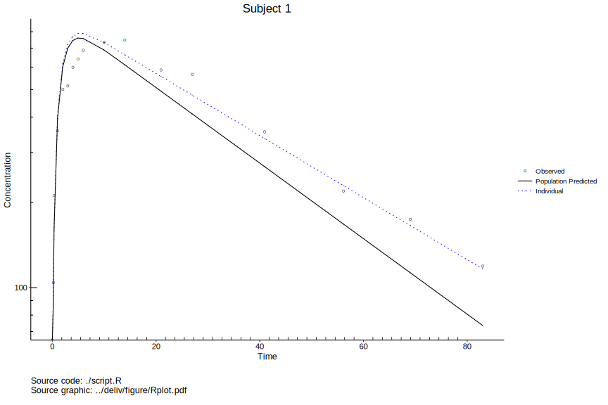
  
## ConcvTimeInd
        

<iframe width="100%" height="400" src="_main_files/help/ConcvTimeIndHelp.html" allowfullscreen></iframe>
        


```r
### Name: ConcvTimeInd
### Title: Concentration vs time profiles for groups of patients (spaghetti
###   plot)
### Aliases: ConcvTimeInd

### ** Examples

data("twoCmt")
twoCmt=twoCmt%>%mutate(DOSE=factor(DOSE))
ConcvTimeInd(datFile = twoCmt)
```

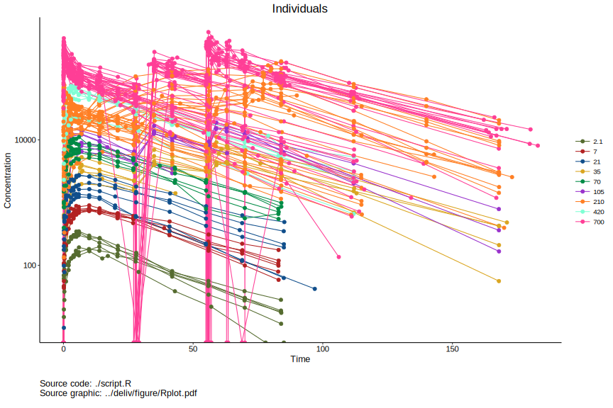

```r
ConcvTimeInd(datFile = twoCmt,facetByRow = 'SEX')
```

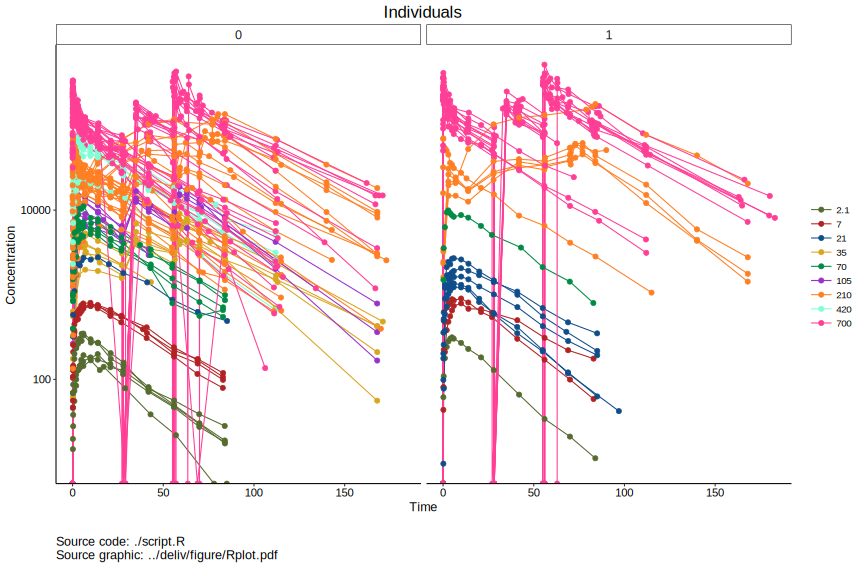
  
## ConcvTimeMult
        

<iframe width="100%" height="400" src="_main_files/help/ConcvTimeMultHelp.html" allowfullscreen></iframe>
        


```r
### Name: ConcvTimeMult
### Title: Multipanel concentration vs time profiles for individual
###   patients
### Aliases: ConcvTimeMult

### ** Examples

data("twoCmt")
twoCmt=twoCmt%>%mutate(DOSE=factor(DOSE))
ConcvTimeMult(datFile = twoCmt,ipredVar='IPRED',genAll=F,page=1)
```

```
## $`1`
```

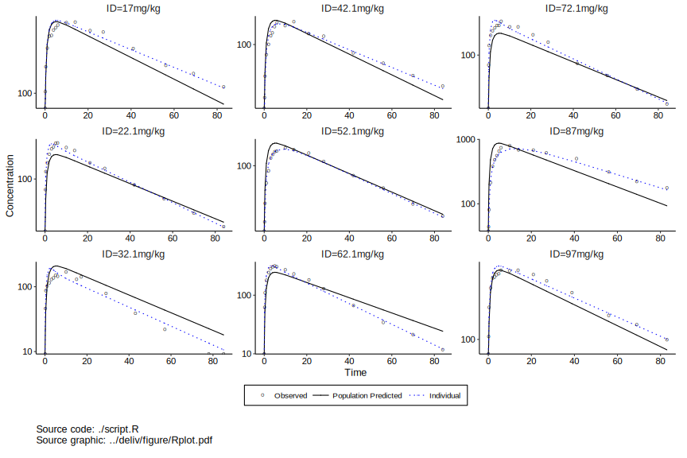

```r
ConcvTimeMult(datFile = twoCmt,ipredVar='IPRED',genAll=F,page=2,nrow =5,ncol=4)
```

```
## $`2`
```

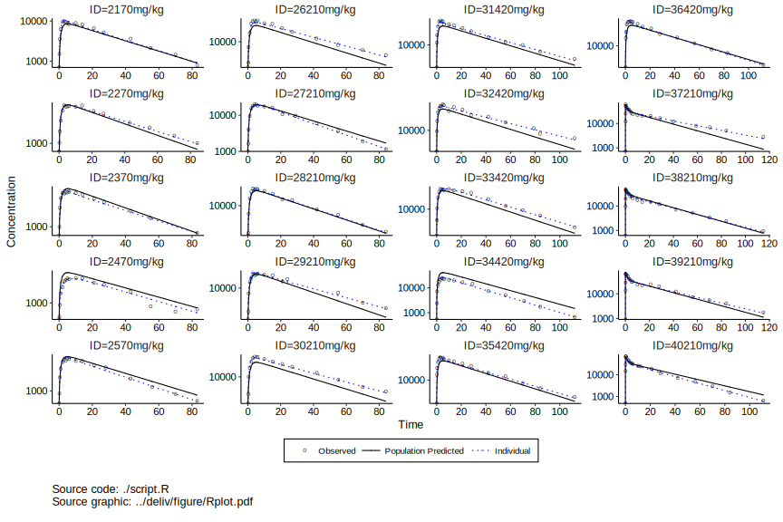

```r
rug.data=addlExpand( tab =file.path(find.package('TFL'),'external/mi210/510/510.tab'),
demog = file.path(find.package('TFL'),'external/mi210/poppk_wcovs.csv'),
group.vars = c('ID','EVID','AMT'),
demog.fillVars = c('HT','WT','CLCR','SEX','AGE'),
demog.keepVars = c('RATE')
)

ConcvTimeMult(datFile = rug.data,
              groupBy='ID',
              xBy = 'TIME',
              ipredVar = 'IPRED',
              genAll = F,
              ID=1:9,
              rugVar = 'EVID',
              rugVals = 1)
```

```
## $`1`
```

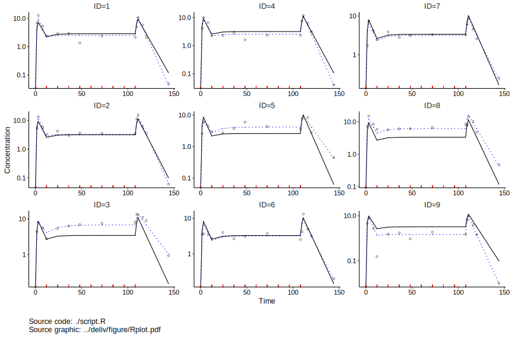
  
## ConcvTimeSum
        

<iframe width="100%" height="400" src="_main_files/help/ConcvTimeSumHelp.html" allowfullscreen></iframe>
        


```r
### Name: ConcvTimeSum
### Title: Concentration vs time profiles for groups of patients (summary
###   plot)
### Aliases: ConcvTimeSum

### ** Examples

data("twoCmt")
twoCmt=twoCmt%>%mutate_each(funs(factor),DOSE,SEX)
ConcvTimeSum(datFile = manipDat(twoCmt,groupBy = 'SEX',sumThis = T))
```

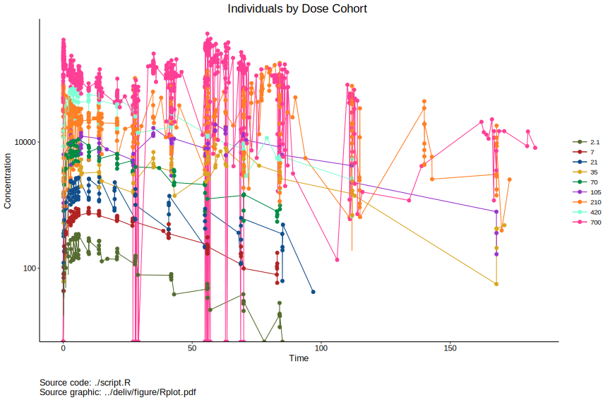<!-- -->
  
## GOF
        

<iframe width="100%" height="400" src="_main_files/help/GOFHelp.html" allowfullscreen></iframe>
        


```r
### Name: GOF
### Title: Goodness of fit plots
### Aliases: GOF

### ** Examples

data("twoCmt")
GOF(twoCmt,cwresBy = 'IRES')
```

<!-- -->
  
## OBSvIPRED
        

<iframe width="100%" height="400" src="_main_files/help/OBSvIPREDHelp.html" allowfullscreen></iframe>
        


```r
### Name: OBSvIPRED
### Title: Standard goodness of fit plots for observed versus predicted
###   values
### Aliases: OBSvIPRED

### ** Examples

data("twoCmt")
OBSvIPRED(twoCmt%>%filter(DV>0),xBy='IPRED')
```

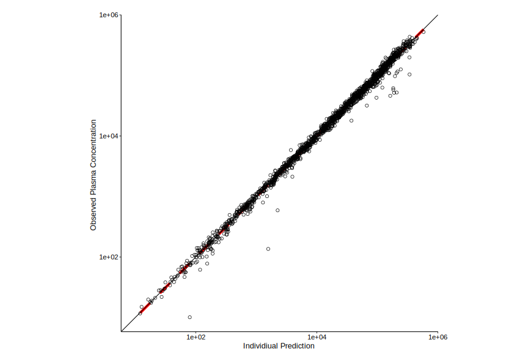

```r
OBSvIPRED(twoCmt,xBy='IPRED',xScale = 'identity',markBy = 'SEX')
```

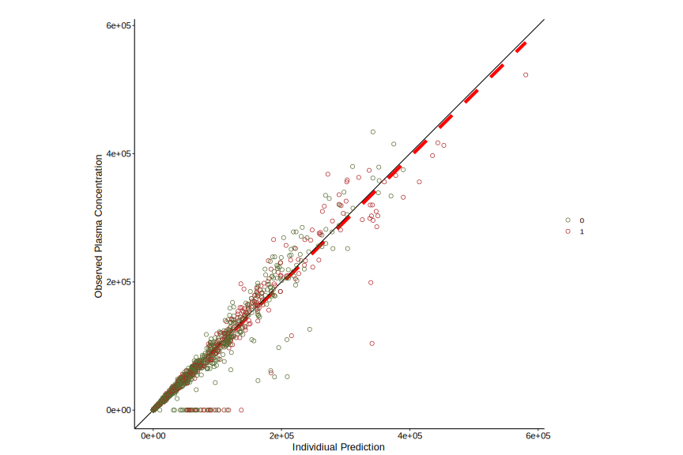
  
## QQplot
        

<iframe width="100%" height="400" src="_main_files/help/QQplotHelp.html" allowfullscreen></iframe>
        


```r
### Name: QQplot
### Title: Create a standard Quantile-Quantile plot
### Aliases: QQplot

### ** Examples

data("twoCmt")
QQplot(twoCmt)
```

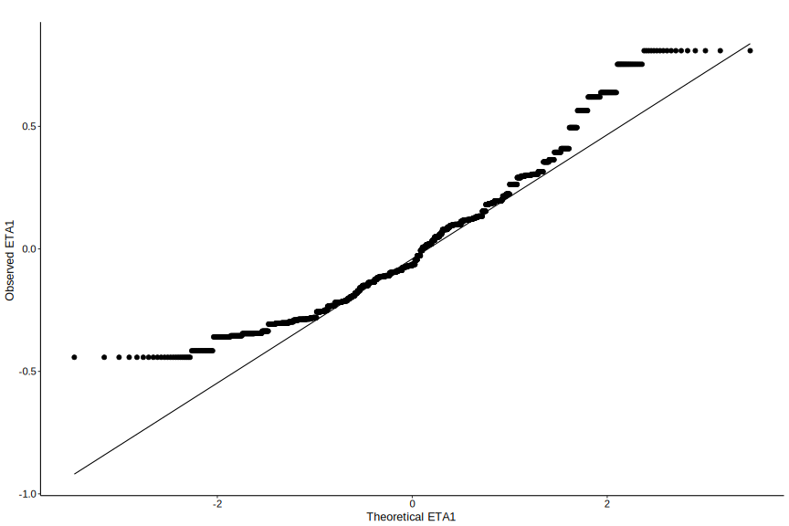

```r
QQplot(twoCmt,markBy = 'SEX')
```

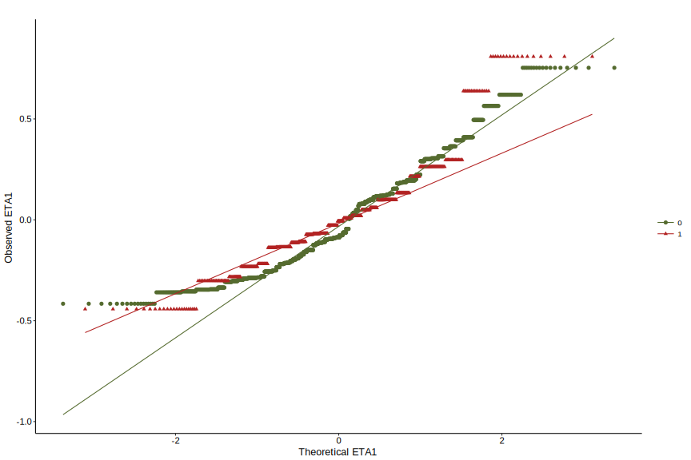

```r
QQplot(twoCmt,facetBy = 'DOSE')
```

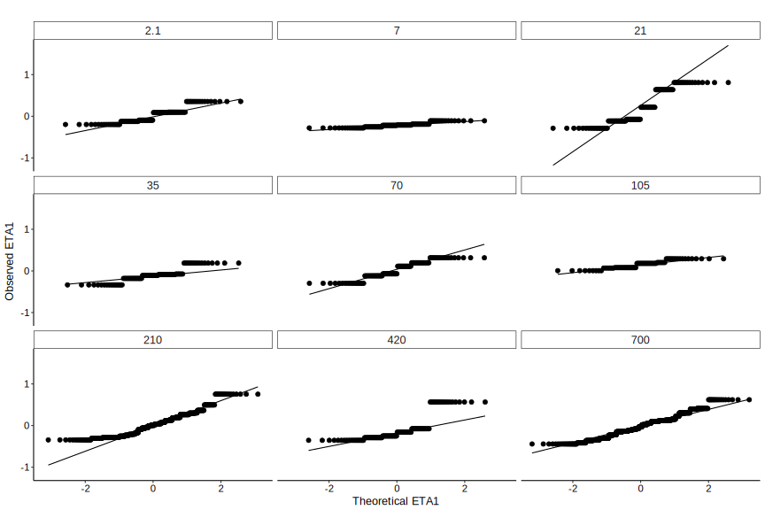
  
## barchartMult
        

<iframe width="100%" height="400" src="_main_files/help/barchartMultHelp.html" allowfullscreen></iframe>
        


```r
### Name: barchartMult
### Title: Bar charts
### Aliases: barchartMult

### ** Examples

data("twoCmt")
barchartMult(datFile = twoCmt)
```

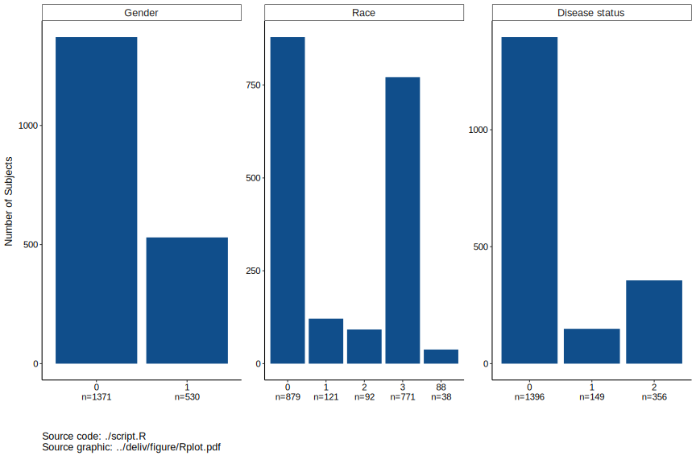

```r
barchartMult(datFile = twoCmt,catList = list(c('SEX','Gender')))
```

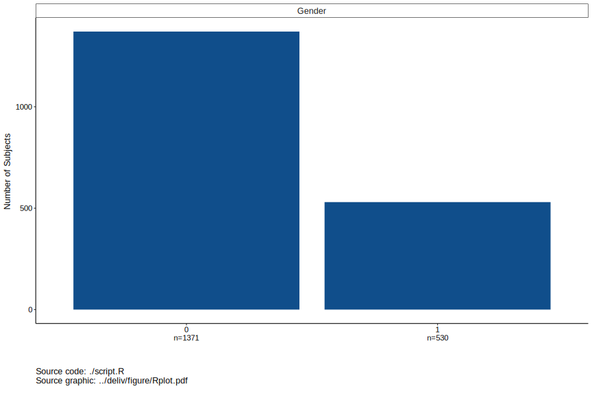

```r
barchartMult(datFile = twoCmt,nrow=2)
```

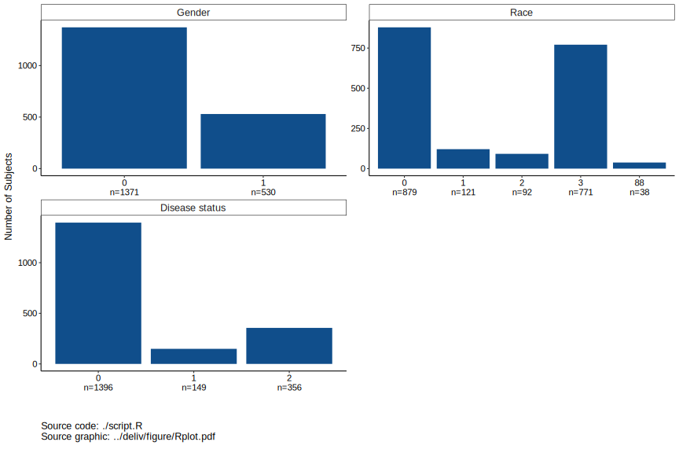
  
## covCat
        

<iframe width="100%" height="400" src="_main_files/help/covCatHelp.html" allowfullscreen></iframe>
        


```r
### Name: covCat
### Title: Boxplots
### Aliases: covCat

### ** Examples

data("twoCmt")
covCat(twoCmt,catList = list('SEX'),conList = 'IPRED',nCols=1)
```

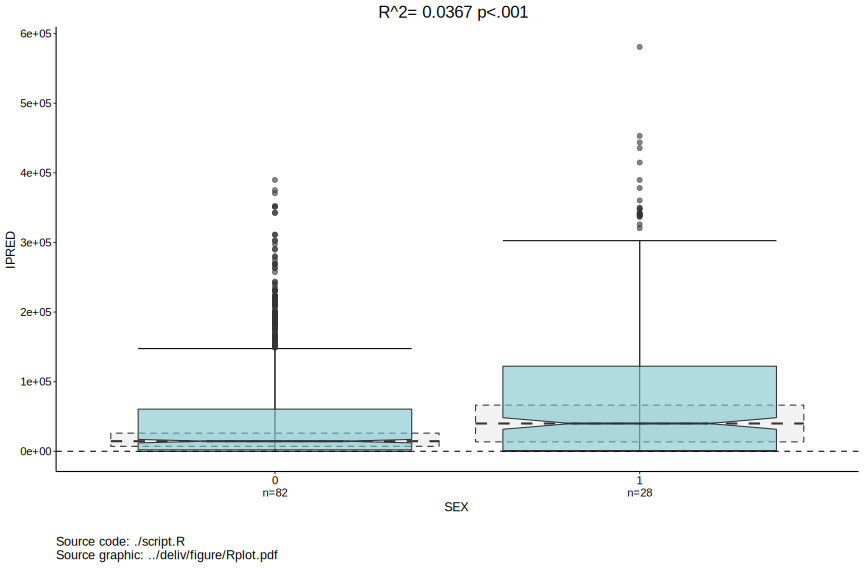

```r
covCat(twoCmt,catList = list(list('SEX','Gender'),list('DOSE')),conList = list(list('IPRED'),list('ETA1',expression(eta[1]))))
```

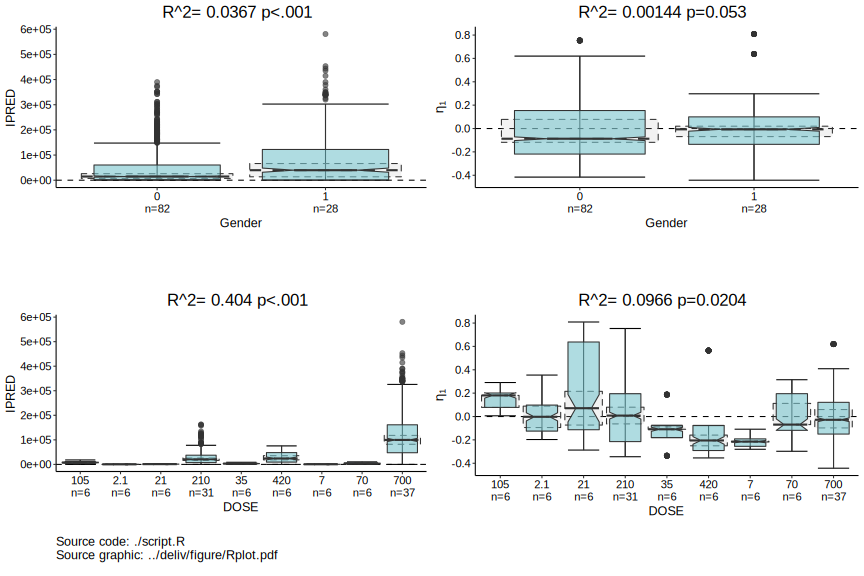
  
## covCon
        

<iframe width="100%" height="400" src="_main_files/help/covConHelp.html" allowfullscreen></iframe>
        


```r
### Name: covCon
### Title: Scatterplots
### Aliases: covCon

### ** Examples

data("twoCmt")
covCon(twoCmt,conList_x = 'IPRED',conList_y = 'ETA1',nCol=1)
```

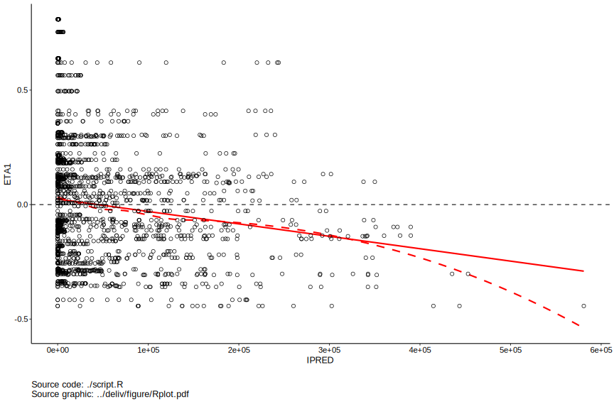

```r
covCon(twoCmt,
conList_x = list(
list('IPRED','Individual Prediction'),
list('IRES','Individual Residual')
),
conList_y = list(
list('ETA1',expression(eta[1]))
)
)
```

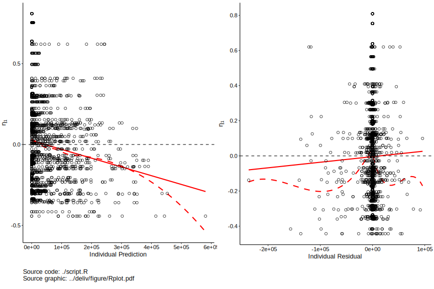
  
## distMult
        

<iframe width="100%" height="400" src="_main_files/help/distMultHelp.html" allowfullscreen></iframe>
        


```r
### Name: distMult
### Title: Multipanel distribution
### Aliases: distMult

### ** Examples

data("twoCmt")
distMult(twoCmt)
```

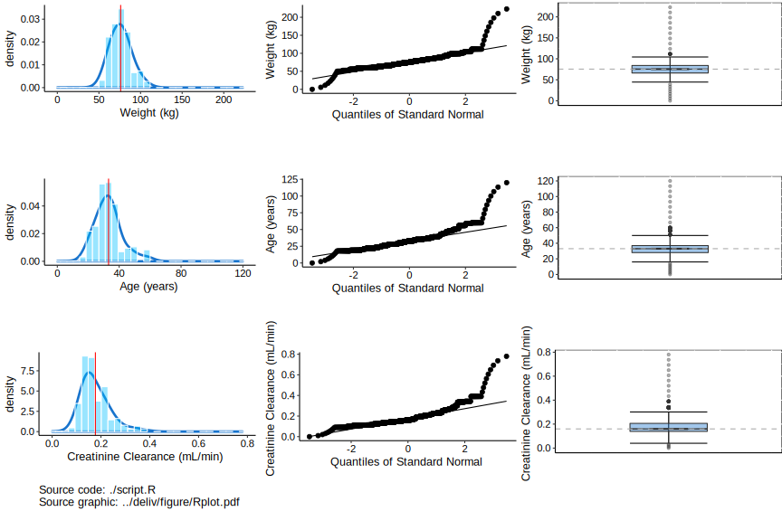

```r
distMult(twoCmt,order = c("Boxplot","Density","QQ"))
```

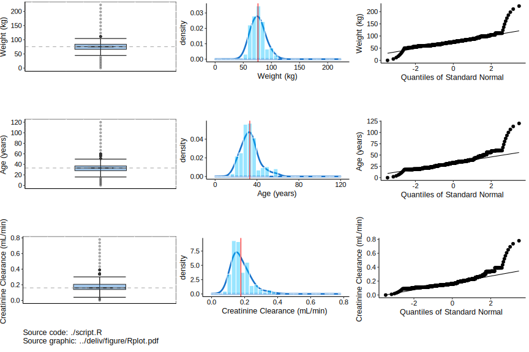
  
## ggpairs
        

<iframe width="100%" height="400" src="_main_files/help/ggpairsHelp.html" allowfullscreen></iframe>
        


```r
### Name: ggpairs
### Title: Correlation Comparison plot
### Aliases: ggpairs

### ** Examples

data("twoCmt")
ggpairs(twoCmt,xCols=c('ETA1','ETA2'))
```

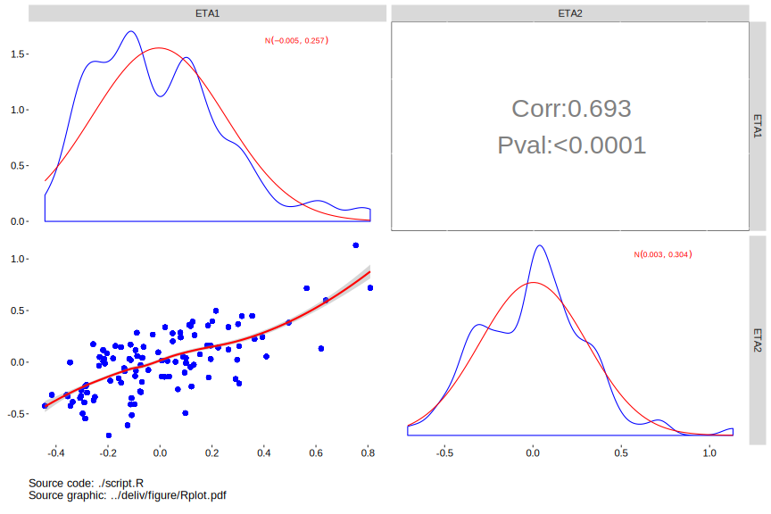

```r
ggpairs(twoCmt,xCols=c('ETA1','ETA2','ETA5'))
```


```r
ggpairs(twoCmt,xCols=c('ETA1','ETA2','ETA5'),runno='0069',project = system.file('external',package = 'TFL'))
```

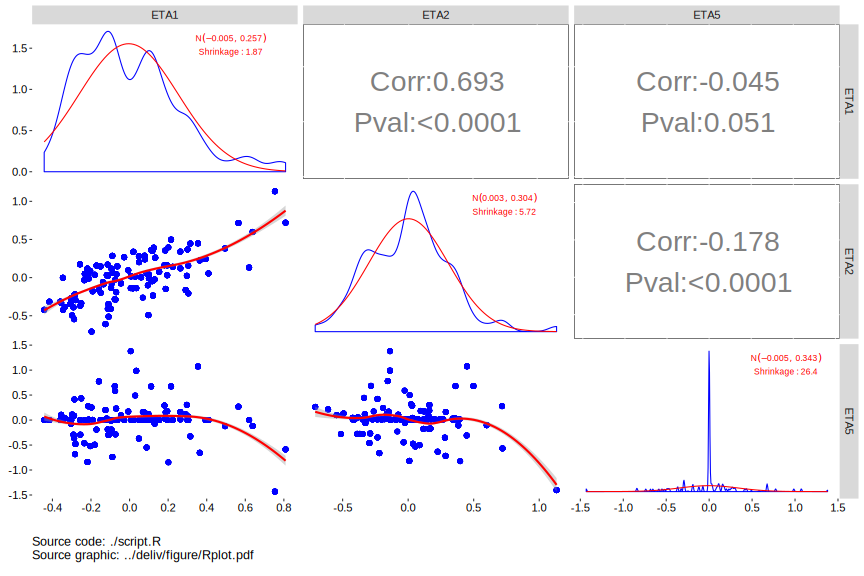
  
## ggpairs_generator
        

<iframe width="100%" height="400" src="_main_files/help/ggpairs_generatorHelp.html" allowfullscreen></iframe>
        


```r
### Name: ggpairs_generator
### Title: Correlation Comparison plot
### Aliases: ggpairs_generator

### ** Examples

data("twoCmt")
ggpairs(twoCmt,xCols=c('ETA1','ETA2'))
```


```r
ggpairs(twoCmt,xCols=c('ETA1','ETA2','ETA5'))
```


  
## paramDist
        

<iframe width="100%" height="400" src="_main_files/help/paramDistHelp.html" allowfullscreen></iframe>
        


```r
### Name: paramDist
### Title: Parameter Distribution Plots
### Aliases: paramDist

### ** Examples

data("twoCmt")
paramDist(twoCmt)
```

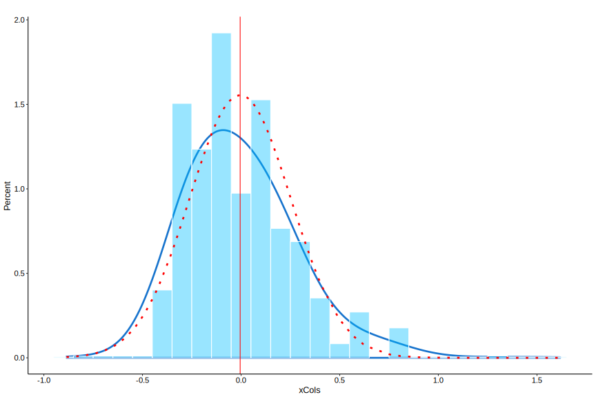

```r
paramDist(twoCmt,xCols=c('ETA1','ETA2'),xLab=c(expression(eta[1]),expression(eta[2])))
```

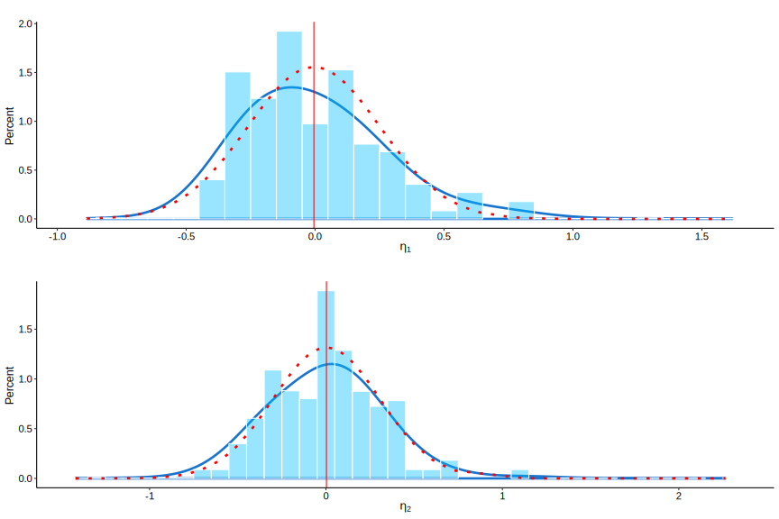
  

<!--chapter:end:02-Figures.Rmd-->

