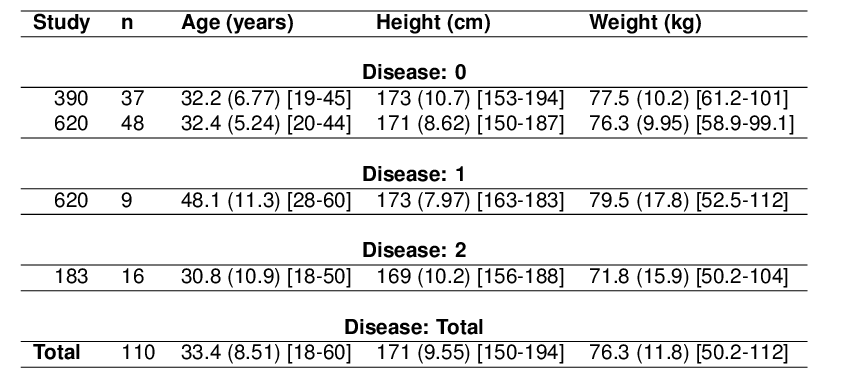
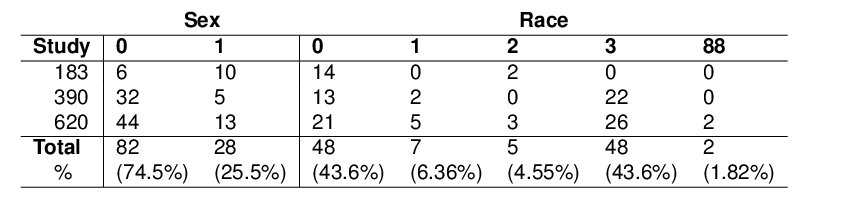
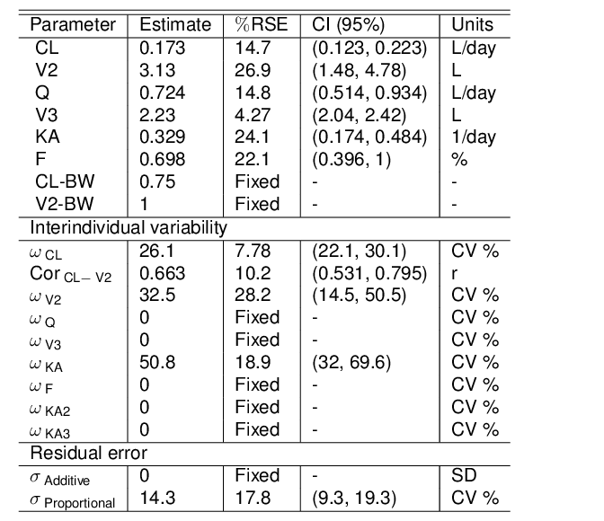

# TFL book guide
Metrum Research Group  
`r Sys.Date()`  


# Preface {-}

The TFL package is an R package for creating tables, figures, and listings in a reproducible manner.

To compile this book you need to install **bookdown** from Github:


```r
devtools::install_github("rstudio/bookdown")
```

Each Rmd file contains a chapter that explains sets of similar funcationalities as specified in the file name.

To compile this to PDF, you need to install XeLaTeX.


Load the Package


Load into the global enviornment data used in the tutorial

```r
data("twoCmt")
```

<!--chapter:end:index.Rmd-->

# Tables

## demogTabCat

Demographics table for categorical variables

<iframe width="100%" height="315" src="_book/demogTabCatHelp.html" frameborder="0" allowfullscreen></iframe>


```r
#Example 1
demogTabCat.ex1=demogTabCat(twoCmt)

texPreview(obj = demogTabCat.ex1,stem = 'demogTabCatEx1',
           fileDir = fd,
           imgFormat = 'png',
           returnType = rt)
```



```r
# Example 2
demogTabCat.ex2=demogTabCat(twoCmt,stratBy = '')

texPreview(obj = demogTabCat.ex2,stem = 'demogTabCatEx2',
           fileDir = fd,
           imgFormat = 'png',
           returnType = rt)
```



## demogTabCont

Demographics table for categorical variables

<iframe width="100%" height="315" src="_book/demogTabContHelp.html" frameborder="0" allowfullscreen></iframe>


```r
demogTabCont.ex1=demogTabCont(twoCmt)

# Example
texPreview(obj = demogTabCont.ex1,stem = 'demogTabCatEx1',
           fileDir = fd,
           imgFormat = 'png',
           returnType = rt)
```


## RNM

NONMEM model summary table

<iframe width="100%" height="315" src="_book/RNMHelp.html" frameborder="0" allowfullscreen></iframe>


```r
projDir=getwd()
setwd("../TFL/inst/external")
RNM.ex1=RNM('0069')
setwd(projDir)

# Example
texPreview(obj = RNM.ex1,stem = 'RNMEx1',
           fileDir = fd,
           imgFormat = 'png',
           returnType = rt)
```



<!--chapter:end:01-Tables.Rmd-->

# Figures
 This is the figures chapter

<!--chapter:end:02-Figures.Rmd-->

