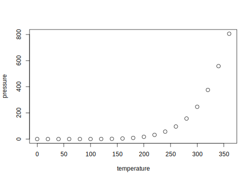

# TFL book guide
Metrum Research Group  
`r Sys.Date()`  

# Preface {-}

<!--chapter:end:index.Rmd-->


# Example Data

<!--chapter:end:00-Example-Data.Rmd-->


# Tables

<!--chapter:end:01-Tables.Rmd-->

---
title: "Untitled"
author: "Jonathan Sidi"
date: "March 23, 2017"
output: html_document
---


## R Markdown

This is an R Markdown document. Markdown is a simple formatting syntax for authoring HTML, PDF, and MS Word documents. For more details on using R Markdown see <http://rmarkdown.rstudio.com>.

When you click the **Knit** button a document will be generated that includes both content as well as the output of any embedded R code chunks within the document. You can embed an R code chunk like this:


```r
sessionInfo()
```

```
## R version 3.3.2 (2016-10-31)
## Platform: x86_64-apple-darwin13.4.0 (64-bit)
## Running under: OS X El Capitan 10.11.5
## 
## locale:
## [1] en_US.UTF-8/en_US.UTF-8/en_US.UTF-8/C/en_US.UTF-8/en_US.UTF-8
## 
## attached base packages:
## [1] stats     graphics  grDevices utils     datasets  methods   base     
## 
## loaded via a namespace (and not attached):
##  [1] backports_1.0.5 bookdown_0.3    magrittr_1.5    rprojroot_1.2  
##  [5] tools_3.3.2     htmltools_0.3.5 rstudioapi_0.6  yaml_2.1.14    
##  [9] Rcpp_0.12.9.4   stringi_1.1.2   rmarkdown_1.3   knitr_1.15.1   
## [13] stringr_1.1.0   digest_0.6.12   evaluate_0.10
```

```r
summary(cars)
```

```
##      speed           dist       
##  Min.   : 4.0   Min.   :  2.00  
##  1st Qu.:12.0   1st Qu.: 26.00  
##  Median :15.0   Median : 36.00  
##  Mean   :15.4   Mean   : 42.98  
##  3rd Qu.:19.0   3rd Qu.: 56.00  
##  Max.   :25.0   Max.   :120.00
```

## Including Plots

You can also embed plots, for example:

<!-- -->

Note that the `echo = FALSE` parameter was added to the code chunk to prevent printing of the R code that generated the plot.

<!--chapter:end:test.Rmd-->

